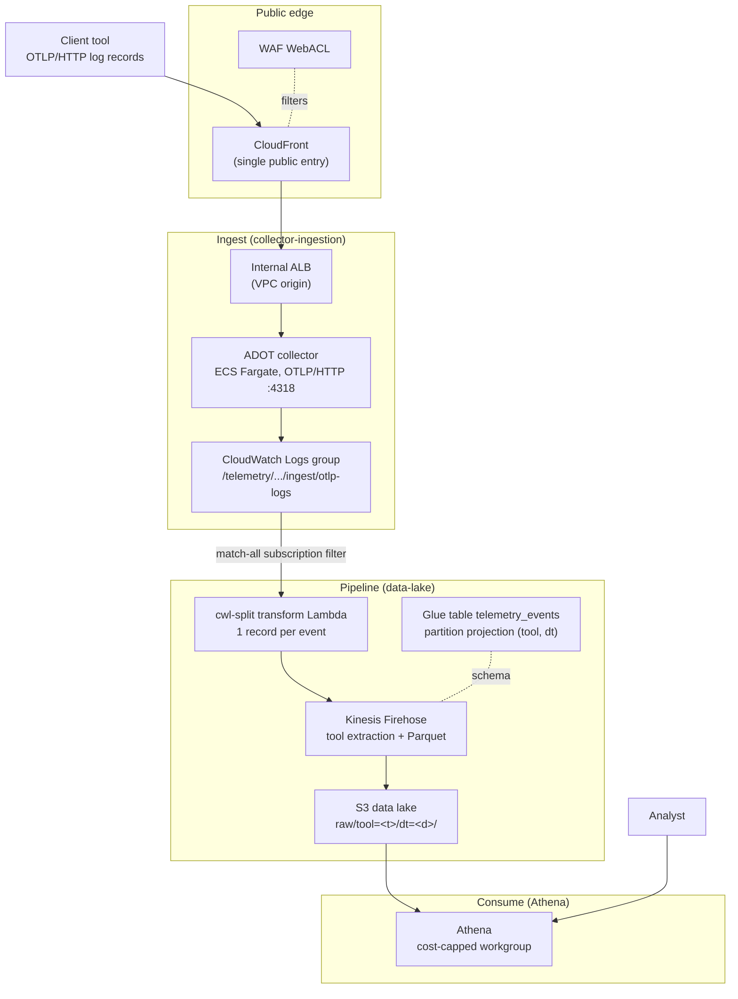

# Architecture

telemetry-platform is an AWS-native usage-analytics platform: client tools POST OTLP
log (and metric) records to a public collector endpoint, a serverless pipeline lands
them as partitioned Parquet in an S3 data lake, and analysts read the results with
Athena over a Glue catalog. This is the system entry-point document; follow the links
below for producer setup, the data model, operations, and deployment mechanics.

The pipeline terminates at the queryable data lake: S3 Parquet described by a Glue
catalog table and read through an Athena workgroup. Any downstream reporting or BI
surface (dashboards, notebooks, a central BI account) attaches to that Athena/Glue
endpoint out of band — the platform itself deploys the ingest-and-lake pipeline, not a
presentation tier.

The platform accepts the OTLP **logs and metrics** signals; there is no traces pipeline. See
[Signal scope: logs and metrics](#signal-scope-logs-and-metrics).

## Where to go next

- Emit telemetry from a client tool: [sending-telemetry.md](sending-telemetry.md)
- Onboard a new tool (the single-edit tool registry): [onboarding-a-tool.md](onboarding-a-tool.md)
- Event schema, the `tool` partition, and Athena queries: [data-model.md](data-model.md)
- Terminology, module taxonomy, and namespacing: [terragrunt-concepts.md](terragrunt-concepts.md)
- CI/CD and the release pipeline: [release-pipeline.md](release-pipeline.md)
- Security and compliance posture: [security.md](security.md)

## End-to-end data flow

The system is two halves joined by an S3 data lake. The **ingest half** accepts
OTLP logs at the edge and writes partitioned Parquet; the **consume half** is an
Athena workgroup that queries that Parquet directly.

**Ingest half — OTLP logs to partitioned Parquet:**

| # | Stage | Component | What happens |
| --- | --- | --- | --- |
| 1 | Emit | Client tool | Sends OTLP/HTTP log records to the collector's public endpoint. |
| 2 | Edge | CloudFront + WAF | CloudFront is the single public entry point; a WAF WebACL filters requests, then CloudFront forwards to an internal ALB over a VPC origin (the ALB never has a public listener). |
| 3 | Collect | ADOT on ECS Fargate | The internal ALB routes to the ADOT collector; its OTLP/HTTP receiver applies per-pipeline memory-limiter and batch processors, then exports log records with the `awscloudwatchlogs` exporter and Claude-tool metric records with the `awsemf` exporter — both land in CloudWatch Logs. |
| 4 | Buffer | CloudWatch Logs | Records land in a dedicated log group; a match-all subscription filter forwards every record to Kinesis Data Firehose. |
| 5 | Split | cwl-split transform Lambda | Decompresses the CloudWatch Logs envelope and re-ingests each event as its own single-JSON record, so any-size delivery becomes one record per event before partitioning. |
| 6 | Land | Kinesis Firehose + S3 | Firehose extracts the `tool` partition key, converts each record to Parquet via the Glue schema, and writes to `raw/tool=<tool>/dt=<date>/`; records that fail extraction route to an `errors/` prefix. |
| 7 | Catalog | Glue | The `telemetry_events` table describes the Parquet layout and resolves partitions through Athena partition projection (no crawler). |

**Consume half — querying the lake:**

| # | Stage | Component | What happens |
| --- | --- | --- | --- |
| 8 | Query | Athena | A cost-capped workgroup queries the Parquet lake directly through the Glue catalog; results are encrypted with a customer-managed key. Downstream reporting/BI tools attach here. |

## Pipeline diagram

## Component responsibilities

Each component is owned by one Terraform reference module that composes lower-level
primitives. See [terragrunt-concepts.md](terragrunt-concepts.md) for the module
taxonomy and how references compose primitives.

| Component | AWS service | Responsibility | Owning reference |
| --- | --- | --- | --- |
| Public edge | CloudFront + WAF | Single public entry point; WAF managed rule groups and per-IP rate limiting; routes to the internal ALB over a VPC origin | `collector-ingestion` |
| Load balancer | Application Load Balancer (internal) | Forwards CloudFront traffic to the ADOT tasks; health-checks the collector health-check extension | `collector-ingestion` |
| Collector | ECS Fargate + ADOT | Terminates OTLP/HTTP, applies per-pipeline memory-limiter and batch processors, exports logs and Claude-tool metrics (as CloudWatch EMF) to CloudWatch Logs | `collector-ingestion` |
| Ingest hop | CloudWatch Logs | Dedicated log group plus a match-all subscription filter that forwards every record to Firehose | `collector-ingestion` |
| Record split | Lambda | Decompresses the CloudWatch Logs envelope and re-ingests each event as its own JSON record | `data-lake` |
| Delivery | Kinesis Data Firehose | Extracts the `tool` partition key, converts to Parquet via the Glue schema, writes partitioned objects to S3 | `data-lake` |
| Storage | S3 | Parquet data lake partitioned by `tool` and `dt`; customer-managed KMS encryption; lifecycle to cold storage | `data-lake` |
| Catalog | Glue | `telemetry_events` table with Athena partition projection (enum `tool` over a governed value set, date `dt`); no crawler | `data-lake` |
| Query | Athena | Cost-capped workgroup querying the lake directly through the Glue catalog; results encrypted with a customer-managed key. This is the platform's terminus — downstream reporting/BI tools attach here | `data-lake` (`athena-workgroup`) |
| Observability | CloudWatch + SNS | A fixed set of alarms across the ingest, delivery, and query stages, delivered through one SNS topic | `observability` |

### Storage layout

Firehose writes Parquet to `raw/tool=<tool>/dt=<date>/`. Partition keys and data
columns are distinct:

| Kind | Fields | Notes |
| --- | --- | --- |
| Partition keys | `tool`, `dt` | Encoded in the S3 path only, never stored as data columns. |
| Data columns | `timestamp`, `event_type`, `payload` | The Glue table's actual columns. |

Athena resolves partitions through projection: `tool` is an *enum* dimension over a
fixed, governed value set, and pinning it with an equality or `IN` predicate is a
scan-cost recommendation rather than a requirement. The full schema and example
queries are in [data-model.md](data-model.md).

### Consumer access path

The platform terminates at the Athena workgroup over the Glue-cataloged Parquet lake.
Downstream consumers — a BI tool, a notebook, a scheduled report, or a central
analytics account — attach to that Athena/Glue endpoint using their own credentials
and, where they live in another AWS account, the data lake's optional cross-account
read grant (S3 `GetObject`/`ListBucket` on the lake bucket plus `kms:Decrypt` on the
telemetry-data CMK; see [data-model.md](data-model.md)). No presentation or sign-in
tier is deployed by this platform.

## Signal scope: logs and metrics

Every usage event is an OTLP **log** or **metric** record. The platform ingests two OTLP
**signals** — logs and metrics — and nothing else: no traces receiver, no Amazon Managed
Prometheus (AMP) endpoint, no Prometheus remote-write exporter, and no OTLP gRPC receiver
(OTLP/HTTP only). `POST /v1/logs` and `POST /v1/metrics` both return `200`; `POST /v1/traces`
still returns `404`.

Within the logs signal, the ADOT collector declares **two** `logs` pipelines, selected by each
record's `resource.attributes["service.name"]`:

- **Raw pipeline** (`raw_log=true`) — the original pipeline, unchanged. Records from
  producers that follow the flat body contract (`{timestamp, tool, event_type,
  payload}`; kanon and similar tools) export byte-for-byte identical, with no
  reshaping.
- **Structured pipeline** (`raw_log=false`) — a `filter/keep_structured` processor routes
  records whose `service.name` is a member of the tool registry's derived
  `structured_otlp_service_names` list (`claude-code`, `claude-cowork`, `claude-office`,
  plus the synthetic `synthetic-claude-e2e`, and any other onboarded structured-OTLP tool
  — see [tool-registry.json](../terragrunt/common/tool-registry.json)) to a distinct
  CloudWatch Logs stream. The `cwl_split` transform Lambda then reshapes each
  attribute-shaped record into the same four-field envelope the raw pipeline already
  produces, resolving `tool` via the registry-derived `service_tool_map` — with **no
  fallback**: an unmapped `service.name` fails that record to the monitored `errors/`
  prefix rather than a catch-all `tool`. See
  [data-model.md](data-model.md#structured-claude-tool-records) for the reshape mapping,
  [onboarding-a-tool.md](onboarding-a-tool.md) for how to register a new tool, and
  [sending-telemetry.md](sending-telemetry.md#sending-claude-tool-telemetry-claude-code-cowork-office)
  for the producer-side contract.

The metrics signal adds a **third** pipeline, `metrics/structured`, isolated with its own
`memory_limiter/metrics` and `batch/metrics` processors so a burst of metric records cannot
starve the logs pipelines' shared limiter. It carries structured-OTLP tools' OTLP metrics
(session, token, cost, and active-time counters, for Claude tools) through an `awsemf`
exporter, which writes them as CloudWatch EMF log events on a dedicated stream
(`adot-collector-metrics-emf`) in the same ingest log group the logs pipelines already use.
From there, metric records flow through the same subscription filter, Firehose delivery,
and `cwl_split` bridge as every other record; a `_reshape_emf` branch in `cwl_split`
reshapes each EMF event into the **same** four-field envelope and the **same**
`telemetry_events` table (`tool = claude-code`) the structured logs pipeline already
produces, so a metric row joins a log row from the same session on `session_id` /
`user_email`. See
[data-model.md](data-model.md#claude-tool-metric-records) for the metric row shape and the
delta-aggregation caveat, and
[ADR 0031](adr/0031-claude-metrics-awsemf-pipeline.md) for the pipeline design.

One logs signal carried by two pipelines, plus one metrics pipeline: all three terminate in the
same `{timestamp, tool, event_type, payload}` shape by the time a record reaches CloudWatch
Logs, so the `tool` partition key and the `timestamp` / `event_type` / `payload` columns
populate consistently regardless of which pipeline produced the record. Records on the raw
logs pipeline carry the additional guarantee of being byte-identical to what the producer sent.

Request shaping still happens at the collector, not the edge: the maximum body size
and the memory limiter live at the ADOT receiver, not the WAF, so legitimately large
batched log exports are not dropped before they reach the collector.

Adding a new OTLP **signal** later — traces, Prometheus scrape, or wider ingest transport and
format — remains a deliberate, separately scoped expansion.

## Deployment and module structure

The platform is delivered as Terraform reference modules and deployed through a
Terragrunt live tree:

- **Modules:** reference modules under `providers/aws/references/`, each composing
  reusable primitives.
- **Environments:** sandbox and prod share identical module code and versions; only
  inputs differ by environment.
- **Instance sets:** deployments are organized into immutable, numbered sets, so a
  change stands up a new set and flips traffic to it rather than mutating a running
  set.

For depth:

- Module taxonomy, the scope hierarchy, namespacing, and glossary:
  [terragrunt-concepts.md](terragrunt-concepts.md)
- Immutable instance sets and zero-downtime promotion:
  [instance-sets-architecture.md](instance-sets-architecture.md)
- CI/CD, validation, and the module-to-leaf release flow:
  [release-pipeline.md](release-pipeline.md)
- Architecture decision records: [adr/README.md](adr/README.md)

For the project overview and the full documentation index, see the
[repository README](../README.md). For the security policy, see
[SECURITY.md](../.github/SECURITY.md).
