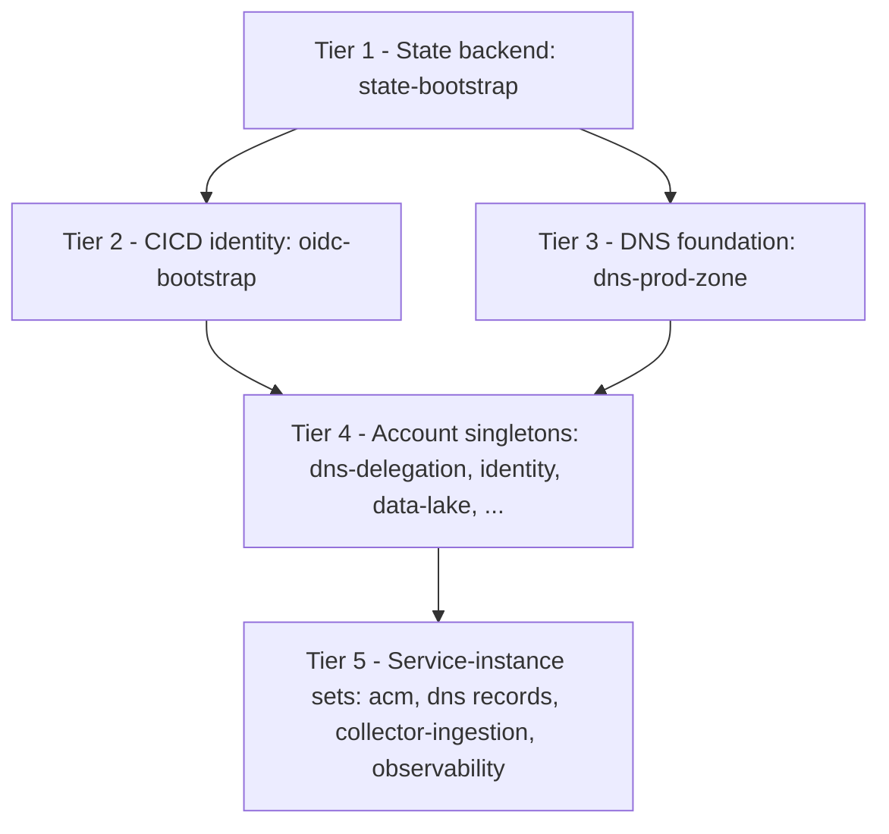
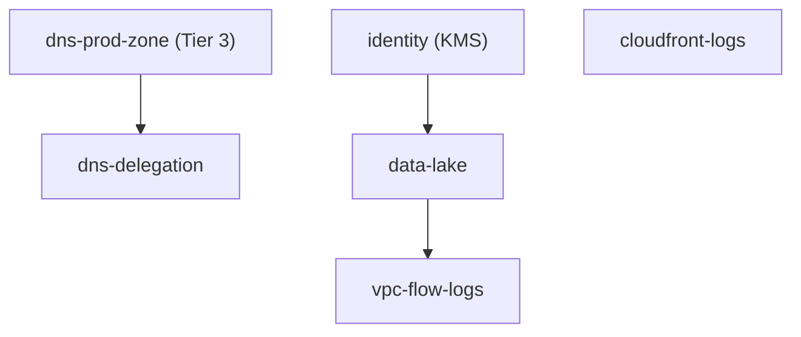
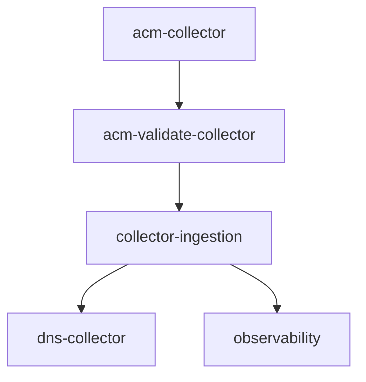

# Bootstrap Ordering

The order in which the telemetry platform must be brought up in a fresh account: the
remote-state backend first, then the CICD identity and DNS foundation, then the
account-wide singletons, and finally the per-environment service-instance sets. Read this
to understand *why* the tiers exist and *what* depends on what; for the exact commands and
credentials, follow the [bootstrap runbook](bootstrap-runbook.md).

## When you need this

- Standing up the platform in a brand-new account for the first time.
- Reasoning about which units can be applied independently and which must wait.
- Reviewing how Terragrunt resolves apply order inside the live service tree.

For terminology used below (leaf unit, singleton, env set, resource set, namespace), see
[terragrunt-concepts.md](terragrunt-concepts.md). For why service-instance sets are
immutable and numbered, see [instance-sets-architecture.md](instance-sets-architecture.md).

## The five tiers

Bringup proceeds through five tiers. Each tier depends on the tiers above it.

The split between tiers reflects two different ordering mechanisms:

- **Tiers 1-3 are operator-ordered out-of-band.** The bootstrap-tier units carry no
  cross-unit Terraform output edges, so their order is enforced by following the runbook,
  not by Terragrunt. They are excluded from change-scoped CICD applies and applied once per
  account by an operator with admin or SSO credentials.
- **Tiers 4-5 are dependency-ordered by Terragrunt.** The live-tree leaf units declare
  their upstream `dependency` blocks, forming a DAG that a single `terragrunt run --all apply`
  walks in order. DAG-root units (for example `identity` and `cloudfront-logs`)
  declare no `dependency` block and so are applied first. The tier numbering
  below simply describes the resulting topological order.

## Account prerequisites (not created by Terraform)

One account-level resource must exist before the tiers below can complete; it is not
created by Terraform (see [iac-coverage.md](iac-coverage.md) for the rationale):

- **GitHub OIDC identity provider** — consumed by `oidc-bootstrap` (Tier 2); created once
  per account by an operator.

Everything else in the account is Terraform-managed through the tiers below. Per-set spin-up
and promotion (both env sets and resource sets) is fully Terragrunt-driven and does not
depend on any of these one-time account prerequisites.

## Tier 1 - State backend

`state-bootstrap` creates the hardened remote-state foundation for the account: the
Terraform state S3 bucket, its customer-managed KMS key, the access-log bucket, and a
shared artifact bucket. State locking is
S3-native (`use_lockfile = true` in `terragrunt/root.hcl`); there is no DynamoDB lock
table.

Because the hardened S3 backend does not yet exist on the very first apply, this unit runs
once against a local backend and then migrates its own state into the bucket it just
created. Every other unit in the account stores its state in this backend, so it must exist
before anything else.

## Tier 2 - CICD identity

`oidc-bootstrap` creates the IAM roles GitHub Actions assumes to plan and apply. It
consumes a GitHub OIDC identity provider ARN as an input; that provider is an operator
prerequisite created once per account and is **not** created by Terraform. The roles differ
per account (plan and apply roles in prod, a Terratest role in QA, a cross-account DNS
writer in the root account). This tier needs the state backend (Tier 1) in place to store
its state.

## Tier 3 - DNS foundation

`dns-prod-zone` is the only bootstrap unit in this tier. It owns the long-lived hosted
zone, the `telemetry-config` customer-managed key, and the SSM seed parameters. It lives in
the bootstrap tier so that destroying and recreating a service-instance set never churns the
hosted zone's name servers (which would force an apex re-delegation and DNS propagation
wait). This tier needs only the state backend, so it can be applied in parallel with Tier 2.

The apex NS records that delegate this zone are written by `dns-delegation`, which is **not**
a bootstrap unit. It lives in the DNS-owner scope (`_singletons/dns_owner/...`), declares a
`dependency` on `dns-prod-zone`, and is applied by CICD along with the other
dependency-ordered units. It is described in Tier 4 below.

## Tier 4 - Account singletons

The account-singleton units provide platform-wide foundations that the service-instance
sets build on. Most are shared backing services in the `_singletons/shared/...` scope;
`dns-delegation` lives in the DNS-owner scope (`_singletons/dns_owner/...`). Terragrunt
orders them all by their `dependency` edges, and CICD applies them once the bootstrap tiers
are in place:

- `identity` and `cloudfront-logs` have no intra-tier dependencies.
- `dns-delegation` depends only on `dns-prod-zone` (Tier 3); it writes the apex NS records
  in the DNS-owner account and is applied by CICD, not by the operator.
- `data-lake` depends on `identity` (and on the DNS foundation).
- `vpc-flow-logs` depends on `data-lake`.

`observability` is also a singleton, but it depends on units from Tier 5 (the running
collector service), so Terragrunt applies it last. It is shown in Tier 5 below.

## Tier 5 - Service-instance sets

The per-environment service-instance sets (`<env>/000/...`) compose the singletons into the
live request path. Within a set, Terragrunt resolves this order:

- `acm-collector` requests the ACM certificate; its `acm-validate-collector`
  sibling completes DNS validation and depends on the DNS foundation.
- `collector-ingestion` depends on `data-lake`, `identity`, the validated collector
  certificate, the log buckets, and the DNS foundation.
- `dns-collector` publishes the service DNS record and depends on the
  running collector.
- `observability` depends on `collector-ingestion` and `data-lake`,
  so it converges only after the rest of the set is up.

Each service-instance set is immutable and numbered. To roll out a change you stand up a new
set and flip traffic to it rather than mutating a live set; see
[instance-sets-architecture.md](instance-sets-architecture.md) and the
[DNS cutover runbook](dns-cutover-runbook.md).

## After bootstrap

Once Tiers 1-3 are applied and the GitHub Actions variables are published, CICD takes over
Tiers 4-5: pull requests plan the changed units and merges to `main` apply prod-affecting
units through the serialized apply queue. Sandbox is applied locally by the operator rather
than by CICD. The full command sequence, per-account credentials, and verification
checklist live in the [bootstrap runbook](bootstrap-runbook.md).

## Related documentation

- [bootstrap-runbook.md](bootstrap-runbook.md) - exact first-deploy commands and credentials.
- [terragrunt-concepts.md](terragrunt-concepts.md) - scope hierarchy, namespacing, glossary.
- [instance-sets-architecture.md](instance-sets-architecture.md) - immutable numbered sets.
- [dns-cutover-runbook.md](dns-cutover-runbook.md) - flipping traffic between sets.
- [Documentation index](../README.md) - all platform docs.
