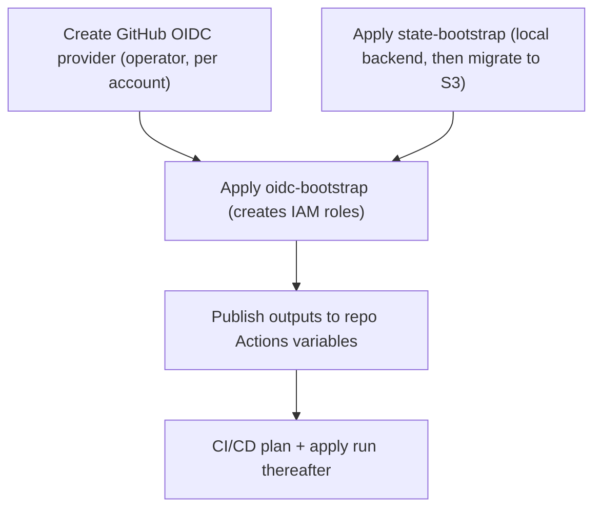

# Bootstrap runbook: state backend and OIDC first deploy

This is the one-time, per-account procedure that stands up the Terraform remote-state
backend and the GitHub Actions OIDC roles **before** any CI/CD can run. You need it only
when bringing a brand-new account into the platform (or rebuilding one from empty). It is
run by an operator with admin/SSO credentials, never by the pipeline.

Common path: create the GitHub OIDC provider in the account, apply `state-bootstrap`
(local backend first, then migrate state to S3), apply `oidc-bootstrap`, then publish the
resulting role ARNs and bucket name to repository Actions variables. After that, CI/CD
operates on its own.

For the ordered, decision-level view of the same sequence see
[bootstrap-ordering.md](bootstrap-ordering.md). For terminology (leaf unit, namespace,
env set, resource set, long-lived vs destroyable) see
[terragrunt-concepts.md](terragrunt-concepts.md). For adding regions, accounts, or
instance sets to an already-bootstrapped tree see
[terragrunt-operational-runbook.md](terragrunt-operational-runbook.md). For the workflows
that run afterward see [release-pipeline.md](release-pipeline.md).

## What this runbook covers

Bootstrap is **per account**: a Terragrunt unit and its single AWS provider create
resources in exactly one account, so each account is bootstrapped independently with that
account's own credentials.

Two unit types make up the state/identity foundation:

- `state-bootstrap` — creates the hardened remote-state foundation (state CMK,
  access-log bucket, and the versioned S3 state/artifact bucket).
- `oidc-bootstrap` — creates the IAM roles GitHub Actions assumes via OIDC (and, in the
  DNS-owner account, the role-chained DNS-writer role).

A third foundation unit, `dns-prod-zone`, also lives in the bootstrap tier for the
service accounts (it holds the long-lived hosted zone, the platform config CMK, and SSM
seeds so they never churn when a service-tree instance set is rebuilt). Its place in the
ordered bringup is documented in [bootstrap-ordering.md](bootstrap-ordering.md); this
runbook focuses on the state backend and OIDC roles.

Every bootstrap unit is applied exactly once per account and is excluded from the
change-scoped CI apply.

## Accounts and what each receives

All four accounts host at least one GitHub Actions OIDC role, so the GitHub OIDC identity
provider is a prerequisite in **every** account. The DNS-writer role is the only role that
is role-chained instead of OIDC-assumed.

| Account | ID | Region | OIDC provider | Bootstrap units | Roles created |
|---------|----|--------|---------------|-----------------|---------------|
| sandbox | `222222222222` | `us-east-1` | required | `state-bootstrap`, `oidc-bootstrap` | `telemetry-platform-gha-tg-plan` |
| QA | `333333333333` | `us-east-1` | required | `state-bootstrap`, `oidc-bootstrap` | `telemetry-platform-gha-terratest` |
| prod | `111111111111` | `us-east-1` | required | `state-bootstrap`, `oidc-bootstrap` | `telemetry-platform-gha-tg-plan`, `telemetry-platform-gha-tg-apply` |
| root (DNS owner) | `444444444444` | `us-east-1` | required | `state-bootstrap`, `oidc-bootstrap` | `telemetry-platform-dns-writer`, `telemetry-platform-gha-tg-plan` |

Sandbox is plan-only in CI (`ci_deploy=false`): its plan role lets a cross-account PR plan
sandbox-scoped units, but sandbox applies are performed locally by the operator, never by
the pipeline. There is no sandbox apply role used by CI.

### Credentials per account

Each unit must be applied with admin/SSO credentials for the **same** account it targets.
The AWS provider is generated with `allowed_account_ids` pinned to the unit's account, so
applying with the wrong profile fails fast. The canonical named profile for each account
is recorded in `terragrunt/common/env_accounts.json` (env-keyed) and
`terragrunt/common/accounts.json` (account-id-keyed); use those rather than inventing
profile names.

## Bootstrap unit paths

Every bootstrap unit lives under the shared `bootstrap` environment layer, keyed by a
per-account role directory:

```text
terragrunt/live/telemetry/us-east-1/bootstrap/<role>_role/<unit>/000
```

The `bootstrap/environment.hcl` resolves to the basename `bootstrap`, reserved exclusively
for these one-time units. The Terraform state key is per-unit (path-derived) and the state
bucket is per-account, so placing units under the `bootstrap` layer does not change the
derived bucket math.

| Account | Unit | Path |
|---------|------|------|
| prod `111111111111` | state-bootstrap | `terragrunt/live/telemetry/us-east-1/bootstrap/prod_role/state-bootstrap/000` |
| prod `111111111111` | oidc-bootstrap | `terragrunt/live/telemetry/us-east-1/bootstrap/prod_role/oidc-bootstrap/000` |
| sandbox `222222222222` | state-bootstrap | `terragrunt/live/telemetry/us-east-1/bootstrap/sandbox_role/state-bootstrap/000` |
| sandbox `222222222222` | oidc-bootstrap | `terragrunt/live/telemetry/us-east-1/bootstrap/sandbox_role/oidc-bootstrap/000` |
| QA `333333333333` | state-bootstrap | `terragrunt/live/telemetry/us-east-1/bootstrap/qa_role/state-bootstrap/000` |
| QA `333333333333` | oidc-bootstrap | `terragrunt/live/telemetry/us-east-1/bootstrap/qa_role/oidc-bootstrap/000` |
| root `444444444444` | state-bootstrap | `terragrunt/live/telemetry/us-east-1/bootstrap/dns_owner_role/state-bootstrap/000` |
| root `444444444444` | oidc-bootstrap | `terragrunt/live/telemetry/us-east-1/bootstrap/dns_owner_role/oidc-bootstrap/000` |

## Ordering

Within an account the order is fixed: the OIDC provider and the hardened S3 backend must
both exist before `oidc-bootstrap` runs. The dependency from `oidc-bootstrap` to
`state-bootstrap` is **documented ordering only** — there is no Terraform output edge
between the two units.



Applying `oidc-bootstrap` before `state-bootstrap` fails: the hardened S3 backend it would
write its own state into does not yet exist.

## Prerequisite: create the GitHub OIDC provider

The GitHub OIDC identity provider (`token.actions.githubusercontent.com`) is created once
per account that hosts an OIDC-assumed role. With the current role layout that is **all
four accounts**.

`oidc-bootstrap` does not create the provider — it consumes the provider ARN derived from
the account id. The module fails fast if a role uses OIDC trust (its `sub` is set) while
the provider ARN is empty, naming the offending role.

Create the IAM OpenID Connect provider in each account with:

- Provider URL: `https://token.actions.githubusercontent.com`
- Audience (client ID): `sts.amazonaws.com`
- Thumbprint: the current GitHub Actions OIDC thumbprint (retrieve from the
  [GitHub OIDC hardening guide](https://docs.github.com/en/actions/security-for-github-actions/security-hardening-your-deployments/about-security-hardening-with-openid-connect)
  or compute it from the GitHub OIDC endpoint certificate at creation time)

The resulting ARN has the form:

```text
arn:aws:iam::<account-id>:oidc-provider/token.actions.githubusercontent.com
```

The DNS-writer role in the root account does not use this provider: it is assumed via
`sts:AssumeRole` (role-chaining) from the prod apply role. The root account still needs the
provider because its plan role (`telemetry-platform-gha-tg-plan`) is OIDC-assumed.

## Step 1 — Create the GitHub OIDC provider in each account

Follow the prerequisite section above for sandbox `222222222222`, QA `333333333333`, prod
`111111111111`, and root `444444444444`. The provider must exist in an account before that
account's `oidc-bootstrap` unit is applied (Step 3).

## Step 2 — Apply state-bootstrap

`state-bootstrap` creates the per-account remote-state foundation:

- state CMK with alias `alias/<account-id>-tfstate` (key rotation enabled)
- a dedicated access-log bucket
- the versioned, KMS-encrypted S3 state/artifact bucket, exported as the
  `artifact_bucket_name` output

State locking is S3-native (`use_lockfile = true`, configured at the Terragrunt root).
There is no DynamoDB lock table.

### Own-state first apply

The root backend configuration hardens every unit's state against the CMK and access-log
bucket that `state-bootstrap` itself creates — a chicken-and-egg on the first apply. The
leaf resolves this with a backend override gated on the `BOOTSTRAP_LOCAL_BACKEND`
environment variable:

| `BOOTSTRAP_LOCAL_BACKEND` | Behavior |
|---------------------------|----------|
| `true` | Generates `backend.tf` with an empty local backend (use ONLY on the one-time first apply) |
| unset / `false` (default) | Generates `backend_disabled.tf.disabled`, a filename Terraform ignores, so the root S3 backend operates normally |

Set `BOOTSTRAP_LOCAL_BACKEND=true` only for the single first apply. After
`terraform init -migrate-state`, leave it unset; no edit to the unit's `terragrunt.hcl` is
required.

Apply sequence for each account that has a state backend (all four):

```bash
# 1. Navigate to the state-bootstrap unit for the target account
cd terragrunt/live/telemetry/us-east-1/bootstrap/<role>_role/state-bootstrap/000

# 2. First apply with a local backend
BOOTSTRAP_LOCAL_BACKEND=true AWS_PROFILE=<profile> terragrunt apply

# 3. Migrate state into the newly created hardened S3 backend (run once)
terraform init -migrate-state

# 4. Confirm state is in S3 (BOOTSTRAP_LOCAL_BACKEND left unset)
terragrunt state list
```

Repeat for `prod_role`, `sandbox_role`, `qa_role`, and `dns_owner_role`.

## Step 3 — Apply oidc-bootstrap

Prerequisite: the OIDC provider for the account exists (Step 1) and `state-bootstrap` has
been applied and migrated for the account (Step 2). With the hardened S3 backend already
present, `oidc-bootstrap` is a plain apply:

```bash
cd terragrunt/live/telemetry/us-east-1/bootstrap/<role>_role/oidc-bootstrap/000
AWS_PROFILE=<profile> terragrunt apply
```

Each unit reads its per-account role subset from `terragrunt/common/oidc-roles.json`
(keyed by account id), so it creates only that account's roles. A missing account row fails
fast at parse time. After each apply, note the output role ARNs for Step 4.

| Account | oidc-bootstrap path | Roles created |
|---------|---------------------|---------------|
| sandbox `222222222222` | `.../bootstrap/sandbox_role/oidc-bootstrap/000` | `telemetry-platform-gha-tg-plan`, `telemetry-platform-gha-tg-apply` |
| QA `333333333333` | `.../bootstrap/qa_role/oidc-bootstrap/000` | `telemetry-platform-gha-terratest` |
| prod `111111111111` | `.../bootstrap/prod_role/oidc-bootstrap/000` | `telemetry-platform-gha-tg-plan`, `telemetry-platform-gha-tg-apply` |
| root `444444444444` | `.../bootstrap/dns_owner_role/oidc-bootstrap/000` | `telemetry-platform-dns-writer`, `telemetry-platform-gha-tg-plan` |

### Role trust-policy notes

- `telemetry-platform-gha-tg-plan` (sandbox, prod, root): OIDC trust with a broad subject
  (`repo:example-org/telemetry-platform:*`). Read-only plan permissions on the remote
  state of the account it lives in (the root and prod plan roles additionally grant
  cross-account `kms:Decrypt`/S3 read on sibling state so a cross-env PR can load
  dependency state).
- `telemetry-platform-gha-terratest` (QA): OIDC trust with subject
  `repo:example-org/telemetry-platform:*`. The test job's reviewer gate is enforced by
  the `terratest-approval` GitHub environment, not by the role trust.
- `telemetry-platform-gha-tg-apply` (prod): OIDC trust restricted to subject
  `repo:example-org/telemetry-platform:environment:prod-apply`. The GitHub environment
  name and the trust-policy claim are the identical literal `prod-apply`. Its
  `AdministratorAccess` grant + the dns-writer assume-role inline policy are added by the prod
  `oidc-bootstrap` leaf as a deep-merge override (not stored in `oidc-roles.json`).
- `telemetry-platform-gha-tg-apply` (sandbox): the on-demand ephemeral apply/destroy role. OIDC
  trust restricted to subject `repo:example-org/telemetry-platform:environment:sandbox-apply`
  (environment name and trust-policy claim are the identical literal `sandbox-apply`). It carries
  `AdministratorAccess` (create side) + a `sandbox-teardown-sweep` inline policy (delete/sweep,
  mirroring the QA terratest sweep) so a `workflow_dispatch` run can stand the full sandbox stack
  up and `run-all destroy` it. Unlike prod, both the managed and inline policies are declared
  directly in `oidc-roles.json` (the QA pattern), so the sandbox leaf needs no override. Sandbox
  stays `ci_deploy=false`; CI applies it only when the run sets `TT_ON_DEMAND_APPLY` AND
  `accounts.json` declares `ci_deploy_on_demand=true` for the account. NOTE: this role has NO
  dns-writer assume-role grant (the dns-writer trust permits only the prod apply role), so an
  on-demand run must scope to the sandbox service account's own units.
- `telemetry-platform-dns-writer` (root): role-chained — its trust policy permits the prod
  apply role (`telemetry-platform-gha-tg-apply`) via `sts:AssumeRole`, not a GitHub OIDC
  subject. The prod apply job assumes this role for Route 53 writes in the root account.

## Step 4 — Publish outputs to repository Actions variables

After `oidc-bootstrap` and `state-bootstrap` have applied, set the following GitHub Actions
**repository variables** on `example-org/telemetry-platform`:

| Variable | Value | Source |
|----------|-------|--------|
| `AWS_QA_TERRATEST_ROLE_ARN` | ARN of `telemetry-platform-gha-terratest` in QA `333333333333` | QA oidc-bootstrap output |
| `AWS_DEFAULT_REGION` | `us-east-1` | fixed |
| `LOCK_MAX_AGE_MINUTES` | maximum Terraform lock age in minutes consumed by the fail-closed safety net (no default) | operator-chosen |

The plan and apply role ARNs are **not** published as repository variables. Both are
resolved at workflow runtime from the changed unit's path plus
`terragrunt/common/accounts.json[<account-id>]`: plan jobs use the `plan_role_name` field,
apply jobs use the `deploy_role_name` field. Adding a new account therefore needs only an
`accounts.json` row, not a workflow or variable edit. The pipeline fails fast if a
referenced variable is empty; no default values are accepted.

### GitHub environments

Create these GitHub environments if they do not already exist:

| Environment | Purpose |
|-------------|---------|
| `terratest-approval` | Reviewer gate on the Terratest job in PR validation |
| `prod-apply` | Reviewer gate on the prod apply job |
| `sandbox-apply` | Gates the on-demand ephemeral sandbox apply/destroy role (`workflow_dispatch` performance-test lifecycle); add reviewers if desired |
| `release` | Reviewer gate on the release pipeline |

## Step 5 — CI/CD runs thereafter

Once Steps 1-4 are complete, the platform workflows operate normally: PR validation plans
each changed unit under the per-account plan role, and the apply workflow applies
prod-affecting units through its serialized queue under the per-account deploy role. See
[release-pipeline.md](release-pipeline.md) for the full workflow set.

Sandbox requires both bootstrap units. The normal push lane never auto-applies sandbox
(`ci_deploy=false`); the operator applies sandbox service units locally as usual. In addition,
because the sandbox row declares `ci_deploy_on_demand=true` and a `sandbox-apply` OIDC role now
exists, a dedicated `workflow_dispatch` run that sets `TT_ON_DEMAND_APPLY` can stand the sandbox
stack up and tear it down on demand (ephemeral performance-test lifecycle) without making sandbox
an always-on CI target.

## Credentials and SSO notes

Each step must run with admin-level credentials in the target account. Acceptable options:

- AWS SSO session started with `aws sso login --profile <profile>`,
  where the profile assumes an admin permission set in the target account.
- Long-lived IAM admin keys, used for bootstrap only and rotated or deactivated afterward.

Applying a unit with credentials from the wrong account fails fast: the account id is
derived from the directory path and the provider `allowed_account_ids` guard rejects any
caller whose account id does not match.

## Verification checklist

After completing all steps, confirm:

- [ ] `aws iam get-open-id-connect-provider` succeeds for the
  `token.actions.githubusercontent.com` provider in each of `222222222222`,
  `333333333333`, `111111111111`, and `444444444444`
- [ ] `aws iam get-role --role-name telemetry-platform-gha-tg-plan` succeeds in
  `222222222222`, `111111111111`, and `444444444444`
- [ ] `aws iam get-role --role-name telemetry-platform-gha-terratest` succeeds in
  `333333333333`
- [ ] `aws iam get-role --role-name telemetry-platform-gha-tg-apply` succeeds in
  `111111111111`
- [ ] `aws iam get-role --role-name telemetry-platform-dns-writer` succeeds in `444444444444`
- [ ] Each account's `state-bootstrap` state is stored in its S3 backend
  (`terragrunt state list` returns the bootstrap resources with no local backend)
- [ ] Repository Actions variables `AWS_QA_TERRATEST_ROLE_ARN`, `AWS_DEFAULT_REGION`, and
  `LOCK_MAX_AGE_MINUTES` are all set and non-empty
- [ ] A test PR touching a `terragrunt/**` unit triggers PR validation and the plan step
  authenticates via OIDC without error
- [ ] A merge to `main` touching a prod `terragrunt/**` unit triggers the apply workflow and
  the role-resolution step resolves the correct role ARN and region from the unit path plus
  `terragrunt/common/accounts.json`
