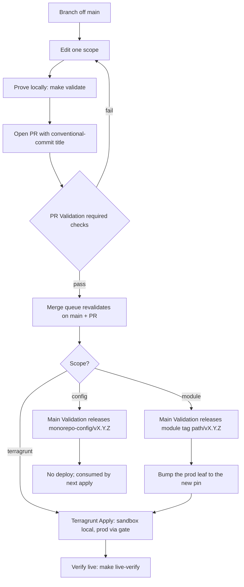
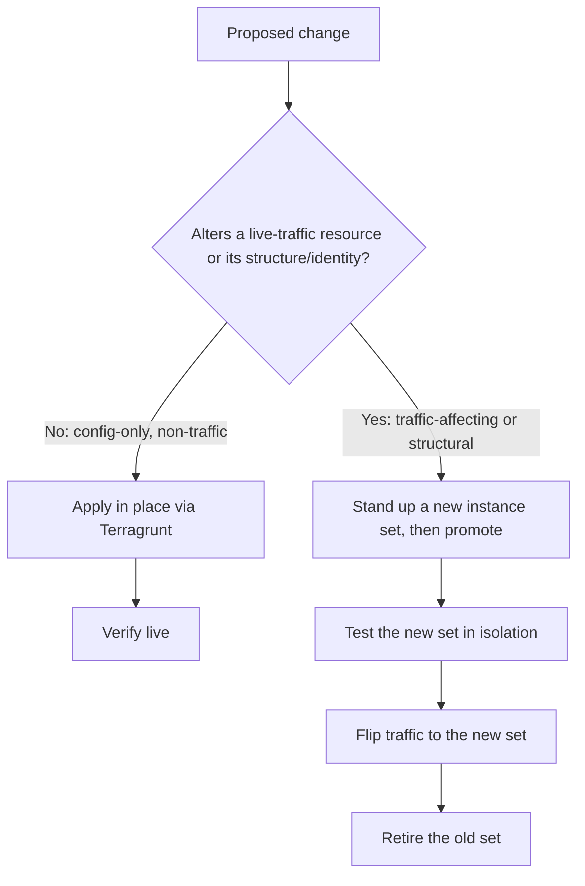
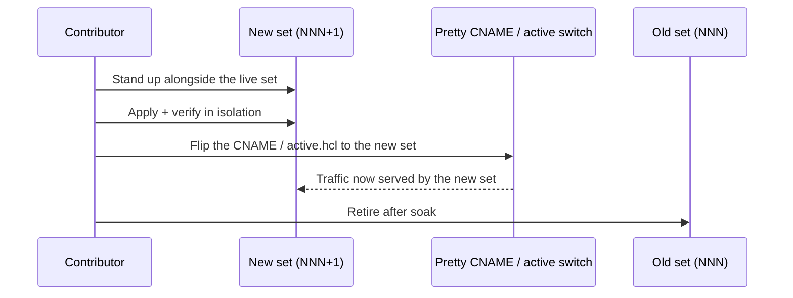

# Contributing

How to make a change to telemetry-platform and ship it safely to production. This
is the contributor entry point: it maps each kind of change to the CI checks it
triggers, its release behavior, and the dev-to-prod path; and it gives the rule
for when to change infrastructure in place versus stand up a new immutable set.

If you only need one thing:

- Pick the right change scope: [Change scopes](#change-scopes).
- Run the gates locally before you push: `make validate`.
- Follow the path for your scope: [The dev-to-prod path](#the-dev-to-prod-path).
- Deciding mutable vs immutable? Jump to [In-place vs immutable](#in-place-versus-immutable-changes).

Terminology used throughout (leaf unit, namespace, env set, resource set,
long-lived vs destroyable) is defined once in
[terragrunt-concepts.md](terragrunt-concepts.md). CI/CD mechanics (workflows,
concurrency, the merge queue, operator prerequisites) live in
[release-pipeline.md](release-pipeline.md). This guide links to those rather than
restating them.

## Prerequisites

One-time local setup provisions the pinned toolchain, syncs the Python
environment from the lockfile, and installs the git hooks:

```bash
make configure
```

The pre-commit hook runs format, lint, type-check, and security checks across
Python, Terraform, YAML, and Markdown; the pre-push hook runs the full suite
(`make ci`). Hooks, linters, and security scanners must never be bypassed
(`--no-verify`, `# noqa`, `# nosec`, ignore-list edits). If a gate fails, fix the
cause.

## Change scopes

CI classifies every PR into exactly one **change scope** from its changed-file
set (`scripts/detect_scope.py`). A PR that spans more than one scope fails fast
(`multi-module` or `mixed`) and must be split. The scope determines which checks
run and what gets released.

| Scope | Release on merge | What it covers and how it is detected |
| --- | --- | --- |
| `module` | `<module_path>/vX.Y.Z` | One Terraform module leaf under `providers/aws/<tier>/<leaf>/` (tier = `primitives`, `collections`, `data`, or `references`); detected as a single module directory. |
| `terragrunt` | Terragrunt Apply (no tag) | The live tree — any path under `terragrunt/`. |
| `config` | `monorepo-config/vX.Y.Z` | Everything outside a module leaf and outside `terragrunt/`: `scripts/`, `policies/`, `docs/`, `.github/`, `Makefile`, `monorepo-config.json`, `pyproject.toml`, `uv.lock`, `.trivyignore`, and the root `VERSION`. |
| `all` | None (each module by its own PR) | A deliberate cross-module batch, authorized only by an admin `detect-scope-override` label. |

Two notes that trip people up:

- **A PR touches exactly one module.** Two module leaves in one PR is a
  `multi-module` violation. Shared files (`scripts/`, `policies/`, `Makefile`,
  the lockfile) are `config` scope and must not be mixed with a module change.
- **The conventional-commit scope in the PR title is not the change scope.** The
  title's `type` (e.g. `feat`, `fix`) drives the semantic-version bump; the
  parenthesized scope (e.g. `feat(kms-key): ...`) is a free label. The change
  scope above is computed from the diff, independently.

### PR title and version bump

PR titles must be valid conventional commits (`make validate-pr-title`). The type
selects the bump applied at release:

- Minor (feature) bump: `feat`, `perf`, `build`, `ci`, `revert`, `release`,
  `meta`, `module`.
- Patch (fix) bump: `fix`, `chore`, `docs`, `style`, `refactor`, `test`.

The squash-merge title is the source of truth for the release; write it
deliberately.

## Local gates

`make validate` (alias of `make ci`) runs the identical full suite CI runs, so a
green local run predicts a green PR; the pre-push hook runs it automatically. All
gates read coverage thresholds from `monorepo-config.json`. Targeted gates by scope:

| Scope | Local gate command | What it checks |
| --- | --- | --- |
| Python | `make python-quality` | `scripts/`: ruff format + lint, mypy, bandit, pytest with a coverage gate. |
| Go | `make go-format` `go-lint` `go-vuln` `go-unit-test-coverage` | Module test harnesses and CLI validators: format, lint, vulnerability scan, unit tests with coverage. |
| Rego | `make rego-format` `rego-lint` `rego-unit-test-coverage` | OPA policy: format, lint, unit tests with coverage. |
| Terraform module | `make module-validate` `tf-format` `tf-lint` `tf-security` `tf-docs-check` `tf-validate` with `MODULE_PATH` + `MODULE_TYPE`; live apply-level `make tf-test MODULE_PATH=<dir>` | Per module: OPA policy, fmt, tflint, Trivy, terraform-docs drift, `terraform validate`. `tf-test` needs AWS credentials and a delegatable test domain. |
| Terragrunt | `make tg-format-check` `tg-validate` `tg-security` `tg-plan` with `INCLUDE_DIR_FLAGS`, plus `make tg-no-hardcoded-identity` `tg-copyability-test` | Live-tree format, validate, security, and plan, plus the identity and copyability guards. |
| YAML / Actions | `make yaml-format-check` `yaml-lint` `actionlint` `actions-sha-pin-check` | YAML format and lint, workflow linting, and action SHA-pin enforcement. |
| Markdown | `make md-lint` | Markdown lint across the repository docs. |

`make help` lists every target.

## The dev-to-prod path

The same spine applies to every scope: branch, prove locally, open a PR, pass
required checks, merge through the queue, then release and/or apply. The steps
that differ are the release and apply stages.



The workflows behind the boxes (PR Validation, Terragrunt PR, Main Validation,
Terragrunt Apply, Terratest Sweep, CodeQL, Safety Net) and their concurrency
model are documented in [release-pipeline.md](release-pipeline.md#workflows-at-a-glance).

### Required checks and the merge queue

PR Validation aggregates the required checks: PR-title validation, scope
detection, Python/Go/Rego quality, and the scope-targeted validations (merge
simulation, version-immutability, module-validate matrix, terratest gate,
terragrunt guards). The aggregate is the single branch-protection required check.

Main is protected and uses the **GitHub Merge Queue**: an approved PR is queued,
revalidated against the latest main, and merged only when green. Self-approval
gates and the prerequisites for both are in
[release-pipeline.md](release-pipeline.md#operator-prerequisites).

### Per-scope walkthroughs

#### Terraform module change

1. Branch; edit one module leaf under `providers/aws/...`.
2. Prove locally: `make module-validate tf-format tf-lint tf-security tf-docs-check tf-validate`
   and, with credentials, `make tf-test MODULE_PATH=<dir>`.
3. Open the PR. PR Validation runs the `module-validate` matrix and the
   terratest-gated `tf-test` job for the module.
4. On merge, Main Validation releases the module tag `<module_path>/vX.Y.Z` and
   updates its CHANGELOG.
5. Promote the new version into the prod leaf that consumes it (the leaf pins
   `git::...?ref=<path>/v<semver>`), then merge that `terragrunt`-scope change so
   Terragrunt Apply deploys it. The promotion model is
   [module-promotion-flow.md](module-promotion-flow.md); the source-pinning
   toggle is [terraform-module-sourcing.md](terraform-module-sourcing.md).

A VERSION-only module PR is a release trigger with no code change; the terratest
job is skipped for it by design.

#### Terragrunt / live-tree change

1. Branch; edit under `terragrunt/`.
2. Prove locally: `make tg-validate tg-plan INCLUDE_DIR_FLAGS=<flags>` plus the
   identity and copyability guards.
3. Open the PR. Terragrunt PR plans the changed units, partitioned per AWS
   account, each under that account's read-only plan role.
4. On merge, Terragrunt Apply detects the changed units and applies them.
   **Sandbox is `ci_deploy=false`: it is applied locally, never by CI**, and is
   stripped from the CI apply scope up front. Prod-affecting units run through one
   repo-wide serialized FIFO queue (`tg-apply-prod`, never cancelled) behind the
   `prod-apply` environment gate.
5. Verify: `make live-verify CHECK=<check> ENV=<env>` (read-only prober).

Apply sandbox locally first to prove the change, then merge so CI applies prod.
Day-2 procedures are in
[terragrunt-operational-runbook.md](terragrunt-operational-runbook.md); first-time
backend bringup is [bootstrap-runbook.md](bootstrap-runbook.md).

#### Config-scope change (scripts, policy, docs, CI)

1. Branch; edit the relevant files. This is one scope even though it spans
   directories — keep module and terragrunt edits out of it.
2. Prove locally with the matching gates (e.g. `make python-quality`,
   `make rego-lint`, `make md-lint`).
3. Open the PR; the quality jobs run unconditionally.
4. On merge, Main Validation releases the single repo-wide tag
   `monorepo-config/vX.Y.Z`.

Documentation is config scope: update the affected docs in the same PR as the
code change.

## In-place versus immutable changes

Most day-to-day changes update infrastructure in place: Terragrunt applies the
new config to existing resources. Some changes must instead be delivered as a new
**immutable instance set** — a fresh numbered copy that you promote traffic to,
leaving the running set untouched. Instance sets are immutable by rule: a live
set is never edited in place; see
[instance-sets-architecture.md](instance-sets-architecture.md).

Decision rule:



- **Apply in place** when the change is config-only and non-traffic: alarm
  thresholds, budgets, tags, IAM policy tightening, log-retention, a new
  non-serving resource, or any change a plan shows as an in-place update with no
  replacement of a traffic-serving resource.
- **Use a new immutable set** when the change is traffic-affecting or structural:
  anything a plan shows as forcing replacement of a CloudFront distribution, ALB,
  ECS service/task definition, certificate, or origin; or any change you cannot
  prove safe on the live set. Two set levels exist — the env set
  (`.../<region>/<env>/<NNN>`) and the resource set
  (`.../<env>/<NNN>/<service>/<NNN>`).

The actual copy, activate, and revert steps live in
[instance-set-operations.md](instance-set-operations.md) (Operation 1 adds a new
set via the copy method; Operation 2 reverts to an older one). The long-lived vs
destroyable resource distinction that makes a copy collision-free is in
[terragrunt-concepts.md](terragrunt-concepts.md).

## Zero-downtime deployment

Zero-downtime here is achieved by promoting a new immutable set and switching
traffic at the edge, not by mutating the serving set:



What makes each layer non-disruptive:

- **CloudFront / ALB / ECS**: the new set provisions its own distribution, ALB,
  and ECS service; the running set keeps serving until traffic is flipped. ECS
  rolling task replacement within a set is a normal in-place update for non-
  structural changes.
- **Instance sets**: a new numbered set coexists with the live one because every
  set-scoped resource name is namespace-derived and collision-free.
- **DNS CNAME flip / active switch**: traffic moves from old to new by
  repointing the pretty CNAME (or the `active` selector), an atomic,
  instantly-revertible switch. The end-to-end cutover procedure is
  [dns-cutover-runbook.md](dns-cutover-runbook.md); the promotion and
  zero-downtime model is
  [instance-sets-architecture.md](instance-sets-architecture.md#promotion-and-zero-downtime).

Roll back by flipping traffic to the previous set — no in-place revert of a live
set.

## Verifying a deployment

After any apply, confirm the live state with the read-only prober (zero mutating
AWS calls):

```bash
make live-verify CHECK=<check> ENV=<env>
```

Checks include `oidc-provider`, `state-backend`, `stack`, `endpoints`,
`observability`, `repo-settings`. Environments are `sandbox`, `qa`, `prod`,
`root`. For a data-plane round trip, the synthetic OTLP harness
(`make e2e-loadgen`, `make e2e-verify`) is documented in
[e2e-harness.md](e2e-harness.md).

## Security and standards

All changes must meet the engineering and security standards in the repository
root `CLAUDE.md`: fail-fast (no fallbacks, no silent failures), no hard-coded
configuration or identity, SOLID and DRY, declarative state, and input-driven
configuration. Never log secrets or PII, and never suppress a security finding
without documented approval. The security posture is documented in
[security.md](security.md).

## Related documents

- [release-pipeline.md](release-pipeline.md) — canonical CI/CD reference.
- [terragrunt-concepts.md](terragrunt-concepts.md) — terminology and structure.
- [module-promotion-flow.md](module-promotion-flow.md) — module-to-leaf semver promotion.
- [terraform-module-sourcing.md](terraform-module-sourcing.md) — const-source vars and the pinning toggle.
- [instance-sets-architecture.md](instance-sets-architecture.md) — immutable sets and zero-downtime.
- [instance-set-operations.md](instance-set-operations.md) — add a set, revert a set.
- [terragrunt-operational-runbook.md](terragrunt-operational-runbook.md) — day-2 operations.
- [bootstrap-runbook.md](bootstrap-runbook.md) — first-time backend bringup.
- [dns-cutover-runbook.md](dns-cutover-runbook.md) — DNS cutover steps.
- [architecture.md](architecture.md) — end-to-end system and pipeline.
- [../README.md](../README.md) — project hub.
