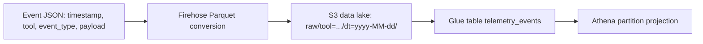

# Data Model and Query Reference

What this is: the schema of the telemetry data lake and how to query it with Amazon Athena. It documents the Glue `telemetry_events` table, the event body fields, the partition layout and projection, the cost-capped Athena workgroup, and ready-to-run queries.

When you need it: writing Athena queries, building downstream reports or extracts, or understanding how a producer's event becomes a queryable row. For how to emit events, see [sending-telemetry.md](sending-telemetry.md); for the end-to-end pipeline, see [architecture.md](architecture.md).

## At a glance

A producer sends a single JSON event. The pipeline lands it as a Parquet row in S3, and Athena reads it through the Glue `telemetry_events` table:



The event's `tool` field is extracted into the `tool` partition path; the `dt` (date) partition is the record's delivery date that Firehose stamps as it writes each object, not a value read from the event body. The event's `timestamp`, `event_type`, and `payload` fields land as data columns — only `tool` is pulled out of the event into the partition path.

## Event body

A producer emits each event as a single JSON object (the body of one OTLP `LogRecord`, sent as a JSON string). The object has exactly four top-level fields:

| Field | Type | Meaning |
| --- | --- | --- |
| `timestamp` | string | ISO-8601 event timestamp |
| `tool` | string | The emitting tool's identifier (drives the `tool` partition) |
| `event_type` | string | The kind of usage event |
| `payload` | string | A JSON string carrying the event-specific detail |

The producer-side contract, encodings, size limits, and endpoints live in [sending-telemetry.md](sending-telemetry.md). This document covers what those events look like once they are queryable.

## Glue table: telemetry_events

The data-lake stack owns the Glue database and the `telemetry_events` table. The table is backed by Parquet objects (the Parquet SerDe and Parquet input/output formats), so Athena reads the columnar files Firehose writes directly.

### Data columns

The data columns are the event fields, minus `tool`:

| Column | Type | Source |
| --- | --- | --- |
| `timestamp` | string | event `timestamp` (ISO-8601) |
| `event_type` | string | event `event_type` |
| `payload` | string | event `payload` (raw JSON string) |

### Partition keys

Partitions are `tool` and `dt`, and they are partition keys **only** — they are deliberately disjoint from the data columns. A column that appears in both the data columns and the partition keys makes the table fail with `HIVE_INVALID_METADATA`, so `tool` is never also a data column.

| Partition | Type | Source |
| --- | --- | --- |
| `tool` | string | extracted from the event's `tool` field into the S3 key |
| `dt` | string | the delivery date, `yyyy-MM-dd`, from the S3 key |

The S3 layout the partitions resolve against is `raw/tool=<tool>/dt=<yyyy-MM-dd>/`.

## Partition projection

The table uses Athena partition projection, so partitions resolve from the S3 key layout at query time without a crawler or registered partitions. The projection parameters are derived from the same Firehose prefix that writes the objects, so the projection can never drift from the on-disk layout. The `tool` partition uses a governed `enum` projection ([ADR 0030](adr/0030-enum-projection-tool-partition.md), amending [ADR 0011](adr/0011-parquet-lake-athena-partition-projection.md)).

| Parameter | Value | Notes |
| --- | --- | --- |
| `projection.enabled` | `true` | projection on |
| `projection.tool.type` | `enum` | the `tool` value resolves from a fixed governed enum set |
| `projection.tool.values` | `e2e-smoke,kanon,claude-code,claude-cowork,claude-office` (registry-derived; see [tool-registry.json](../terragrunt/common/tool-registry.json)) | the governed set of `tool` partition values |
| `projection.dt.type` | `date` | a real date dimension |
| `projection.dt.format` | `yyyy-MM-dd` | matches the Firehose timestamp prefix |
| `projection.dt.range` | `NOW-3YEARS,NOW` (default) | the queryable window |
| `projection.dt.interval` | `1` (default), unit `DAYS` (default) | one partition per day |
| `storage.location.template` | `s3://<bucket>/raw/tool=${tool}/dt=${dt}/` | the projected key template |

Adding a new producer to the lake means adding one entry to the
[tool registry](../terragrunt/common/tool-registry.json) — see
[onboarding-a-tool.md](onboarding-a-tool.md) — which derives its `tool` value into the
governed `projection.tool.values` set; an ungoverned `tool` value written to S3 by mistake
is simply not resolvable by Athena, since enum projection only recognizes the named values.

### Pin the tool partition

`projection.tool.type` is `enum`: the table declares the fixed, governed `tool` value set
above, and Athena resolves partitions from that set rather than requiring the query to supply
one. An unfiltered `SELECT` **succeeds** under enum projection — the governed enum set bounds
the scan — unlike the earlier `injected` projection, which rejected any query with no `tool`
predicate with `CONSTRAINT_VIOLATION`.

Pinning `tool` with `=` or an `IN` set is still recommended: it prunes the scan to only the
named partitions, which reduces bytes scanned and cost. Treat it as a cost and scan-efficiency
practice rather than a hard requirement.

```sql
-- Recommended for cost and scan efficiency: prune to the tools you need
WHERE tool IN ('tool-a', 'tool-b')
```

## Structured Claude-tool records

Claude tools (Claude Code, Cowork, Office) emit attribute-shaped OTLP rather than the flat
[event body](#event-body) contract above: the `LogRecord` body is the event name string, and
the event's data lives in the log-record and resource attributes instead of a JSON body
object. The pipeline reshapes each such record into this table's same four-field envelope
before it lands: `tool` resolves from `service.name` via the registry-derived
`service_tool_map` (`claude-code`, `claude-cowork`, `claude-office`, …). There is **no
fallback**: a `service.name` that is routed to the structured pipeline but has no map entry
fails fast per-record and lands in the monitored `errors/` prefix instead of a catch-all
`tool` — see [onboarding-a-tool.md](onboarding-a-tool.md#fail-fast-unregistered-tools-go-to-errors-never-a-catch-all).
`event_type` is the record's event name, and `payload` carries every attribute flattened
(dotted keys become underscores) plus the resource attributes, `resource_`-prefixed. See
[sending-telemetry.md](sending-telemetry.md#sending-claude-tool-telemetry-claude-code-cowork-office)
for the producer-side shape and
[tool-registry.json](../terragrunt/common/tool-registry.json) for the full
`service.name`-to-`tool` mapping.

Claude tools' OTLP **metrics** signal reshapes into this same table too — see
[Claude-tool metric records](#claude-tool-metric-records) below.

## Claude-tool metric records

Claude tools also emit OTLP **metrics** — session, token, cost, and active-time counters —
alongside the structured log records above. The pipeline exports metric records through a
dedicated `awsemf` exporter as CloudWatch EMF log events, carries them through the same
subscription-filter, Firehose, and `cwl_split` bridge as every other record, and reshapes them
into this table's **same** four-field envelope and the **same** `telemetry_events` table
(`tool = 'claude-code'`) as the structured Claude-tool log records — so a metric row and a log
row from the same session join on `session_id` / `user_email` inside `payload`.

`event_type` is the full OTel instrument name rather than an event name, for example
`claude_code.token.usage`, `claude_code.cost.usage`, `claude_code.session.count`, and
`claude_code.active_time.total` (also `lines_of_code.count`, `code_edit_tool.decision`,
`commit.count`, and `pull_request.count` on sessions that edit code). `payload` carries the
metric's numeric `value`, its `unit`, a `metric_type` of `SUM`, and every OTel attribute
flattened the same way as the log reshape (`type` = `input` / `output` / `cacheRead` /
`cacheCreation`, `model`, `user_email`, `session_id`, `user_id`, `organization_id`, and more;
OTel resource keys are `resource_`-prefixed).

### Telling metric rows from log rows

`payload.$.otel_signal` is the discriminator: it is `"metric"` on a metric row and absent on a
log row.

```sql
WHERE json_extract_scalar(payload, '$.otel_signal') = 'metric'
```

### Metric values are per-interval deltas — SUM, never MAX

The `awsemf` exporter converts Claude Code's cumulative monotonic OTel sums into
**per-interval deltas** before it emits them as EMF, so each landed row is the delta since the
previous export interval, not a running total. A total over a window is the **sum** of
`payload.$.value` across rows in that window; `MAX(payload.$.value)` returns only the largest
single interval's delta and silently under-reports usage.

```sql
-- Correct: sum the deltas for a total
SELECT SUM(CAST(json_extract_scalar(payload, '$.value') AS double)) AS total_tokens
FROM telemetry_db.telemetry_events
WHERE tool = 'claude-code'
  AND event_type = 'claude_code.token.usage'
  AND dt >= date_format(current_date - interval '30' day, '%Y-%m-%d');
```

`MAX(json_extract_scalar(payload, '$.value'))` is **wrong** for a total — it returns the
largest single interval's delta, never the sum of usage. Always aggregate metric values with
`SUM`.

### Example queries

Tokens by type and model:

```sql
SELECT json_extract_scalar(payload, '$.type')  AS token_type,
       json_extract_scalar(payload, '$.model') AS model,
       SUM(CAST(json_extract_scalar(payload, '$.value') AS double)) AS tokens
FROM telemetry_db.telemetry_events
WHERE tool = 'claude-code'
  AND event_type = 'claude_code.token.usage'
  AND dt >= date_format(current_date - interval '30' day, '%Y-%m-%d')
GROUP BY 1, 2
ORDER BY tokens DESC;
```

Cost per user:

```sql
SELECT json_extract_scalar(payload, '$.user_email') AS user_email,
       SUM(CAST(json_extract_scalar(payload, '$.value') AS double)) AS cost_usd
FROM telemetry_db.telemetry_events
WHERE tool = 'claude-code'
  AND event_type = 'claude_code.cost.usage'
  AND dt >= date_format(current_date - interval '30' day, '%Y-%m-%d')
GROUP BY 1
ORDER BY cost_usd DESC;
```

See
[sending-telemetry.md](sending-telemetry.md#sending-claude-tool-telemetry-claude-code-cowork-office)
for the producer-side metrics contract and
[ADR 0031](adr/0031-claude-metrics-awsemf-pipeline.md) for the pipeline design.

## Athena workgroup

Queries run in a dedicated, cost-capped Athena workgroup:

- Per-query scan cap (`bytes_scanned_cutoff_per_query`) of 100 GB. A query that would scan more is cancelled before it runs, so a missing `tool` or `dt` filter cannot run away.
- Query results are encrypted with a customer-managed KMS key.

Keep scans small by always pinning `tool` and constraining `dt` to the window you need; both are partition columns, so they prune objects before any data is read.

## Query examples

The following run in the telemetry Athena workgroup. Replace the database and table names with the deployed values and the `tool` values with the tools you are querying. Note that `timestamp` is a reserved word in the Athena (Trino) dialect and must be double-quoted.

### Recent events for one tool

```sql
SELECT "timestamp", event_type, payload
FROM telemetry_db.telemetry_events
WHERE tool = 'tool-a'
  AND dt >= date_format(current_date - interval '7' day, '%Y-%m-%d')
ORDER BY "timestamp" DESC
LIMIT 100;
```

### Event counts by type across tools

```sql
SELECT tool, event_type, count(*) AS events
FROM telemetry_db.telemetry_events
WHERE tool IN ('tool-a', 'tool-b')
  AND dt BETWEEN '2026-01-01' AND '2026-01-31'
GROUP BY tool, event_type
ORDER BY events DESC;
```

### Daily volume for a tool

```sql
SELECT dt, count(*) AS events
FROM telemetry_db.telemetry_events
WHERE tool = 'tool-a'
  AND dt >= date_format(current_date - interval '30' day, '%Y-%m-%d')
GROUP BY dt
ORDER BY dt;
```

### Extract a field from the JSON payload

`payload` is stored as a JSON string. Parse it on read with Athena's JSON functions:

```sql
SELECT "timestamp",
       json_extract_scalar(payload, '$.version') AS tool_version
FROM telemetry_db.telemetry_events
WHERE tool = 'tool-a'
  AND dt = date_format(current_date, '%Y-%m-%d')
LIMIT 100;
```

### Downstream BI relation

A downstream reporting or BI tool can read the same table through a projection-safe
relation: a query whose `WHERE "tool" IN (...)` supplies a static `tool` set prunes the
scan and casts `dt` to a real date for a date-range control:

```sql
SELECT "timestamp", "tool", "event_type", "payload", CAST("dt" AS date) AS dt
FROM telemetry_db.telemetry_events
WHERE "tool" IN ('tool-a', 'tool-b');
```

Such tools attach to the Athena workgroup with their own credentials (and, from another
AWS account, the data lake's optional cross-account read grant); no presentation tier is
deployed by this platform.

## Related documentation

- [sending-telemetry.md](sending-telemetry.md) — producer event shape, endpoints, encodings, and limits
- [architecture.md](architecture.md) — end-to-end system and pipeline design
- [onboarding-a-tool.md](onboarding-a-tool.md) — register a new tool in the tool registry
- [../README.md](../README.md) — documentation hub
