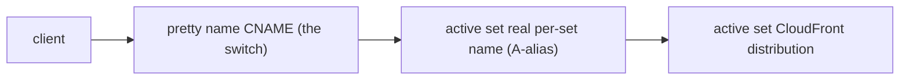
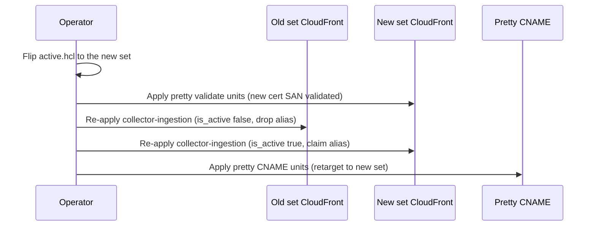

# DNS Cutover Runbook

A DNS cutover moves live traffic from one immutable instance set to another by retargeting a
single CNAME. You need this when you have stood up a new set and want to promote it (or roll a
promotion back). The whole cutover is driven by one config value -- `<env>/active.hcl` -- and
applied through Terragrunt; there are no manual `aws route53` edits.

For the concept (immutable sets, blue/green, the active switch) see
[instance-sets-architecture.md](instance-sets-architecture.md#the-active-switch). For the exact
add-a-set and revert commands see
[instance-set-operations.md](instance-set-operations.md#operation-1----add-a-new-set-the-copy-method).
This runbook is the DNS-layer detail: the records involved, the zone and credential boundary,
the apply order, and how to verify and roll back.

## The two name layers

Each public endpoint resolves through two layers. The lower layer is permanent and per-set; the
upper layer is the single movable switch.

- **Real per-set name** -- `collector-<set>.<service_apex>`.
  An A-alias record pointing at that set's own CloudFront distribution. It exists for every set
  simultaneously, never moves, and is owned by the set's `dns-collector` unit.
  Because it never moves, a set stays reachable on its own address before, during, and after a
  cutover.
- **Pretty name** -- `collector.<pretty_apex>`. A single
  CNAME, owned by the `_singletons/pretty` tier, that resolves to the active set's real per-set
  name. Retargeting this one CNAME is the cutover.



The pretty record is a name-to-name CNAME composed from `common/domains.json` plus
`<env>/active.hcl`, so it carries no dependency on the per-set DNS unit and can be retargeted on
its own.

## The switch: active.hcl

Promotion is a one-line change. `<env>/active.hcl` holds the active set number:

```hcl
locals {
  active = "000"
}
```

Every pretty-tier unit reads `env_active` from this file at plan time. The collector pretty
CNAME composes its target as:

```text
collector.<pretty_apex>   CNAME   collector-<env_active>.<service_apex>
```

Flipping `active` from `000` to `001` and re-applying the affected units retargets the CNAME,
moves the pretty CloudFront alias, and re-points the pretty-SAN certificate validation -- all
from the single value. No instance number is hard-coded anywhere.

## What the active flag controls

The flip propagates through three coupled pieces of state, each derived from `<env>/active.hcl`.

- **CloudFront pretty alias.** The `collector-ingestion` reference attaches the pretty alias to
  the active set's distribution only:

  ```hcl
  aliases = var.is_active ? [var.collector_service_fqdn, var.collector_pretty_fqdn] : [var.collector_service_fqdn]
  ```

  `is_active` is `true` when the set's own index equals `env_active`. A CloudFront alias is
  unique across distributions, so the old set must release the pretty alias before the new set
  can claim it -- this dictates the apply order below.
- **Pretty-SAN certificate validation.** Every set's certificate already carries the pretty
  FQDN as a subject-alternative name, so any set is ready to serve the pretty name. The
  `_singletons/pretty/validate-collector` unit writes the ACM validation
  CNAME for the active set's certificate into the config-derived zone.
- **Pretty CNAME.** `_singletons/pretty/collector` writes the CNAME that resolves
  the pretty name to the active set's real per-set name.

## Zone and credential boundary

Where the pretty records live -- and which account applies them -- depends on whether the pretty
apex differs from the service apex. This asymmetry is config-derived from `common/domains.json`,
so one unit serves both environments.

| Environment | `dns_service_apex` | `dns_pretty_apex` | Pretty records live in | Pretty tier applies as |
|-------------|--------------------|-------------------|------------------------|------------------------|
| sandbox | `sandbox.telemetry.example.com` | same as service apex | the env's own hosted zone | the env service account |
| prod | `prod.telemetry.example.com` | `telemetry.example.com` | the shared DNS-owner root zone | the DNS-owner account |

The rule is: the credential boundary follows the **zone owner**, not the environment class. Any
record written into the shared DNS-owner zone is applied by a unit whose provider pins
`allowed_account_ids` to the DNS-owner account, so a wrong-account caller fails fast before any
mutation. The numbered-set and `shared` tiers always run with the env service account. For how
the harness resolves and assumes the DNS-owner role, see
[terragrunt-operational-runbook.md](terragrunt-operational-runbook.md).

The cross-account `dns_owner/dns-delegation` unit -- which writes the env child zone's NS
records into the parent zone -- likewise runs with DNS-owner credentials. It is a once-per-env
singleton, not part of a cutover.

## Cutover procedure

A cutover assumes the new set is already stood up, healthy, and tested on its own per-set
address -- that is the add-a-set procedure in
[instance-set-operations.md](instance-set-operations.md#operation-1----add-a-new-set-the-copy-method).
The steps below move traffic onto it.



1. **Flip the switch.** Set `active` to the new set number in `<env>/active.hcl`.
2. **Validate the new set's pretty SAN.** Apply `_singletons/pretty/validate-collector`
   so the new active set's certificate validation covers the pretty name.
3. **Release the alias on the old set.** Re-apply the old set's `collector-ingestion`
   unit. With `is_active` now `false`, it drops the pretty alias from the old
   distribution, freeing it. The old set keeps serving its own per-set name.
4. **Claim the alias on the new set.** Re-apply the new set's `collector-ingestion`
   unit. With `is_active` now `true`, it attaches the pretty alias; CloudFront accepts it
   because step 3 released it.
5. **Retarget the CNAME.** Apply `_singletons/pretty/collector`. The pretty CNAME
   now resolves to the new set's per-set name. This DNS record is the cutover.

Order is binding: free the alias (step 3) before claiming it (step 4), and validate the SAN
(step 2) before the new set serves the pretty name. Apply the pretty-tier units with the
config-derived credentials from the table above.

## Verification

Use the maintained live-verification harness; it polls against readiness predicates within a
bounded budget and never sleeps as a synchronisation mechanism.

```bash
make live-verify CHECK=endpoints ENV=<env>
make live-verify CHECK=stack ENV=<env>
```

Valid `ENV` values are `sandbox`, `qa`, `prod`, and `root`; other `CHECK` values include
`observability`. The budget is driven by `LIVE_VERIFY_TIMEOUT` (default `1800` seconds) and
`LIVE_VERIFY_POLL_INTERVAL` (default `15` seconds), defined in `scripts/constants.py` and
overridable via environment variables.

After a cutover, confirm the pretty name resolves to the new set's per-set name and the per-set
name still answers:

```bash
dig +short collector.<pretty_apex>
dig +short collector-<new_set>.<service_apex>
```

The pretty CNAME's answer should be the new set's `collector-<new_set>.<service_apex>`. Because
the pretty CNAME carries a short TTL (300 seconds), resolvers pick up the change quickly.

## Rollback

Rollback is the same mechanism in reverse: point `<env>/active.hcl` back at the previous set
number and re-run the cutover procedure with old and new swapped. Because every set keeps its
own per-set name and certificate the whole time, the previous set is still standing until it is
explicitly retired, so a reverse cutover is non-destructive. The exact revert commands are in
[instance-set-operations.md](instance-set-operations.md#operation-2----revert-to-an-older-set).

No manual `aws route53 change-resource-record-sets` command is ever required for a cutover,
rollback, or teardown -- every record traces to exactly one Terragrunt unit.
