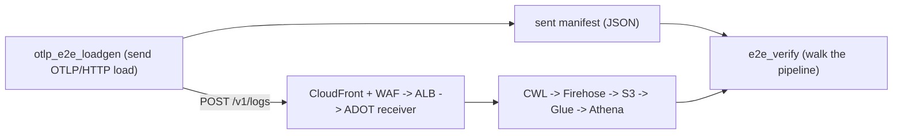
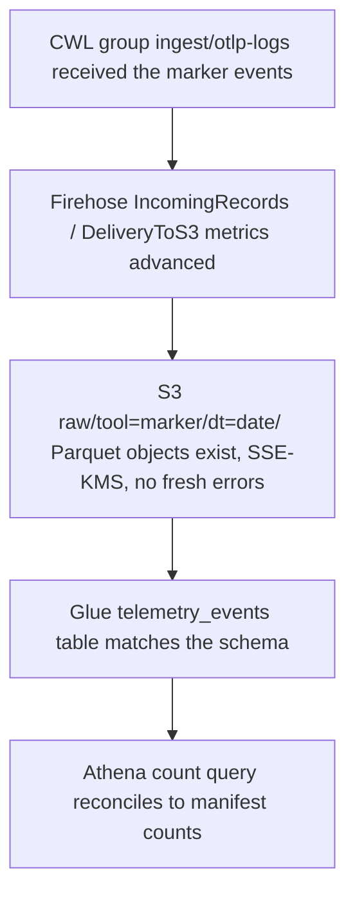

# OTLP End-to-End Test Harness

A standalone harness that exercises the deployed telemetry stack end to end:
it generates OTLP/HTTP traffic at the public collector edge, then verifies the
data flows through the full consumer pipeline (CloudWatch Logs to Firehose to
S3 to Glue to Athena). Reach for it when you want to
prove a freshly deployed (or changed) environment really ingests, lands, and
reconciles synthetic telemetry.

The common path is two commands against one environment:

```bash
make e2e-loadgen ENV=sandbox MODE=happy   # send traffic, write the manifest
make e2e-verify  ENV=sandbox              # walk the pipeline against that manifest
```

The harness imports nothing from any external CLI tool. Its synthetic event
taxonomy is derived from the Glue `telemetry_events` schema (see
[data-model.md](data-model.md)), and every record is tagged
`tool = "synthetic-e2e-<run-id>"` so all synthetic data is queryable and
cleanable by the `tool` partition prefix.

## How it fits together



The load generator and the verifier exchange exactly one artifact: the
**sent-manifest**. The load generator records what it sent; the verifier
reconciles what landed against it.

## Components

Two entry points plus one shared helper module, all under `scripts/`:

- `otlp_e2e_loadgen.py` builds OTLP `ExportLogsServiceRequest` messages (via the
  `opentelemetry-proto` package) whose `LogRecord` body is the JSON string the
  stack expects, encodes them as protobuf or OTLP/JSON, and POSTs them to
  `/v1/logs`. It emits a sent-manifest.
- `e2e_verify.py` consumes a manifest and asserts (read-only, active polling)
  that the records reached CloudWatch Logs, advanced the Firehose delivery
  metrics, landed as CMK-encrypted S3 Parquet, match the Glue table, and
  reconcile in Athena.
- `e2e_common.py` holds the shared helpers: ENV validation, account resolution
  from `accounts.json`, endpoint composition from `domains.json`, the run-marker
  and partition helpers, the bounded readiness polling, and the count
  reconciliation. The load generator uses the resolution and marker helpers; the
  bounded readiness polling and the count reconciliation are exercised only by
  the verifier.

The verifier is the AWS-calling script: it
resolves the target AWS account and profile per `--env` from
`terragrunt/common/accounts.json` (the `aws_profile` field equals the env name).
The load generator and the verifier compose the published collector
hostname per `--env` from `terragrunt/common/domains.json`. Resource names are never hardcoded:
the verifier discovers the Glue table by its schema,
the Firehose stream by its destination, and the Athena workgroup by name pattern.

`ENV` is one of `sandbox`, `prod`, `qa`.

## Make targets

```bash
make e2e-loadgen ENV=sandbox MODE=happy   # generate traffic + write the manifest
make e2e-verify  ENV=sandbox              # verify the consumer pipeline
make e2e-all     ENV=sandbox              # loadgen then verify (core round trip)
```

`e2e-all` chains `e2e-loadgen` then `e2e-verify` for the core data-plane round
trip.

Overridable make variables:

- `MODE` (default `happy`) selects the conformance mode for `e2e-loadgen`.
- `E2E_MANIFEST` (default `e2e-manifest-<env>.json`) is the manifest path written
  by `e2e-loadgen` and read by `e2e-verify`.
- `E2E_EVIDENCE` (default `e2e-evidence`) is the directory for verifier evidence.
- `E2E_LOADGEN_ARGS` forwards extra load-generator flags into the recipe
  (for example `--encoding json`, `--count`, `--concurrency`, or the
  `--resolve` / `--connect-to` edge-pinning flags below).

Manifests and the evidence directory are git-ignored.

## Conformance modes

`--mode` selects one conformance test. The load generator asserts every request
returns the status the mode expects, and exits non-zero if any request deviates:

| Mode | What it sends | Expected outcome |
| --- | --- | --- |
| `happy` | a valid small batch | `200` |
| `volume` | a large valid batch | `200` |
| `variety` | small, nested, unicode, control-character, and large payloads | `200` |
| `structured-events` | synthetic STRUCTURED Claude-style log records (`service.name=synthetic-claude-e2e`, data in `LogRecord` attributes) -- the collector's `logs/structured` raw_log=false route + the data-lake `cwl_split` reshape | `200` |
| `structured-metrics` | synthetic Claude-style OTLP Sum metrics posted to `/v1/metrics` (`service.name=synthetic-claude-e2e`) -- the collector's `metrics/structured` awsemf/EMF route + the data-lake `cwl_split` `_reshape_emf` (ADR 0031) | `200` |
| `oversize` | one body above the 4 MiB cap | `413` |
| `bad-content-type` | a valid body with a wrong `Content-Type` | rejected (`415` or `400`) |
| `malformed` | malformed protobuf/JSON bytes | `400` |
| `wrong-signal` | POST to `/v1/traces` | `404` (traces not ingested; `/v1/logs` and `/v1/metrics` are accepted signals) |
| `grpc-probe` | a TCP connect to port 4317 | no listener present |
| `waf-trigger` | an SQLi/XSS signature in the body | `403` |
| `rate-burst` | more than the per-IP WAF rate limit | some requests throttled (`403`/`429`) |

`happy`, `volume`, `variety`, `structured-events`, and `structured-metrics` produce
records that land in the data lake and therefore contribute counts the
verifier can reconcile. `structured-events` and `structured-metrics` are gated by the
registry-derived `structured_otlp_service_names` allowlist
(`terragrunt/common/tool-registry.json`, derived per
[onboarding-a-tool.md](onboarding-a-tool.md)) whose reserved `e2e-smoke` entry carries
the `synthetic-claude-e2e` marker -- an environment where no registry entry has
`service_names` skips both cleanly rather than failing (see the post-deploy gate in
`.github/workflows/terragrunt-apply.yml`). The remaining modes are negative or boundary
tests with nothing to reconcile.

Every request always carries a `User-Agent` header: the collector WAF blocks
requests with no User-Agent, so a UA-less request never reaches the receiver.

## The sent-manifest and reconciliation

`e2e-loadgen` writes a JSON manifest (`--manifest-out`) describing the run:
`run_id`, `env`, target endpoint, the synthetic `tool_marker`
(`synthetic-e2e-<run-id>`), the concrete `tool_values` accepted records carry,
the expected `dt` partitions, per-`(tool, event_type)` counts, sample record
hashes, and an HTTP status summary. Records are counted into the manifest only
when the receiver accepted them (`200` on `/v1/logs`).

`e2e-verify` reads that manifest and walks the pipeline:



The Athena reconciliation pins the `tool` partition with an exact equality
(`tool = ?`) or `IN (?, ...)` set so the scan is bounded to the marker
partitions it is verifying: the Glue table uses Athena enum partition projection
over a governed `tool` value set, so an unfiltered query would resolve every
governed partition and scan more than the run needs. The `tool_values` are bound
as native Athena query parameters, never string-interpolated. Because the
projection registers no physical catalog partition, the verifier proves
`tool=<marker>` data presence through this reconciliation query rather than by
enumerating Glue partitions. See [data-model.md](data-model.md) for the
projection details.

Probe statuses are `OK` (passed), `FAIL` (a hard pipeline assertion failed), and
`INFO` (a best-effort observation that never fails the run).

## Direct invocation and flags

The make targets wrap `uv run python -m scripts.<module>`. Invoke a script
directly when you need a flag the recipe does not surface.

Load generator (`scripts.otlp_e2e_loadgen`):

```bash
uv run python -m scripts.otlp_e2e_loadgen --env sandbox --mode happy --count 50 \
  --manifest-out e2e-manifest-sandbox.json
```

- `--env` (required) selects the environment and resolves the collector FQDN.
- `--endpoint` overrides the collector host.
- `--encoding` is `protobuf` (default) or `json`.
- `--count` records or requests (default `50`); `--concurrency` senders (default `4`).
- `--run-id` fixes the run id (and thus the `synthetic-e2e-<run-id>` marker).
- `--manifest-out` writes the manifest to a file (otherwise stdout only).
- `--resolve HOST:IP` (or `HOST:PORT:IP`) and `--connect-to` pin a specific
  CloudFront/ALB edge IP while keeping SNI and Host on the target host, which is
  useful while public DNS re-propagates.
- `--port` and `--user-agent` override the HTTPS port and the User-Agent header.

Verifier (`scripts.e2e_verify`) takes `--env`, `--manifest`, and an optional
`--output` evidence path.

`e2e-verify` requires `AWS_DEFAULT_REGION` to be set and fails fast
with an actionable message when it is not.

Exit codes are consistent across the entry points: `0` success, `1` a hard
failure (a deviating request, a failed probe, or an API error), and `2` a usage
error (unknown env, mode, manifest, or malformed flag).

## Tunable behaviour

All waits are active readiness polling over an env-driven, bounded budget;
there are no fixed sleeps. The relevant environment variables and their
defaults:

| Variable | Default | Effect |
| --- | --- | --- |
| `E2E_POLL_TIMEOUT` | `900` | Verifier readiness budget, seconds |
| `E2E_POLL_INTERVAL` | `15` | Verifier poll interval, seconds |
| `E2E_HTTP_TIMEOUT` | `30` | Load-generator request timeout, seconds |
| `E2E_HTTPS_PORT` | `443` | Collector edge HTTPS port |
| `E2E_ENVIRONMENT_INSTANCE` | `000` | Env-instance segment for service FQDNs |
| `E2E_USER_AGENT` | derived from `VERSION` | User-Agent header sent on every request |

## Related docs

- [architecture.md](architecture.md) for the end-to-end system the harness exercises.
- [data-model.md](data-model.md) for the event schema, the `tool` projection, and Athena query patterns.
- [sending-telemetry.md](sending-telemetry.md) for the producer-side endpoints and event shape.
- [onboarding-a-tool.md](onboarding-a-tool.md) for registering a new tool in the tool registry.
- [../README.md](../README.md) for the project hub and quickstart.
