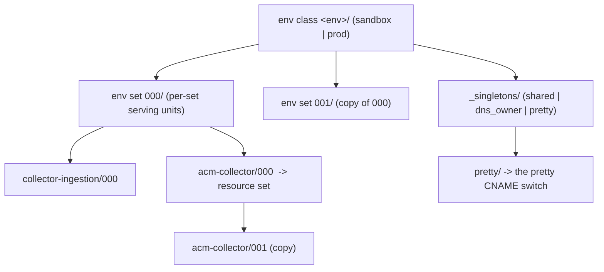
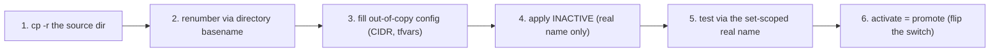
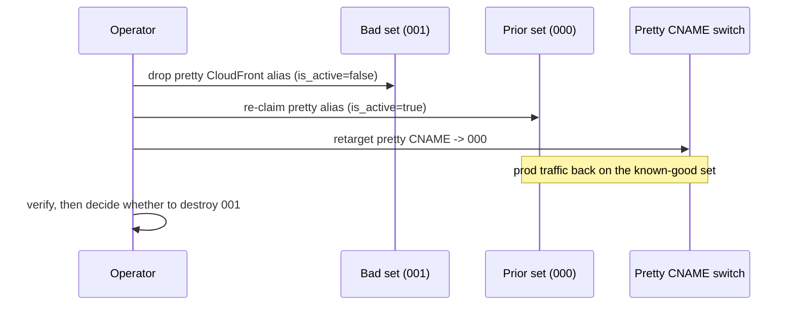

# Instance-Set Operations Runbook

What this is: the step-by-step procedure for the two everyday instance-set lifecycle
operations -- **adding** a new immutable set via the copy method, and **reverting** to an older
set when a change breaks. It covers both serving env classes (`sandbox` and `prod`) and all
three copy granularities (new env, new env set, new resource set).

When you need it: standing up a candidate set before a cutover, or rolling traffic back to a
known-good set after a bad promote.

For the concepts behind these procedures -- why sets are immutable, the 6-field namespace, the
singleton vs per-set split, and the active-switch model -- read
[instance-sets-architecture.md](instance-sets-architecture.md) first. For the DNS/ACM mechanics
of a cutover (the two-step CloudFront alias move, bounded-poll verification), see
[dns-cutover-runbook.md](dns-cutover-runbook.md). For day-2 apply/destroy/copy mechanics and the
fail-fast error catalog, see
[terragrunt-operational-runbook.md](terragrunt-operational-runbook.md).

## The one rule that governs everything here

A set is **immutable**. You never edit a live set in place. Every change -- a new collector
image, a new VPC layout, a new cert -- is a brand-new numbered set stood up alongside the
current one. Traffic moves between sets by flipping a single pointer (the pretty CNAME and the
`active.hcl` file), and it moves back the same way. Reverting is therefore a **traffic flip to a
set that still exists**, never an in-place mutation or a state rollback.

## Two levels of set, two copy granularities

The tree carries instance sets at two levels. An operation targets exactly one of them.

| Level | Directory shape | What a copy reproduces |
|-------|-----------------|------------------------|
| Env set | `<env>/000`, `<env>/001`, ... | every per-set serving unit (collector-ingestion, acm-collector, acm-validate-collector, dns-collector) for the whole env |
| Resource set | `<env>/<set>/<service>/000`, `.../001`, ... | a single service unit's deployment, swapped in isolation while the rest of the set stays put |

A third, coarser granularity stands up a whole new **env class** (e.g. a brand-new `prod` from
`sandbox`); it copies the `_singletons` tier too, because a new environment needs its own zone,
roles, and data store.



The `_singletons` tier (`shared`, `dns_owner`, `pretty`) is a **sibling** of the numbered env
sets, never inside one. That placement is what makes `cp -r <env>/000 <env>/001` copy only the
per-set serving units: the singletons -- data-lake, identity, observability, the
hosted zone, the pretty switch -- are not swept, so they stay single per env and every set
shares them. See [instance-sets-architecture.md](instance-sets-architecture.md) for the full
singleton list and the contiguous-history rationale.

## Why a copy is collision-free

Every name-bearing resource is derived from the unit's **namespace**, and the namespace is the
unit's position in the directory tree:

```text
telemetry-useast1-<env>-<env_instance>-<service>-<service_instance>
```

When you `cp -r <env>/000 <env>/001`, the fourth field (`env_instance`) changes from `000` to
`001` for every copied unit, so every derived bucket, IAM role, KMS alias, log group, target
group, and CloudFront distribution gets a distinct name automatically. When you
`cp -r <service>/000 <service>/001`, the sixth field (`service_instance`) changes the same way.
No name is hardcoded and no name is shared, so the new set coexists with the old one with zero
collisions -- you renumber a directory, and the namespace does the rest.

The single exception is the per-set VPC CIDR: a collector-ingestion unit creates a VPC, and its
CIDR is not derivable from the namespace, so it is authored in `terragrunt/common/networks.json`
keyed by the unit's canonical namespace. A new env set that includes collector-ingestion needs a
new, non-overlapping CIDR row added there before apply, or the unit fails fast (see
[terragrunt-operational-runbook.md](terragrunt-operational-runbook.md), the missing-CIDR error).

## Operation 1 -- Add a new set (the copy method)

The pattern is identical at all three granularities: copy, renumber by directory, fill in the
out-of-copy config, deploy the new set **inactive** (it serves only its own set-scoped real
name), test it through that real name, then activate it with a promote. The new set never touches
the active set during stand-up.



### 1a -- Add a new env set (e.g. prod/000 -> prod/001)

Use this when you need a fresh full copy of the serving plane for an env -- a new collector
image, a VPC change, a cert change.

1. Copy the active env set to the next number, singletons untouched:
   `cp -r terragrunt/live/telemetry/us-east-1/prod/000 terragrunt/live/telemetry/us-east-1/prod/001`.
2. Renumbering is automatic -- the new directory basename `001` becomes the `env_instance` field
   for every copied unit, so all namespaces (and thus all resource names) shift to the `001` set.
   Nothing inside the copied files needs a hand-edit for naming.
3. Add a new `networks.json` CIDR row for the `001` collector-ingestion namespace
   (`telemetry-useast1-prod-001-collector_ingestion-000`) with a CIDR that does not overlap any
   live set. Apply any other out-of-copy `terraform.tfvars` changes that are the point of the new
   set (the new image tag, the new sizing).
4. Leave `prod/active.hcl` pointing at the old set (`active = "000"`). Apply the new set. Because
   `is_active = (environment_instance == <env>/active.hcl)` evaluates false for `001`, the new
   set comes up serving **only** its own real name `collector-001.<service_apex>` and does NOT
   claim the pretty alias. The active set keeps serving production. Use the standard two-pass
   apply from [terragrunt-operational-runbook.md](terragrunt-operational-runbook.md).
5. Test the candidate through its real per-set name (`collector-001.<service_apex>`).
   A health/smoke check against the real name validates the set
   without pushing production-shaped traffic into the shared data-lake.
6. Activate by promoting -- flip `prod/active.hcl` from `000` to `001` and run the two-step
   CloudFront alias move and pretty-CNAME retarget. The full promote sequence (drop the alias on
   the old set, claim it on the new set, retarget the CNAME, with bounded-poll verification)
   lives in [dns-cutover-runbook.md](dns-cutover-runbook.md).

### 1b -- Add a new resource set (e.g. one unit, acm-collector/000 -> 001)

Use this for a surgical swap of a single unit inside an existing env set, without rebuilding the
whole set.

1. Copy the service unit's instance directory:
   `cp -r .../prod/000/acm-collector/000 .../prod/000/acm-collector/001`.
2. The new `001` directory basename becomes the `service_instance` field (the sixth namespace
   field), so the unit's resources renumber automatically. Edit the copied `terraform.tfvars` for
   whatever the new resource set changes.
3. Leave the unit's own `acm-collector/active.hcl` pointing at `000`. Apply the new instance; it
   stands up alongside `000` with distinct names.
4. After verification, flip that unit's `active.hcl` from `000` to `001`. Dependent units resolve
   the instance through the active pointer, so the rest of the set picks up the new resource set
   on the next apply -- the same pointer mechanism as the env-set promote, applied one level
   deeper.

### 1c -- Add a whole new env class (e.g. sandbox -> a new prod)

Use this only to bootstrap an environment that does not yet exist.

1. Copy the env directory including its singletons:
   `cp -r .../us-east-1/sandbox .../us-east-1/prod`. This sweeps `_singletons` too, which is
   correct -- the new env needs its own hosted zone, identity, data store, and pretty switch.
2. The env directory basename (`prod`) becomes the `env` field for every unit. The AWS account,
   DNS apexes, and pinned-vs-local module sourcing are resolved from `common/*.json` by env
   class, not from the path, so the copied tree targets the new account automatically. The
   foundation (state backend + OIDC roles + the env hosted zone under `bootstrap/<role>_role`)
   must already exist for that account; see [bootstrap-runbook.md](bootstrap-runbook.md) and the
   new-env-class copy scenario in
   [terragrunt-operational-runbook.md](terragrunt-operational-runbook.md).
3. From here the per-set stand-up is exactly Operation 1a for the new env's first set (`000`).

## Operation 2 -- Revert to an older set

Reverting is the safety property the immutable-set model buys you. Because the prior set was
never mutated and its real per-set names never moved, it is still fully deployed and reachable.
Reverting is a **traffic flip back to that existing set**, not a redeploy, not a `terraform`
state rollback, and never an in-place edit.



### 2a -- Revert at the env-set level

1. Confirm the prior set still exists in the tree and is applied (its real name
   `collector-000.<service_apex>` answers). Do not delete it -- that is what you are reverting
   to.
2. Flip `<env>/active.hcl` back to the prior set (`active = "000"`).
3. Run the two-step alias move in reverse: drop the pretty alias from the bad set
   (now `is_active=false`), re-claim it on the prior set (now `is_active=true`), then retarget
   the pretty CNAME to the prior set. This is the promote sequence with old/new swapped -- the
   exact steps and verification are in [dns-cutover-runbook.md](dns-cutover-runbook.md).
4. Verify the pretty apex resolves to the prior set and serves correctly
   (`make live-verify CHECK=endpoints ENV=<env>`; see the cutover runbook for the bounded-poll
   probes).
5. Decide on the bad set: keep it for diagnosis, or retire it with a scoped
   `run --all destroy` of only its set directory once burn-in confirms the revert. Retiring is
   optional and independent -- the revert is already complete after step 4. The singletons and
   the contiguous data-lake history are untouched throughout.

### 2b -- Revert at the resource-set level

1. Confirm the prior service instance (e.g. `acm-collector/000`) is still applied.
2. Flip that unit's `active.hcl` back from `001` to `000`.
3. Re-apply the dependents that resolve the instance through the pointer. Because the prior
   instance was never destroyed, this is a pointer flip, not a rebuild.
4. Verify, then optionally destroy the bad instance directory.

## What revert is not

- Not an in-place mutation -- you never edit the bad set's resources to "undo" a change.
- Not a `terraform state` import or rollback -- restructuring is always destroy + recreate, and
  reverting needs neither because the prior set is already deployed.
- Not a manual DNS edit -- every record (real per-set names, the pretty CNAME, ACM validation)
  is IaC-managed; the flip is `active.hcl` plus a terragrunt apply, never an
  `aws route53 change-resource-record-sets` call. See
  [dns-cutover-runbook.md](dns-cutover-runbook.md).

## Quick reference

| Goal | Copy | Renumbered field | Activate / revert pointer |
|------|------|------------------|---------------------------|
| New env set | `cp -r <env>/000 <env>/001` | `env_instance` (4th) | `<env>/active.hcl` |
| New resource set | `cp -r <svc>/000 <svc>/001` | `service_instance` (6th) | `<svc>/active.hcl` |
| New env class | `cp -r sandbox prod` | `env` (3rd) | first set via env-set flow |

Related: [instance-sets-architecture.md](instance-sets-architecture.md) (concepts),
[dns-cutover-runbook.md](dns-cutover-runbook.md) (cutover mechanics),
[terragrunt-operational-runbook.md](terragrunt-operational-runbook.md) (apply/destroy/copy
scenarios and error catalog).
