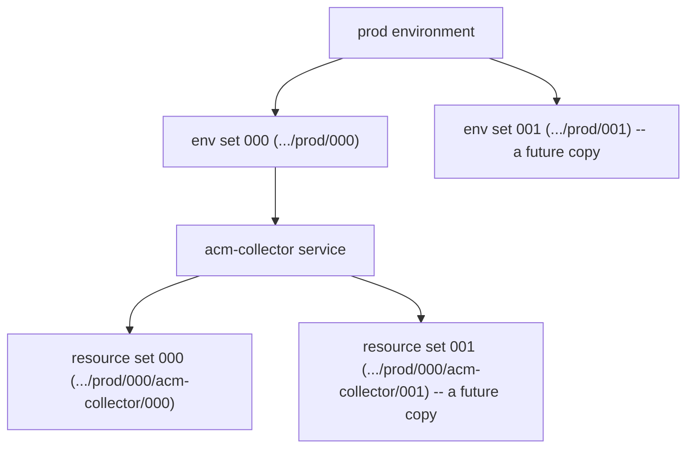
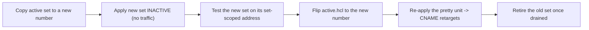

# Instance-Set Architecture

`telemetry-platform` deploys its serving infrastructure as **immutable, numbered instance
sets**. A change is never an in-place edit of a live set; it is a brand-new set deployed
alongside the old one, tested while inactive, then made live by flipping a single switch.
This document explains the concept at both levels and how the switch yields zero-downtime
cutovers.

Read this when you need to understand *why* the live tree carries numbered directories like
`000`, what may and may not be edited in place, and how traffic moves from one set to the
next. For the step-by-step commands to add or revert a set, see
[instance-set-operations.md](instance-set-operations.md). For the terminology (namespace,
leaf unit, singleton, scope hierarchy) see [terragrunt-concepts.md](terragrunt-concepts.md).

## Two levels of set

Numbered sets exist at two nested levels of the live tree. Both are immutable; they differ
only in blast radius.

| Level | Path example | What it is | Active switch |
|-------|--------------|------------|---------------|
| Environment set | `.../us-east-1/prod/000` | A full, independently deployable copy of every per-set serving unit (collector, ACM, DNS records) for one environment | `<env>/active.hcl` |
| Resource set | `.../us-east-1/prod/000/acm-collector/000` | One numbered instance of a single service inside an environment set | `<service>/active.hcl` |



The fourth namespace field carries the environment-set number and the sixth field carries
the resource-set number, so every resource a set owns is named distinctly from its siblings.
Two sets at either level therefore coexist with zero name collisions — that property is what
makes side-by-side deployment possible. See
[terragrunt-concepts.md](terragrunt-concepts.md) for the full namespace derivation.

## Immutability

A live set is never mutated. Once a set is applied and serving, its leaf units are treated as
frozen artifacts:

- To change configuration or a module version, stand up a **new** numbered set; do not edit
  the running one.
- Each set owns its own set-scoped resources — its own ACM certificate, CloudFront
  distribution, ALB, ECS service, and DNS records — so a new set is built without touching any
  resource the old set depends on.
- Rollback is achieved by re-pointing the active switch at a previous set, not by reverting
  edits inside a running set.

This is the immutable-deployment posture applied to the live tree: deployments replace whole
instances rather than patching them, which removes configuration drift and makes every cutover
and rollback a single, reversible switch flip.

## Long-lived versus destroyable resources

Not everything in an environment is part of a numbered set. The tree separates resources that
are replaced with each set from resources that must outlive any individual set.

| Class | Where it lives | Lifecycle |
|-------|----------------|-----------|
| Destroyable (per-set) | numbered env sets and resource sets — collector-ingestion, ACM, DNS records | Created new per set; retired when the set is retired |
| Long-lived (singleton + foundation) | `_singletons/shared`, `_singletons/dns_owner`, `_singletons/pretty`, and the `bootstrap` tier | Exist once per environment; survive every set swap |

The long-lived tier holds the resources a cutover must not disturb:

- `_singletons/shared` — the env-wide units every set consumes: `data-lake`, `identity`,
  `observability`, `cloudfront-logs`, and
  `vpc-flow-logs`. The last two are shared logging destinations the collector unit wires in by
  input: `cloudfront-logs` supplies the CloudFront access-log bucket and `vpc-flow-logs`
  supplies the VPC Flow Logs delivery role and destination. Because the data lake (the Firehose
  delivery stream and its S3 bucket) also lives here, the collector unit in every set receives
  the delivery-stream ARN as an input and writes into the same lake. Swapping the collector set
  therefore never moves or drops ingested data.
- `_singletons/dns_owner` — the cross-account `dns-delegation` unit.
- `_singletons/pretty` — the friendly, human-facing apex names that *point at* whichever set
  is active (covered next).
- `bootstrap` — the state backend, OIDC apply roles, and hosted-zone foundation, created
  before any service tree.

See [terragrunt-concepts.md](terragrunt-concepts.md) for the singleton-tier and bootstrap-role
taxonomy.

## The active switch

Promotion is driven by tiny `active.hcl` files, each holding one value:

```hcl
locals {
  active = "000"
}
```

There is one at the environment level (`<env>/active.hcl`) and one per service inside a set
(`<service>/active.hcl`). Units read these files at plan time to resolve which set is live —
no instance number is ever hard-coded.

The `_singletons/pretty` tier turns the switch into a traffic cutover. The pretty CNAME unit
for the collector composes its record entirely from configuration plus `<env>/active.hcl`:

```text
collector.<pretty_apex>   CNAME   collector-<env_active>.<service_apex>
```

`env_active` is read from `<env>/active.hcl`. The friendly name `collector.<pretty_apex>` is a
stable address that clients use; it resolves to the active set's own set-scoped record. The
pretty record is a name-to-name CNAME, so it carries no dependency on the per-set DNS unit and
can be retargeted independently. The same pattern covers the pretty-SAN
ACM validation.

## Set lifecycle



1. **Deploy inactive.** Copy the active set to the next number and apply it. The new set comes
   up fully — its own certificate, CloudFront, ALB, ECS service, and set-scoped DNS records —
   while the pretty names still point at the old set. No client traffic reaches it yet.
2. **Test.** Exercise the new set on its own set-scoped address before any cutover.
3. **Flip the switch.** Change `active.hcl` to the new number.
4. **Retarget traffic.** Re-apply the pretty unit. The CNAME now resolves
   `collector.<pretty_apex>` to the new set's record, and clients follow DNS to the new set.
5. **Retire.** Once the old set is drained, destroy it. Its set-scoped resources are removed
   without affecting the active set or the long-lived tier.

## Promotion and zero-downtime

Because the new set is already applied, healthy, and tested before the switch flips, the
cutover is a single DNS retarget rather than a rebuild of running infrastructure. The friendly
address never goes down; only the set it points at changes. The CNAME carries a short TTL
(300 seconds), so resolvers pick up the new target quickly and the change is reversible by
flipping `active.hcl` back — the previous set is still standing until it is explicitly retired.

This is the blue/green property of the design: two complete sets coexist, traffic moves
atomically at the DNS layer, and rollback is the same one-line switch in reverse. The
resource-set level works identically inside a set — a dependent unit resolves its upstream
through `<service>/active.hcl`, so a single service can be re-cut without rebuilding the whole
environment set.

## Reverting

Reverting to an earlier set is the same mechanism run backward: point `active.hcl` at the
older number and re-apply the pretty unit. No edits are made inside any set. The exact
commands for both adding a new set and reverting at either level are in
[instance-set-operations.md](instance-set-operations.md).

## Related documentation

- [instance-set-operations.md](instance-set-operations.md) — step-by-step add and revert
  procedures (the copy method, the switch flip, retirement).
- [terragrunt-concepts.md](terragrunt-concepts.md) — namespace, scope hierarchy, singleton
  tiers, and leaf-unit terminology.
- [contributing.md](contributing.md) — the dev-to-prod SDLC, including when a change is an
  in-place edit versus a new immutable set.
- [../README.md](../README.md) — documentation hub and quickstart.
