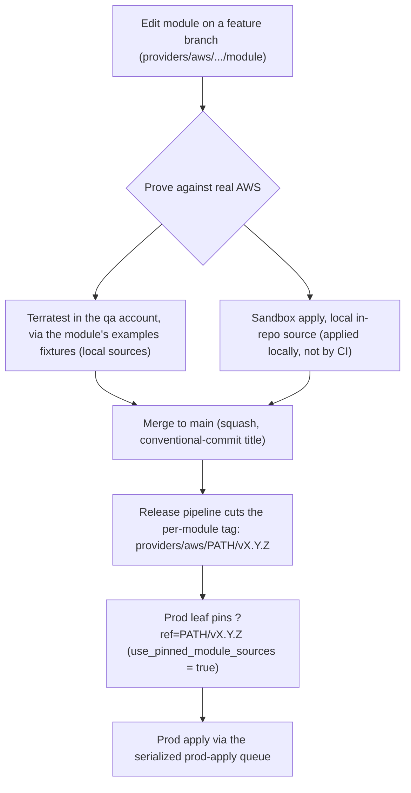

# Module promotion flow

A change to an in-repo Terraform module reaches production in three moves: it is
**proven** against real AWS, **released** as a per-module semantic-version tag, and then
**pinned** by the production Terragrunt leaves. Read this when you edit a module under
`providers/aws/` and need to know what carries that change all the way to prod.

This page is the map of the journey. The mechanics live next door: the dev-local vs
prod-pinned sourcing model is in [terraform-module-sourcing.md](terraform-module-sourcing.md),
the tagging and CI machinery is in [release-pipeline.md](release-pipeline.md), and the
vocabulary (leaf, env set, namespace) is in
[terragrunt-concepts.md](terragrunt-concepts.md).

## The promotion model

Two facts shape the entire flow:

- In-repo modules live at `providers/aws/primitives/<module>` and
  `providers/aws/references/<module>`; a reference composes primitives.
- Each Terragrunt account resolves `use_pinned_module_sources` from
  `terragrunt/common/env_accounts.json`. When the value is `false`, a leaf sources the
  in-repo module by relative path via `get_repo_root()`; when `true`, a leaf pins an
  immutable git tag with `?ref=`. Today the values are: `qa = false`, `sandbox = false`,
  `prod = false` — see the note below.

The consequence: **only prod consumes a released tag.** The `qa` and `sandbox` accounts run
the module straight from the working tree. That is exactly what lets a change be proven
before any release tag exists.

**Prod is not pinned yet.** No `providers/**/v<semver>` tag has been published from this
repository (the first release is `0.1.0`), so the tags the prod leaves pin do not exist and a
`prod = true` toggle would fail every prod `terragrunt init` with "module not found". `prod` is
therefore `false` in `terragrunt/common/env_accounts.json` until this flow has cut the tags the
prod leaves reference; flipping it back is a one-line change in that file, with no leaf edits.

## Promotion sequence



## Step by step

### Edit and prove

A module under `providers/aws/primitives/<m>` or `providers/aws/references/<m>` is changed on
a feature branch. While it is being developed it sources every in-repo child module through
its relative-path default, so it builds and runs with no released tag (see
[terraform-module-sourcing.md](terraform-module-sourcing.md)).

The change is proven against real AWS two ways, neither of which needs a tag because both run
the working-tree source:

- **Terratest in the `qa` account.** The module is exercised by its own Terratest suite
  driven through its `examples/` fixtures. This is the terratest bed: it stands the module
  up, asserts, and tears it down, proving the module's code rather than a pin.
- **Sandbox apply.** The `sandbox` account (`use_pinned_module_sources = false`) applies the
  in-repo module directly. Sandbox units are applied locally, never by CI, so the working
  tree is what runs there.

### Release the per-module tag

Once the change lands on `main`, the release pipeline derives the semantic-version bump from
the conventional-commit subject of the squash merge and cuts a per-module tag of the form
`<module_path>/vX.Y.Z` (for example `providers/aws/primitives/route53-record/v1.0.2`), then
creates the matching GitHub release. The release pipeline is the only path to a pinnable
version; a manually created tag bypasses the validation chain and is not used. Full mechanics
and the merge-method requirement are in [release-pipeline.md](release-pipeline.md).

### Prod pins the release

Production is the one environment that consumes the released tag. Once the `prod` account
resolves `use_pinned_module_sources = true` (it is `false` until the tags exist — see above),
its leaves reference the immutable URL — for example:

```hcl
source = "git::https://github.com/matthew-dresden/telemetry-platform.git//providers/aws/primitives/route53-record?ref=providers/aws/primitives/route53-record/v1.0.2"
```

A prod apply against a tag that the release pipeline has not published fails loudly at
`terraform init`, so prod can only ever run a version that was actually released. Prod applies
run through a single serialized queue gated by a protected environment; that queueing is
described in [release-pipeline.md](release-pipeline.md).

## Upgrading a deployed stack to a new module version

Cutting a new tag does not move any running environment on its own — a deployed stack
adopts a new version only when an apply runs against it. There are two ways to make that
move, and the choice is whether the change can be updated in place or should replace the
running resources.

### In-place (mutable) upgrade

Re-point the leaf at the new tag and apply; Terraform updates the existing resources in
place.

- Bump the leaf's pinned `?ref=` to the new `<module_path>/vX.Y.Z` in the `prod` account.
  In `qa` / `sandbox` (`use_pinned_module_sources = false`) there is no pin to bump — the
  already-updated working tree applies directly.
- Apply. Prod runs through the serialized prod-apply queue; day-2 apply mechanics and the
  safety checks are in
  [terragrunt-operational-runbook.md](terragrunt-operational-runbook.md).

Use this for safe in-place updates — configuration, additive, or otherwise
non-traffic-affecting changes that Terraform can modify without recreating the
traffic-serving path.

### Immutable (new-instance-set) upgrade

Stand up a new numbered instance set on the new version, prove it while it serves no
traffic, flip traffic to it, then retire the old set — no running set is mutated.

- Copy the current set to a new numbered set pinned to the new version, deploy it inactive,
  test it, activate it (CNAME / `active.hcl`), and retire the old set. The exact copy /
  activate / revert steps live in
  [instance-set-operations.md](instance-set-operations.md); the immutability model and the
  zero-downtime rationale are in
  [instance-sets-architecture.md](instance-sets-architecture.md).

Use this when the upgrade is traffic-affecting, structurally destructive, or must be
zero-downtime — anything you would not want applied in place to the live set.

### Which to use

The in-place-vs-immutable decision rule, and how it maps to each code scope, lives once in
the contributing guide — see [contributing.md](contributing.md). This page defers to it
rather than restating it.

## Exceptions to the pin

Two parts of the tree do not pin a released tag, by design:

- **Bootstrap units stay on local sources.** Leaves whose path contains a `bootstrap`
  segment always source their module through `get_repo_root()`, even in the prod account.
  They create the S3 state backend on first account bring-up, before any release tag exists,
  so there is nothing to pin against. See the bootstrap carve-out in
  [terraform-module-sourcing.md](terraform-module-sourcing.md).
- **External `terraform-modules` sources stay pinned literals.** Modules sourced from the
  upstream `matthew-dresden/terraform-modules` repository (for example `budget`) are always
  hardcoded immutable `?ref=` URLs regardless of the toggle, because they live on a separate
  release cadence outside this repository.

## See also

- [terraform-module-sourcing.md](terraform-module-sourcing.md) — the const-source variables
  and the `use_pinned_module_sources` toggle that this flow depends on.
- [release-pipeline.md](release-pipeline.md) — how tags are cut and how prod applies are
  serialized.
- [terragrunt-concepts.md](terragrunt-concepts.md) — terminology: leaf, env set, namespace.
- [../README.md](../README.md) — documentation hub.
