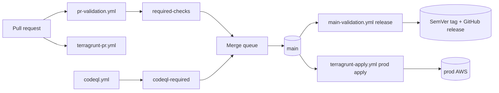
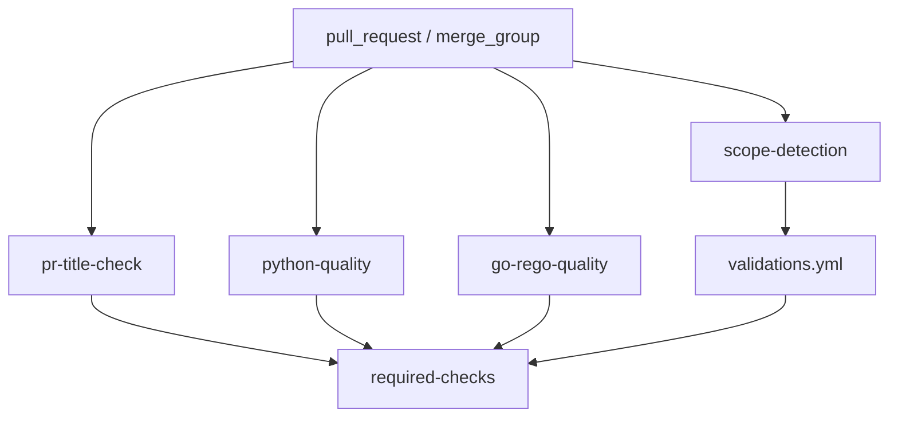
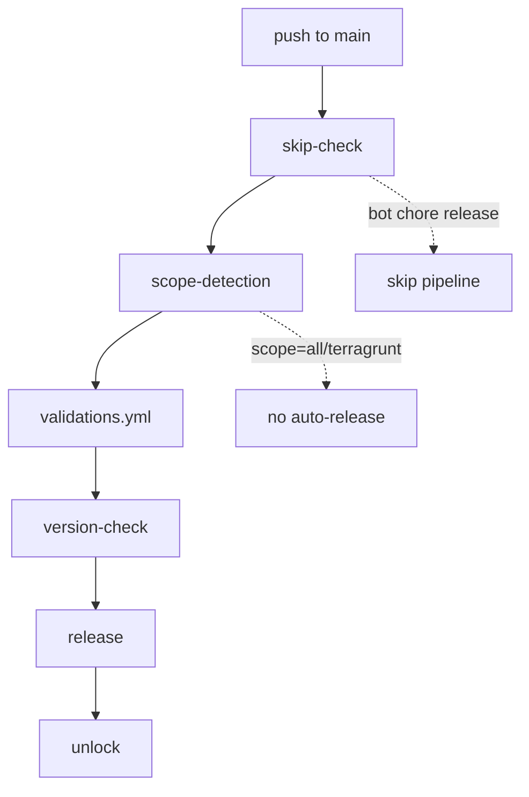
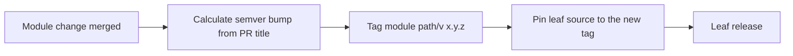
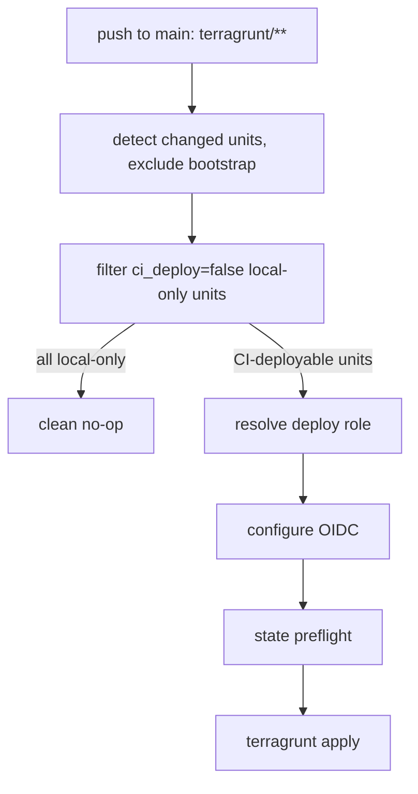
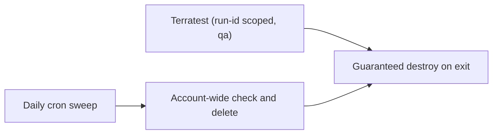
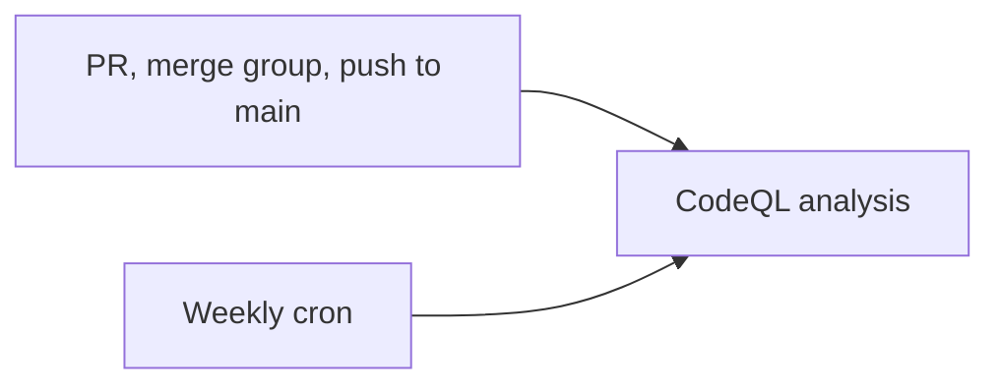
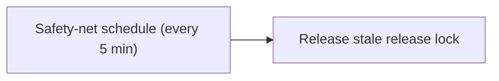

# CI/CD and release pipeline

The canonical reference for every GitHub Actions workflow in this repository:
how a pull request is validated, how a merge to `main` cuts a SemVer release,
how Terragrunt changes are planned and applied, and the branch-protection and
merge-queue policy that ties it together. Start here when a check is failing,
when a release tag did not publish, or when setting the repository up in a new
org.

For terminology (module taxonomy, scope hierarchy, namespacing, instance sets)
see [terragrunt-concepts.md](terragrunt-concepts.md). For the dev-to-prod
contribution flow that drives these workflows see
[contributing.md](contributing.md).

## Workflows at a glance

| Workflow | Trigger | Purpose |
|---|---|---|
| `pr-validation.yml` | `pull_request` + `merge_group` | PR-title conventional-commit check, scope detection, quality gates, the shared validations, and the `required-checks` aggregate. |
| `terragrunt-pr.yml` | `pull_request` under `terragrunt/**` | Per-account, change-scoped `terragrunt validate` + `plan`. |
| `main-validation.yml` | `push` to `main` | The release pipeline: skip-check, scope detection, validations, version check, release, unlock. |
| `terragrunt-apply.yml` | `push` to `main` under `terragrunt/**`, plus `workflow_dispatch` | Change-scoped `terragrunt apply` for the CI-deployable accounts, gated by the `prod-apply` environment. |
| `validations.yml` | `workflow_call` | Reusable gate suite shared by PR and release runs. |
| `terratest-sweep.yml` | `schedule` (daily) + `workflow_dispatch` | Account-wide delete of orphaned terratest resources in the QA account. |
| `codeql.yml` | `pull_request` + `merge_group` + `push` + weekly `schedule` | CodeQL static analysis; produces the `codeql-required` aggregate check. |
| `safety-net.yml` | `schedule` (every 5 minutes) + `workflow_dispatch` | Fail-closed watchdog that releases a stale release lock. |

Most steps that do real work invoke a `make <target>`, which keeps the build
logic in the Makefile rather than inline in YAML. The non-`make` steps are the
shared actions — `actions/checkout`, the `setup-tools` bootstrap,
`actions/create-github-app-token`, and `aws-actions/configure-aws-credentials`
(OIDC) — plus a few inline `bash` glue steps that wire the runner environment
for those `make` targets: configuring git auth for in-repo pinned module
fetches, freeing runner disk before per-unit provider installs, and exporting the
primary CI account id for cross-account role assumption. Action SHAs are pinned to a
40-character commit with a trailing version comment.



## Pull-request validation

`pr-validation.yml` runs on every `pull_request` to `main` and on every
`merge_group` event (the merge queue's speculative ref). It produces the
`required-checks` aggregate that branch protection requires.



### Jobs

- `pr-title-check` — validates the PR title is a conventional commit and maps it
  to a SemVer bump. Skipped on `merge_group` (the payload carries no PR title,
  which is immutable metadata already validated on the PR).
- `scope-detection` — classifies the diff into exactly one change scope and
  emits the affected module path(s).
- `python-quality`, `go-rego-quality` — language quality gates (format, lint,
  type-check, security, coverage).
- `validations` — the reusable [validations.yml](#shared-validations) gate suite.
- `required-checks` — aggregates the results of all of the above into a single
  stable status context. A skipped required `need` counts as a pass.

### Conventional-commit title to SemVer bump

`make validate-pr-title` parses `type(scope)!: subject`. The bump is derived
from the type and the optional breaking-change marker:

| Trigger | Bump | Commit types |
|---|---|---|
| Breaking-change marker `!` | major | any type with `!` |
| Feature types | minor | `feat`, `perf`, `build`, `ci`, `revert`, `release`, `meta`, `module` |
| Fix / maintenance types | patch | `fix`, `chore`, `docs`, `style`, `refactor`, `test` |

The bump is taken from the **first line** of the commit subject, so a multi-line
body is fine. A `Merge pull request #N ...` subject is not conventional-commit
form and fails version derivation — see [Merge method](#merge-method).

### Scope detection

`make scope-detect` classifies the changed-file set into exactly one scope. A PR
that spans more than one scope fails fast.

| Scope | Meaning |
|---|---|
| `module` | Changes under one module leaf in `providers/aws/**`. |
| `terragrunt` | Changes under the `terragrunt/` live tree. |
| `config` | Repo-wide config (anything outside a single module leaf or the live tree). |
| `all` | A deliberate multi-module batch, valid only via an authorized override (below). |

A change touching more than one module leaf, or mixing scopes, is rejected. The
deliberate exception is the `detect-scope-override` label, which an organization
admin applies to authorize a `scope=all` batch; the authorization is resolved
fail-closed against org membership (`make check-scope-override` on the PR,
`make check-mq-scope-override` on a merge-group ref).

## Merge queue and branch protection

Merges to `main` are governed by two coexisting layers.

- A **classic branch-protection rule** on `main`, kept minimal with
  enforce-admins disabled. Its only role is the release lock — see
  [Branch lock](#branch-lock). It carries no required checks.
- A **repository ruleset** named `main-protection` (target `refs/heads/main`,
  enforcement `active`) that enforces the merge policy.

### The `main-protection` ruleset

| Rule | Configuration | Effect |
|---|---|---|
| `pull_request` | `required_approving_review_count: 0`; all merge methods allowed | A PR is required (no direct human pushes), with zero required approvals. |
| `required_status_checks` | `strict_required_status_checks_policy: false`; contexts `required-checks` and `codeql-required` | A PR merges only after both aggregate checks report success. `strict = false` avoids forcing branches up to date. |
| `non_fast_forward` | — | Blocks force-pushes / history rewrites of `main`. |
| `deletion` | — | Blocks deletion of `main`. |
| `merge_queue` | `merge_method: SQUASH`, `grouping_strategy: ALLGREEN`, `min_entries_to_merge: 1`, `max_entries_to_merge: 1`, `max_entries_to_build: 5` | PRs land only through the GitHub Merge Queue, exactly one per push to `main`. |

Bypass actors (`bypass_mode: always`) bypass every rule in the ruleset,
including `merge_queue`:

- The **release-bot GitHub App** (`actor_type: Integration`) — the
  release bot pushes the `chore(release)` commit and
  tag directly to `main` via its installation token. Without this bypass that
  direct push (no PR) would be rejected and every release would fail. This is the
  single most important entry in the ruleset.
- **Organization admins** (`actor_type: OrganizationAdmin`) — an admin retains a
  direct merge/push path and can land an urgent fix even if a check is wedged.

Resolve the App id from `gh api repos/<owner>/<repo>/installation` (it is the
App **integration** id, not the `github-actions[bot]` user id).

### How the merge queue behaves

GitHub serializes ready PRs into a strict FIFO, validates each on a speculative
`gh-readonly-queue/main/pr-<n>-<sha>` ref via a `merge_group` event, and merges
an entry only once every required check passes on that ref (`ALLGREEN`).

- **One PR per push to `main`.** `max_entries_to_merge: 1` lands exactly one PR
  per push. This preserves the per-PR release model: `main-validation.yml`
  derives one module release from each `before...HEAD` push, so batching
  multiple PRs into one push would make scope detection see multiple modules
  (`scope=all`) and skip the release.
- **Up to five entries build speculatively** (`max_entries_to_build: 5`) for
  throughput; they still merge one at a time.
- **Both required checks report on `merge_group`.** `pr-validation.yml`
  (`required-checks`) and `codeql.yml` (`codeql-required`) both trigger on
  `merge_group`; a required check that never ran on the speculative ref would
  hang the queue forever.
- **The release bot's direct push is never queued** — it is allowed by the
  Integration bypass actor.

On a merge-group run, `pr-validation.yml` adapts to stay non-hanging: it keys
concurrency on the unique `merge_group.head_sha` (never cancelled), skips
`pr-title-check` (no title in the payload), skips the approval-gated terratest
job (already approved on the PR), and resolves the scope override from the
queued PR number embedded in the head ref.

`terragrunt-pr.yml` intentionally does **not** trigger on `merge_group`: its
per-account `terragrunt-plan` jobs are not part of `required-checks`, so the
queue neither waits for nor can require them.

### Rolling back the ruleset

Disabling or deleting the ruleset is reversible and never required to merge an
urgent fix (org admins bypass it):

```bash
# Disable enforcement (keeps the definition):
gh api --method PUT repos/<owner>/<repo>/rulesets/<id> -f enforcement=disabled
# Or delete it outright:
gh api --method DELETE repos/<owner>/<repo>/rulesets/<id>
```

Find `<id>` with `gh api repos/<owner>/<repo>/rulesets`. Both leave the classic
lock rule and the release pipeline intact.

## Release pipeline (push to `main`)

`main-validation.yml` is the release pipeline. A squash-merge to `main` flows
through six jobs and publishes one SemVer tag and GitHub release for the changed
module (or config).



1. **skip-check** — skips the pipeline for the release bot's own
   `chore(release):` commits so releases do not recurse.
2. **scope-detection** — derives the scope and affected module path(s) from the
   `before...HEAD` diff, resolving any authorized `scope=all` override.
3. **validations** — runs the shared [validations.yml](#shared-validations) gates
   (`run_merge_simulation: false`, `run_terratest: false`).
4. **version-check** — derives and verifies the SemVer bump (below). Skipped for
   `scope=terragrunt` and `scope=all`, which have no single module to release.
5. **release** — runs in the `release` environment: locks the branch, checks
   staleness, updates the version file(s), generates the changelog, and
   publishes the tag and GitHub release.
6. **unlock** — always runs after `release` (unless `release` was skipped) and
   releases the branch lock idempotently.

### Version check

`make calculate-version` enforces that the bump comes from the **GitHub API PR
title** for the merge commit, not from the squash subject, and that the two
agree. This prevents forging a larger or smaller bump by editing the squash
commit message after approval. It then globs existing `<prefix>[0-9]*` tags,
strips the leading `/v`, and computes the next version.

### Release publication

`make publish-release` commits the version bump as the bot
(`github-actions[bot]`), tags, pushes to `main`, and creates the GitHub
release. The tag form depends on scope:

| Scope | Tag form | Example |
|---|---|---|
| `module` | `providers/aws/<path>/v<x.y.z>` | `providers/aws/primitives/kms-key/v1.2.0` |
| `config` | `<config_tag_prefix>/v<x.y.z>` | `monorepo-config/v1.4.0` |

A prod Terragrunt leaf with `use_pinned_module_sources = true` can reference a
module version only after this pipeline has published its tag — unreleased code
can never reach a prod apply. See
[terraform-module-sourcing.md](terraform-module-sourcing.md) and
[module-promotion-flow.md](module-promotion-flow.md).

The full module-to-leaf promotion — from a merged module change through the
SemVer bump and tag to pinning the leaf source and releasing the leaf — is:



**Why:** promote a proven module into prod deterministically, so unreleased code can
never reach a prod apply.

**What:**

1. A module change is merged to `main`.
2. `make calculate-version` derives the SemVer bump from the GitHub API PR title.
3. The pipeline tags the module `providers/aws/<path>/v<x.y.z>` and publishes its release.
4. A prod leaf pins its source to the new tag (`git::...?ref=<path>/v<semver>`).
5. Merging that leaf change releases the leaf so Terragrunt Apply can deploy it.

### Changelog

`make generate-changelog` groups the commit into a section keyed by its
conventional-commit type (`feat` to Features, `fix` to Bug Fixes, and so on) and
writes the entry for the new version.

### Merge method

The release pipeline derives the bump from the conventional-commit subject of
the commit on `main`. **Squash-merge** so the squash subject is the PR title:

```bash
gh pr merge <N> --squash
```

The merge queue is configured for `SQUASH`, so queued PRs land in this form
automatically. A non-conventional merge-commit subject fails the version check.

## Shared validations

`validations.yml` is a reusable (`workflow_call`) gate suite invoked by both PR
and release runs. It declares no `concurrency` of its own so it inherits the
caller's lane.

| Job | Runs when | Checks |
|---|---|---|
| `simulate-merge` | `run_merge_simulation: true` (PR runs) | The change still applies cleanly onto `origin/main`. |
| `check-version-immutability` | always | A released version is never silently rewritten. |
| `tg-no-hardcoded-identity` | always | No hard-coded account ids / identity in the live tree. |
| `tg-copyability-test` | `scope` is `terragrunt` or `all` | The Terragrunt live tree is relocatable at any level. |
| `tf-guard-pinned-sources` | `scope` is `terragrunt` or `all` | Prod leaves pin `?ref=.../v<semver>`; dev leaves use the in-repo relative source. |
| `tf-guard-const-sources` | `scope` is `module`, `terragrunt`, or `all` | Module source vars are `const` relative defaults, never bare literals. |
| `module-validate` | `scope` is `module` or `all`, not version-only | Per-module matrix: OPA policy, `fmt`, `tflint`, Trivy, terraform-docs drift, `terraform validate`, Go gates. |
| `tf-test` | as `module-validate`, plus `run_terratest: true` | Per-module terratest against real cloud, gated by the `terratest-approval` environment. |

Inputs let the caller tune the suite: `scope`, `module_path`, `modules`,
`version_only` (a version-file-only change skips `module-validate` and `tf-test`),
`run_merge_simulation`, and `run_terratest`. The release run passes
`run_terratest: false` because the PR already ran and approved terratest before
merge; re-running it on the release run would wait on the manual
`terratest-approval` environment and stall the release lane.

`tf-test` assumes the QA OIDC role and, on every run (including failure), sweeps
only that run's own terratest resources by run id, so concurrent module PRs do
not delete each other's in-flight infrastructure.

## Terragrunt plan (pull request)

`terragrunt-pr.yml` runs on PRs that touch `terragrunt/**`. It detects the
changed units once, partitions them by AWS account, and runs one plan job per
account so each unit plans under its own account's OIDC plan role (a single PR
may touch leaves in more than one account).

Each job assumes a read-only plan role scoped to remote state only (S3 + the
state CMKs) and plans with `-lock=false -refresh=false`: the role cannot write
the state lock object or read live resources, and planning against stored state
validates the config and diff without broad resource-read grants. The plan job
also runs the state preflight, dependency-path, pinned-source, bucket-uniqueness,
format, security, and regression guards.

## Terragrunt apply (push to `main`)

`terragrunt-apply.yml` runs on a `push` to `main` that touches `terragrunt/**`,
and on `workflow_dispatch` (which supplies the unit scope explicitly via
`include_dir_flags`). It applies through the `prod-apply` environment gate.



Key behaviors:

- **Bootstrap units are excluded.** State-backend and OIDC-provider bootstrap
  units are operator-applied out of band; CI never applies them. A push that
  touches only bootstrap or common files is a clean no-op.
- **Sandbox is applied locally, never by CI.** Sandbox is a `ci_deploy=false`
  account; its units are filtered out of the apply scope up front and logged as
  skipped. If the entire scope is local-only the run is a clean no-op success. A
  scope spanning two CI-deployable service accounts still fails fast.
- **The deploy role is resolved from the unit path.** The primary account's
  deploy role is the single ambient OIDC identity; units in a different account
  (for example the shared DNS-owner singletons in a prod apply) assume their own
  account's deploy role.

Concurrency, environment gating, and provider caching for this lane are covered
under [Concurrency and FIFO semantics](#concurrency-and-fifo-semantics).

## Terratest and the daily sweep

The `tf-test` job in [validations.yml](#shared-validations) runs terratest on PR
runs behind the `terratest-approval` environment. To prevent leaked cloud
resources from accumulating, `terratest-sweep.yml` runs a daily account-wide
sweep (`cron: 0 6 * * *`) plus on-demand `workflow_dispatch`.



**Why:** prove modules against real cloud resources without letting leaked test
infrastructure accumulate in the QA account.

**What:**

1. On a PR run, `tf-test` provisions run-id-scoped resources in QA and guarantees a
   destroy on exit, including on failure.
2. The daily cron performs an account-wide check-and-delete of any orphaned terratest
   resources left behind.
3. It re-checks after deletion and fails if any residue remains.

The sweep targets the QA account only (sandbox sweeps locally; prod and root are
never swept). It deletes orphaned terratest resources, then re-checks and fails
if any residue remains. It needs no environment gate — it is unattended cleanup,
not a deploy — and the QA sweep role trusts the repository directly via OIDC.

## CodeQL

`codeql.yml` runs the default CodeQL query suite for `python` and
`javascript-typescript` (`build-mode: none`) and `go` (`build-mode: autobuild`,
because the Go extractor does not support `none`). It triggers on every
`pull_request` and `push` to `main` (no path filters), on every `merge_group`,
and weekly (`cron: 27 4 * * 1`).



**Why:** run static security analysis on every change (and weekly) and expose it as one
stable required check that gates the merge queue.

**What:**

1. A PR, merge-group ref, or push to `main` triggers the CodeQL query suite for
   `python`, `javascript-typescript`, and `go`.
2. A weekly cron re-runs the same analysis to catch newly published queries.
3. The `codeql-required` aggregate job reports one status across every language leg.

A single aggregate job, `codeql-required`, reports across all language legs, so
there is one stable required-status context wired into the ruleset. Adding or
removing a language never orphans a required check.

CodeQL result upload requires **GitHub Advanced Security** code scanning to be
enabled on the repository (`security_and_analysis.code_security.status =
enabled`). It must stay enabled while `codeql-required` is a required check.

## Branch lock

Concurrent releases are prevented by a branch lock with two parts
(`make lock-branch`):

1. A repo variable `BRANCH_LOCK_RUN_ID_MAIN` recording the run id and timestamp
   of the run that owns the lock.
2. The `main` classic branch-protection rule's `lock_branch` field, toggled
   `true` on lock and `false` on unlock.

The lock reads the existing protection rule and re-PUTs the **complete**
configuration with `lock_branch` toggled — GitHub's update-branch-protection API
rejects a partial body (HTTP 422), so the full rule is preserved on every toggle.
`unlock` is idempotent: with no marker variable present it is a no-op.

`BRANCH_LOCK_RUN_ID_MAIN` is auto-managed (created on lock, deleted on unlock) —
do not pre-create it.

### Safety-net watchdog

`safety-net.yml` runs every five minutes (`cron: */5 * * * *`). It is fail-closed:
it releases the lock only when the owning release run is no longer active and the
lock is older than `LOCK_MAX_AGE_MINUTES`; otherwise it retains the lock. This
recovers a lock orphaned by a crashed release run without ever clearing a lock a
live run still holds.



**Why:** recover a branch lock orphaned by a crashed release run without ever clearing a
lock that a live run still holds.

**What:**

1. Every five minutes the watchdog checks whether the lock's owning release run is still
   active.
2. If the owner is gone and the lock is older than `LOCK_MAX_AGE_MINUTES`, it releases the
   lock.
3. Otherwise it fails closed and retains the lock.

## Concurrency and FIFO semantics

The release lane (`main-validation.yml`) and the prod-deploy lane
(`terragrunt-apply.yml`) behave as serialized FIFO queues: many contributors may
merge concurrently, and every release and apply must run to completion in order.
A run is cancelled only when genuinely superseded (a newer push to the same PR),
never because another contributor merged at the same time.

| Workflow | Group | `cancel-in-progress` | Why |
|---|---|---|---|
| `main-validation.yml` | `release-pipeline` (repo-wide) | `false` | One global lane: the release commits, tags, and pushes to the single `main` ref under one global branch lock. Never cancel an in-flight release. |
| `terragrunt-apply.yml` | `tg-apply-prod-v2` (repo-wide) | `false` | One global lane: concurrent applies corrupt shared remote state. Never cancel an in-flight apply. (Group key renamed from `tg-apply-prod` on 2026-07-16 to clear a stuck GitHub Actions concurrency lock.) |
| `pr-validation.yml` | `pr-validation-<pr-number>` (PR) / `pr-validation-mq-<head-sha>` (queue) | `true` (PR) / `false` (queue) | Per-PR supersession is legitimate; a queue entry's validation is distinct and must never be cancelled. |
| `terragrunt-pr.yml` | `terragrunt-pr-<pr-number>` | `true` | Per-PR supersession of stale plan runs. |
| `terratest-sweep.yml` | `terratest-sweep` | `false` | Two account-wide destructive sweeps must never run at once. |
| `safety-net.yml` | `safety-net` | `false` | Idempotent watchdog; never cut a running check mid-flight. |
| `validations.yml` | inherits caller | inherits | A reusable workflow runs in its caller's run; a fixed group would make PR and release validations cancel each other. |

No lane ever shares a concurrency group with another lane, so a PR re-push can
never cancel a release or a prod apply, and vice versa.

### Why a single repo-wide release lane

A per-module release lane would let independent modules release in parallel, but
the release job commits, tags, and pushes to the single `main` ref under one
global branch lock (one `BRANCH_LOCK_RUN_ID_MAIN` variable). Two releases at once
— even for different modules — would race on that lock, on that variable, and on
`git push origin main`. The release must be globally serialized. The prod-apply
lane is single-laned for the same class of reason: concurrent applies corrupt
shared remote state. The workflow-level `concurrency.group` also cannot be keyed
per module, because the group is evaluated when the run is created, before the
scope-detection job that derives the module path runs.

### Queue depth

Both global lanes set `cancel-in-progress: false`, which protects a *running*
run from being cancelled by a newer one. GitHub Actions workflow `concurrency`
supports only `group` and `cancel-in-progress` — there is **no `queue` key**. At
most one run may be *pending* per group, and when a newer run is queued while one
is already pending, GitHub supersedes the previously-pending run — so a burst of
several near-simultaneous merges can drop a middle release or apply run.

> **Correction (2026-07-17).** Earlier revisions of this section (and the two
> workflow comments) proposed `queue: max` as a "native fix held back by the
> pinned actionlint." That was mistaken. `queue` is a GitHub **Merge Queue**
> concept (repo ruleset / branch protection), **not** a workflow-`concurrency`
> sub-key. Bumping actionlint would not add a deep FIFO — an unknown
> `concurrency.queue` key is not a GitHub Actions feature. There is no one-line
> workflow-concurrency fix, so no actionlint bump is pursued for this.

**Mitigation.** The repo's GitHub **Merge Queue** (enabled) already serializes PR
merges: each merge is gated on its own `merge_group` build, so prod-affecting
merges arrive spaced by build time rather than all at once. In practice 3+
near-simultaneous prod-affecting merges are therefore unlikely, and the
supersede-pending edge case rarely bites. If a true deep-FIFO for the release /
apply lanes is ever genuinely required, it would need an external serialization
mechanism (a mutex/turnstile action or an external lock), not a
workflow-`concurrency` setting.

## Operator prerequisites

These are configured once by a repo or org admin and are not inferable from the
code. A fresh clone cannot release without them.

### GitHub App

`scope-detection`, `version-check`, `release`, `unlock`, and `safety-net.yml`
authenticate as a GitHub App via `actions/create-github-app-token`, using repo
secrets `GH_APP_ID` and `GH_APP_PRIVATE_KEY`. The App (the platform release bot)
must be installed on the repository with these repository permissions:

| Permission | Level | Why |
|---|---|---|
| Contents | Read and write | Push the release commit and tags; create GitHub releases. |
| Administration | Read and write | Read/toggle the `main` `lock_branch` field during release. |
| Variables | Read and write | Manage the `BRANCH_LOCK_RUN_ID_MAIN` lock marker. |
| Pull requests | Read | Read the PR title for the merge commit. |
| Metadata | Read | Required by the GitHub API for the above. |

After changing the App's permissions, accept the updated permissions on the
installation — new permissions stay inert until accepted. A missing permission
surfaces as `gh: Resource not accessible by integration (HTTP 403)` in the
release `Lock branch` step or in `safety-net.yml`.

A classic branch-protection rule must already exist on `main` before the first
release: the lock toggles the rule's `lock_branch` field but does not create the
rule. Keep it minimal and keep enforce-admins disabled so the bot can push the
`chore(release)` commit and operate the lock.

### GitHub environments

| Environment | Used by | Notes |
|---|---|---|
| `release` | `main-validation.yml` `release` job | Add reviewers/secrets per policy. |
| `prod-apply` | `terragrunt-apply.yml` | Gates the live prod apply; add reviewers. |
| `terratest-approval` | `validations.yml` `tf-test` job | Gates terratest runs that assume cloud roles. |

### Repository Actions variables

| Variable | Consumed by | Notes |
|---|---|---|
| `AWS_DEFAULT_REGION` | terratest / sweep | For example `us-east-1`. |
| `AWS_QA_TERRATEST_ROLE_ARN` | `validations.yml`, `terratest-sweep.yml` | QA OIDC role for terratest and the sweep. |
| `AWS_QA_SANDBOX_DOMAIN` | `validations.yml` `tf-test` | Delegatable domain for ACM example fixtures. |
| `AWS_QA_SANDBOX_PARENT_ZONE_ID` | `validations.yml` `tf-test` | Parent public-zone id for the per-run validation sub-zone. |
| `LOCK_MAX_AGE_MINUTES` | `safety-net.yml` | Stale-lock age threshold. |
| `RELEASE_WORKFLOW_FILE_NAME` | `safety-net.yml` | Release workflow file name; the watchdog fails fast if unset. |
| `OBSERVABILITY_BUDGET_AMOUNT` | `terragrunt-apply.yml` | Apply-time budget input (no in-code default). |
| `OBSERVABILITY_BUDGET_EMAIL` | `terragrunt-apply.yml` | Apply-time alarm-subscriber email. |

## See also

- [terragrunt-concepts.md](terragrunt-concepts.md) — terminology, module
  taxonomy, scope hierarchy, namespacing.
- [contributing.md](contributing.md) — the dev-to-prod contribution flow.
- [terraform-module-sourcing.md](terraform-module-sourcing.md) — the
  const-source vars and the `use_pinned_module_sources` toggle.
- [module-promotion-flow.md](module-promotion-flow.md) — module-to-leaf SemVer
  promotion.
- [terragrunt-operational-runbook.md](terragrunt-operational-runbook.md) — day-2
  apply/plan operations.
- [bootstrap-runbook.md](bootstrap-runbook.md) — first-time state-backend bringup.
- [security.md](security.md) and [../.github/SECURITY.md](../.github/SECURITY.md)
  — security posture and reporting.
- [adr/README.md](adr/README.md) — the decision log behind these workflows.
- [../README.md](../README.md) — the documentation hub.
</content>
</invoke>
