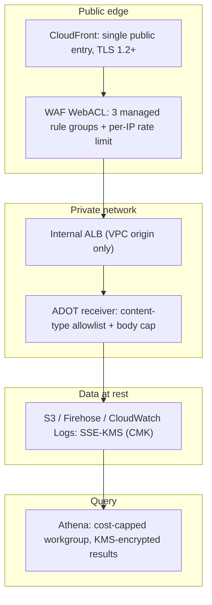

# Security and compliance posture

What this is: the security overview for telemetry-platform — how the public ingest edge,
encryption, IAM, secrets, and the CI/CD supply chain are hardened, and why the collector
edge is deliberately unauthenticated. Read this when you need the controls that protect the
platform end to end, or before changing anything on the public path.

For the system shape these controls protect, see [architecture.md](architecture.md); for the
producer-side view of the unauthenticated edge, see [sending-telemetry.md](sending-telemetry.md).

## Defense in depth at a glance

The platform layers independent controls so that no single mechanism is the only thing
standing between an attacker and the data.

Every boundary below is enforced in code (Terraform/Terragrunt) and asserted by tests, not
applied by hand. Terminology used here (namespace, reference, leaf, instance set) is defined
in [terragrunt-concepts.md](terragrunt-concepts.md).

## Edge protection

CloudFront is the single public entry point. The application load balancer stays
`scheme = internal` and is reachable only through the CloudFront VPC origin; its security
group admits inbound traffic exclusively from the AWS-managed
`com.amazonaws.global.cloudfront.origin-facing` prefix list on the HTTPS listener port.
There is no public origin and no origin self-loop.

### Transport security

- CloudFront viewer connections require a minimum TLS protocol version of `TLSv1.2_2021`;
  the module rejects any weaker policy at plan time.
- The ALB HTTPS listener uses `ssl_policy = ELBSecurityPolicy-TLS13-1-2-2021-06`. HTTPS
  listeners are validated to require both a non-empty `ssl_policy` and a valid ACM
  `certificate_arn`.
- Certificates are issued and validated through ACM; the collector certificate must cover
  the collector service FQDN so the origin TLS handshake (and SNI) succeeds.

### WAF managed protections

The reused `waf-webacl` module (CLOUDFRONT scope) attaches three AWS managed rule groups at
fixed priorities, each with `override_action = "none"` (fully enforced):

| Priority | Managed rule group | Purpose |
| --- | --- | --- |
| 10 | `AWSManagedRulesCommonRuleSet` | Common web exploits (SQLi, XSS, LFI, and similar) |
| 20 | `AWSManagedRulesKnownBadInputsRuleSet` | Known malicious request patterns |
| 30 | `AWSManagedRulesAmazonIpReputationList` | Known-malicious / low-reputation source IPs |

`AWSManagedRulesAnonymousIpList` (VPN/Tor/anonymizing-proxy and, via `HostingProviderIPList`,
all hosting/cloud IPs) is **deliberately omitted**: the collector is a public telemetry
ingestion endpoint that must accept usage data from any tool on any network (GitHub-hosted,
self-hosted, and cloud CI runners included), and that rule blocks exactly those legitimate
sources. Only **known-malicious** IPs are blocked (`AmazonIpReputationList`). Payload attacks
(CommonRuleSet + KnownBadInputs), flooding (the rate-based rule below), and the pipeline's own
structure validation (malformed records route to `errors/`, never queryable) remain the
enforced controls for the open endpoint.

A rate-based rule (`rate_limit_per_ip`, default `2000` requests per source IP per
five-minute window) caps per-IP request volume.

One sub-rule is deliberately re-targeted: `CommonRuleSet`'s `SizeRestrictions_BODY` is set to
`count` (not block) via a per-sub-rule action override, because its default body-inspection
limit would otherwise reject legitimate batched OTLP payloads. Every other rule in every
group stays fully enforced. Request-body size is instead bounded at the ADOT receiver
(`adot_receiver_max_request_body_size`, default 4 MiB) together with the receiver memory
limiter — the body cap is enforced where the receiver can return a clean error, not silently
dropped at WAF.

## Deliberate unauthenticated ingest and its compensating controls

The collector edge is intentionally public and unauthenticated so any tool or CLI can report
usage without distributing or rotating client credentials. The ingested data is usage
telemetry, not customer or financial data, so authentication is replaced by layered edge
controls rather than per-client secrets. The producer-facing rationale and the request shape
live in [sending-telemetry.md](sending-telemetry.md#why-there-is-no-client-authentication).

Compensating controls on the open path:

- CloudFront is the only public entry; the ALB is internal and reachable only via the VPC
  origin.
- WAF managed rule groups plus the per-IP rate-based rule constrain abusive and malicious
  traffic.
- The ADOT OTLP/HTTP receiver accepts only the logs and metrics signals and enforces an
  intrinsic content-type allowlist (`application/x-protobuf`, `application/json`) and the 4 MiB
  body cap. There is no traces receiver, no gRPC, and no general-purpose request surface. The
  metrics signal (client-tool usage counters) traverses the same public edge, WAF, and
  private-lake delivery path as the logs signal; identity attributes it carries are usage data
  retained under the same data-classification and retention controls as every other record.
- The ALB target-group health check targets the dedicated health-check port (13133), not the
  traffic port, so liveness probing does not exercise the ingest path.

## Encryption at rest

All data-bearing stores use SSE-KMS with customer-managed keys (CMKs). The S3 primitive
applies `aws:kms` server-side encryption by default with a bucket key. Each CMK is owned by
the reference that owns the data it protects, and keys are scoped by key policy to the
principals that legitimately need them.

| CMK alias | Owning reference | Protects |
| --- | --- | --- |
| `alias/telemetry-data` | data-lake | Data-lake S3 objects, Firehose delivery, ingest CloudWatch Logs, WAF logs, Athena query results |
| `alias/telemetry-config` | dns-prod-zone (foundation) | SSM config parameters, the WAF CloudWatch log group, and the observability SNS alarm topic |

The data-lake CMK has annual automatic key rotation enabled. CMK grants are least-privilege:
for example, the telemetry-data key grants `kms:Decrypt`/`kms:GenerateDataKey` only to the
Firehose delivery role, the ECS task role, and the Athena/Glue principals that read the lake,
each scoped by key policy.

## Encryption in transit

External connections terminate TLS at CloudFront (TLS 1.2+). Internally, CloudFront reaches
the ALB over an `https-only` VPC origin, and the ALB listener enforces a TLS 1.2/1.3 policy.

## IAM least privilege

Execution roles are ARN-scoped with no wildcard resources:

- A single Firehose role serves both delivery and Glue schema reads, scoped to the
  data-lake resources it uses.
- The CloudWatch-Logs-to-Firehose subscription role trust is constrained to the
  CloudWatch Logs service principal with a source-ARN condition.
- The ADOT collector's ECS task role is scoped to the CloudWatch Logs group it writes and
  the telemetry-data CMK it encrypts with, and nothing else.
- Athena query access runs in a cost-capped workgroup whose result location and CMK are
  fixed by the workgroup configuration, not chosen per query.

## Query-side access

The platform terminates at the Athena workgroup over the Glue-cataloged Parquet lake; it
deploys no sign-in or presentation tier. Downstream consumers query Athena with their own
IAM credentials. A consumer in another AWS account is granted access only through the data
lake's optional, label-keyed cross-account read grant (S3 `GetObject`/`ListBucket` on the
lake bucket plus `kms:Decrypt`/`DescribeKey` on the telemetry-data CMK); the grant is
declared in `terragrunt/common/cross-account-read.json` and is empty by default.

## Secrets handling

- No credentials, tokens, or secrets are committed to the repository or baked into build
  artifacts. Configuration is supplied at runtime through environment variables and SSM
  parameters.
- The unauthenticated ingest design means there are no client API keys to distribute,
  store, or rotate.
- Non-secret runtime configuration is published to SSM parameters; SecureString parameters
  are decryptable only via the telemetry-config CMK, scoped by key policy to the principals
  that need them.
- Application logs carry usage telemetry only; the pipeline does not log credentials.

## Supply-chain and branch protection

The `main` branch is protected by a ruleset that requires the PR-validation aggregate and the
CodeQL checks to pass before merge, with the GitHub Merge Queue enabled. Bypass is limited to
the automation bot and organization administrators. Production-affecting Terragrunt applies
run through a single serialized FIFO queue gated by a protected GitHub Environment; sandbox is
never applied by CI. The full pipeline is documented in
[release-pipeline.md](release-pipeline.md).

CodeQL (GitHub Advanced Security) analyzes Python, JavaScript/TypeScript, and Go on every pull
request, every merge-queue group, every push to `main`, and weekly on a schedule, using
build-free extraction. Because the CodeQL check is a required status check, it must report on
the merge-queue ref so the queue never waits on a check that never runs.

## Data classification

The ingested payload is operational usage telemetry — tool name, event type, timestamp, and a
JSON payload (see [data-model.md](data-model.md)). It is treated as internal, non-sensitive
data: it carries no payment, account, or regulated financial data, and the design avoids
collecting personal data beyond the identity attributes client tools attach to their own
usage records. Do not extend producers to emit secrets, tokens,
or personal data into the telemetry payload; the pipeline is not classified or controlled for
that content.

## Related documents

- [architecture.md](architecture.md) — system and pipeline overview
- [sending-telemetry.md](sending-telemetry.md) — producer setup and the unauthenticated edge
- [release-pipeline.md](release-pipeline.md) — CI/CD, branch protection, and CodeQL
- [terragrunt-concepts.md](terragrunt-concepts.md) — terminology and structure
- [project README](../README.md)
