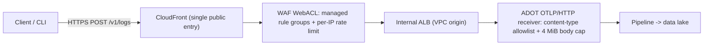

# Sending telemetry

**What this is:** the producer/client guide for shipping usage telemetry into the
telemetry platform collector. **When you need it:** you are instrumenting a tool or CLI to
report usage events and want the exact endpoint, request shape, and limits.

**Common path:** `POST https://collector.<apex>/v1/logs` over HTTPS (port 443) with an OTLP
log payload whose `LogRecord` body is a JSON string carrying `{timestamp, tool, event_type,
payload}`. There is no client credential — the edge is public and protected by WAF and rate
limiting. Pick your environment endpoint below and send.

## Endpoints

The collector publishes two names per environment. Send client traffic to the **pretty**
endpoint: it is the stable name that survives instance-set promotions (the service name is
per-set and immutable — see [instance-sets-architecture.md](instance-sets-architecture.md)).

| Environment | Endpoint (use this) | Per-set service name |
|-------------|---------------------|----------------------|
| sandbox | `https://collector.sandbox.telemetry.example.com/v1/logs` | `collector-000.sandbox.telemetry.example.com` |
| prod | `https://collector.telemetry.example.com/v1/logs` | `collector-000.prod.telemetry.example.com` |

Both names are derived from `terragrunt/common/domains.json` (`dns_pretty_apex` /
`dns_service_apex`) and the collector-ingestion module — the same source the infrastructure
uses. Use sandbox for development and integration testing; use prod only for real production
telemetry.

## Quickstart

Send one event with `curl` using OTLP/JSON:

```bash
curl -sS -X POST \
  "https://collector.sandbox.telemetry.example.com/v1/logs" \
  -H "Content-Type: application/json" \
  --data-binary @- <<'JSON'
{
  "resourceLogs": [
    {
      "resource": {
        "attributes": [
          { "key": "service.name", "value": { "stringValue": "my-tool" } }
        ]
      },
      "scopeLogs": [
        {
          "scope": { "name": "my-tool" },
          "logRecords": [
            {
              "timeUnixNano": "1700000000000000000",
              "body": {
                "stringValue": "{\"timestamp\":\"2026-06-30T12:00:00Z\",\"tool\":\"my-tool\",\"event_type\":\"command_execution\",\"payload\":\"{\\\"command\\\":\\\"build\\\",\\\"exit_code\\\":0}\"}"
              }
            }
          ]
        }
      ]
    }
  ]
}
JSON
```

A success returns HTTP `200`. The OTLP `LogRecord` `body` is itself a JSON **string** — the
pipeline reads `log.Body().AsString()`, so the four telemetry fields are nested inside that
string, not in the OTLP envelope. The `tool` field becomes the data-lake partition key.

## Request contract

| Property | Value |
|----------|-------|
| Method | `POST` |
| Path | `/v1/logs` (events) or `/v1/metrics` (Claude-tool usage metrics) |
| Port | `443` (HTTPS) |
| Content-Type | `application/x-protobuf` or `application/json` |
| Max body size | `4194304` bytes (4 MiB) per request |
| Authentication | none (public edge — see below) |

The collector accepts the OTLP **logs** and **metrics** signals; there is no traces receiver
and no gRPC listener. `POST /v1/logs` and `POST /v1/metrics` both return `200`; `POST
/v1/traces` returns `404`, and a TCP connect to the gRPC port `4317` finds no listener. Split
large workloads into multiple requests that each stay under the 4 MiB cap; a single request
body larger than the cap is rejected with `413`.

The `Content-Type` allowlist is intrinsic to the OTLP/HTTP receiver — only
`application/x-protobuf` and `application/json` are accepted; any other content type is
rejected. Every request must carry a `User-Agent` header: the WAF Common rule set blocks
requests with no `User-Agent`, so a header-less client never reaches the receiver. `curl`
and OTLP SDKs set one by default.

## Event body

The value of `LogRecord.body` is a JSON object serialized to a string with exactly these
top-level fields:

```json
{
  "timestamp": "2026-06-30T12:00:00Z",
  "tool": "my-tool",
  "event_type": "command_execution",
  "payload": "{\"command\":\"build\",\"exit_code\":0}"
}
```

| Field | Type | Meaning |
|-------|------|---------|
| `timestamp` | string | ISO-8601 event time |
| `tool` | string | Producer identifier; becomes the `tool` partition key in the data lake |
| `event_type` | string | Category of the usage event (for example `command_execution`, `session_start`, `feature_usage`) |
| `payload` | string | A JSON **string** carrying event-specific detail |

`tool` and `event_type` are partition / query dimensions in the data lake. See
[data-model.md](data-model.md) for the full schema, the `tool` projection rules, and example
Athena queries.

## Encodings

The receiver accepts two wire encodings of the OTLP `ExportLogsServiceRequest`:

- **Protobuf** — `Content-Type: application/x-protobuf`, the binary `opentelemetry-proto`
  serialization. Most compact and the default for OTLP SDKs.
- **OTLP/JSON** — `Content-Type: application/json`, the canonical protobuf-to-JSON mapping
  (as in the Quickstart). Convenient for `curl` and ad-hoc clients.

Both carry the same logical payload; choose whichever your client library produces. In both
cases the inner telemetry object lives in `LogRecord.body` as a JSON string.

## Sending from an OTLP SDK

Any OpenTelemetry logs SDK can target the collector by pointing its OTLP/HTTP log exporter at
the endpoint and emitting a log record whose body is the telemetry JSON string. Example using
the OpenTelemetry Python SDK:

```python
import json

from opentelemetry._logs import SeverityNumber
from opentelemetry.exporter.otlp.proto.http._log_exporter import OTLPLogExporter
from opentelemetry.sdk._logs import LoggerProvider, LogRecord
from opentelemetry.sdk._logs.export import BatchLogRecordProcessor
from opentelemetry.sdk.resources import Resource

endpoint = "https://collector.sandbox.telemetry.example.com/v1/logs"

provider = LoggerProvider(resource=Resource.create({"service.name": "my-tool"}))
provider.add_log_record_processor(
    BatchLogRecordProcessor(OTLPLogExporter(endpoint=endpoint))
)

event_body = json.dumps(
    {
        "timestamp": "2026-06-30T12:00:00Z",
        "tool": "my-tool",
        "event_type": "command_execution",
        "payload": json.dumps({"command": "build", "exit_code": 0}),
    }
)

logger = provider.get_logger("my-tool")
logger.emit(
    LogRecord(
        body=event_body,
        severity_number=SeverityNumber.INFO,
    )
)
provider.force_flush()
```

The exporter sends protobuf over OTLP/HTTP to `/v1/logs` and sets a `User-Agent`
automatically. Keep batch sizes below the 4 MiB request cap.

## Sending Claude tool telemetry (Claude Code, Cowork, Office)

Anthropic's Claude tools (Claude Code CLI, Cowork, Office agents) already emit
OpenTelemetry natively, but in a **different shape** from the flat [event body](#event-body)
above: each record is a structured OTLP `LogRecord` whose `body` is the **event name string**
(for example `claude_code.plugin_loaded`) and whose data lives in the **log-record and
resource attributes** (`plugin.name`, `marketplace.name`, `mcp.server_name`, `user.email`,
`model`, …), not in a JSON body object. Every record carries
`resource.attributes["service.name"] = "claude-code"` (or `claude-cowork` / `claude-office`).

The platform ingests this shape **natively — no client-side reshaping is required**. The
collector routes any record whose `service.name` is registered as a `structured-otlp`
(or `both`) entry's `service_names` in the single-source-of-truth
[tool registry](../terragrunt/common/tool-registry.json) to a structured pipeline, and the
data-lake reshaping stage folds it into the canonical `{timestamp, tool, event_type,
payload}` envelope automatically:

| Source `service.name` | Data-lake `tool` partition |
|-----------------------|----------------------------|
| `claude-code`   | `claude-code`   |
| `claude-cowork` | `claude-cowork` |
| `claude-office` | `claude-office` |

There is **no fallback tool**: a `service.name` that is not registered is not routed or
reshaped, so its data lands in the monitored `errors/` prefix instead of a catch-all
`tool` value. Onboarding a new structured-OTLP tool (Claude or otherwise) is a single edit
to the registry — see [onboarding-a-tool.md](onboarding-a-tool.md).

`event_type` is taken from the record's event name (for example `plugin_loaded`,
`mcp_server_connection`, `api_request`); the full attribute set is flattened into `payload`
(dotted keys become underscores, resource attributes are `resource_`-prefixed), so a query
like `json_extract_scalar(payload, '$.marketplace_name')` returns the marketplace a plugin was
loaded from. Kanon and any other tool that follows the flat body contract are **completely
unaffected** — they travel a separate pipeline and are written byte-for-byte unchanged.

> **Logs and metrics.** Both the OTLP **logs** and **metrics** signals are ingested. Claude
> tools' usage metrics (session, token, cost, and active-time counters) are exported through a
> dedicated pipeline and land in the same data lake as the reshaped log records, joinable on
> `session_id` / `user_email` — see
> [Claude-tool metric records](data-model.md#claude-tool-metric-records) for the row shape and
> the delta-aggregation caveat. Traces remain out of scope: `/v1/traces` still returns `404`.

### Point a single client at the collector (for testing)

Set the standard Claude Code telemetry environment variables before launching the CLI. The
OTLP/HTTP exporter appends `/v1/logs` to the endpoint automatically:

```bash
export CLAUDE_CODE_ENABLE_TELEMETRY=1
export OTEL_LOG_USER_PROMPTS=0 # never export prompt/response TEXT (only event metadata)
export OTEL_LOG_TOOL_DETAILS=1 # legible skill / tool / command NAMES (not prompt text)
export OTEL_LOGS_EXPORTER=otlp
export OTEL_METRICS_EXPORTER=otlp
export OTEL_METRIC_EXPORT_INTERVAL=60000
export OTEL_EXPORTER_OTLP_PROTOCOL=http/protobuf
export OTEL_EXPORTER_OTLP_ENDPOINT=https://collector.telemetry.example.com
# Use the sandbox apex (collector.sandbox.telemetry.example.com) for non-production tests.

claude -p "hello"
```

Identity attributes (`user.email`, `organization.id`) are attached only for an authenticated
session. Prompt and response **text** are never exported unless `OTEL_LOG_USER_PROMPTS=1` is
explicitly set; the export above pins it to `0` so only event metadata is sent, matching the
enforced fleet-wide default below.

### Fleet-wide rollout (Anthropic Enterprise managed settings)

To enforce export for an entire organization without per-user configuration, apply a
**managed settings** policy in the Claude admin console (Claude Code reads managed settings at
the highest precedence, so users cannot override or disable it). The policy is the same set of
variables in the `env` block:

```json
{
  "env": {
    "CLAUDE_CODE_ENABLE_TELEMETRY": "1",
    "OTEL_LOG_USER_PROMPTS": "0",
    "OTEL_LOG_TOOL_DETAILS": "1",
    "OTEL_LOGS_EXPORTER": "otlp",
    "OTEL_METRICS_EXPORTER": "otlp",
    "OTEL_METRIC_EXPORT_INTERVAL": "60000",
    "OTEL_EXPORTER_OTLP_PROTOCOL": "http/protobuf",
    "OTEL_EXPORTER_OTLP_ENDPOINT": "https://collector.telemetry.example.com"
  }
}
```

The managed policy **enforces** prompt and response text off org-wide: pinning
`OTEL_LOG_USER_PROMPTS` to `0` at the highest settings precedence means no user, project, or
local setting can re-enable text export. In a regulated environment, prompt and response text
can carry PII, credentials, or material non-public information (MNPI), so the fleet policy
removes that exposure at the source rather than relying on each user to leave the setting
unset. Only event metadata (event names and the attributes described
[above](#sending-claude-tool-telemetry-claude-code-cowork-office)) ever leaves the client.

`OTEL_LOG_TOOL_DETAILS=1` makes **skill, tool, and command names legible** in the lake: with it,
a `skill_activated` event carries the real `skill_name` (e.g. `demo-skill`) and tool events carry
the invoked tool's name; without it Claude Code masks them to generic buckets (for example
`skill_name=custom_skill`). It reports which skills/tools/commands are used — it does **not**
export prompt or response text (that remains controlled solely by `OTEL_LOG_USER_PROMPTS`, pinned
to `0`). Enabling it is what turns "a skill was used" into "*which* skill was used," so the fleet
policy sets it for detailed usage analytics on marketplaces, plugins, skills, and MCP servers.

Cowork and Office agents are enrolled through their own admin-console telemetry settings
pointed at the same endpoint; their `claude-cowork` / `claude-office` service names route and
partition automatically. Claude.ai web sessions and direct Claude API traffic cannot be
redirected to a customer collector and are out of scope.

## Why there is no client authentication

The collector edge is deliberately public and unauthenticated so that any tool or CLI can
report usage without distributing or rotating credentials. The data is non-sensitive usage
telemetry, and authentication is replaced by layered edge controls rather than per-client
secrets:



Controls on the public path:

- **CloudFront** is the single public entry point; the ALB stays internal and is reachable
  only through the CloudFront VPC origin.
- **WAF** applies AWS managed rule groups (common protections, known-bad inputs, IP
  reputation, anonymous-IP) plus a **rate-based rule** that caps requests per source IP.
- The **receiver** enforces the content-type allowlist and the 4 MiB body cap, and exposes
  only the logs and metrics signals.

For the full security and compliance posture, see [security.md](security.md).

## Confirming data arrived

After a `200`, the event flows through the pipeline to the S3 data lake (partitioned by
`tool` and `dt`) where it is queryable via Athena. To confirm delivery:

- Query the data lake by your `tool` value and date — see [data-model.md](data-model.md) for
  the Athena query examples and the `tool` projection (an enum over a fixed, governed set of
  tool values; pin `tool` with `=` or `IN` for scan cost, though an unfiltered `SELECT` also
  succeeds).
- Use the synthetic OTLP test harness to drive a full send-and-verify cycle end to end — see
  [e2e-harness.md](e2e-harness.md).

If sends fail or data does not appear, see [troubleshooting.md](troubleshooting.md).

## Reference

- [architecture.md](architecture.md) — end-to-end system and pipeline
- [data-model.md](data-model.md) — event schema, `tool` projection, query examples
- [onboarding-a-tool.md](onboarding-a-tool.md) — register a new tool in the tool registry
- [e2e-harness.md](e2e-harness.md) — synthetic OTLP send-and-verify harness
- [troubleshooting.md](troubleshooting.md) — failure to cause to fix
- [../README.md](../README.md) — documentation hub
