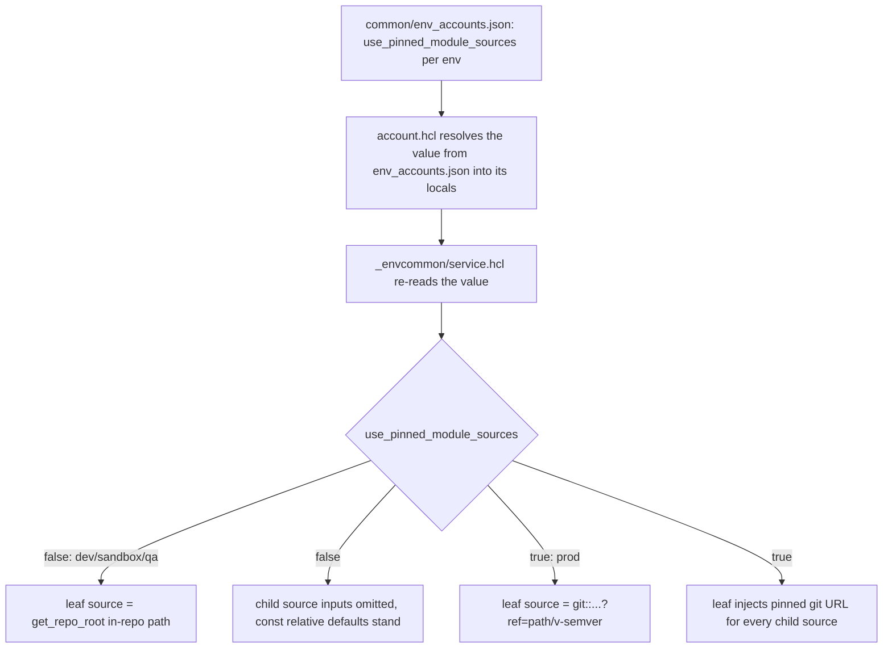

# Terraform Module Sourcing

How `providers/aws/references/*` modules reference their in-repo child modules, and how the
`use_pinned_module_sources` toggle switches every leaf between local relative paths (dev) and
pinned, immutable git URLs (prod). Read this when authoring or reviewing a reference module, or
when a prod apply fails to resolve a module `?ref=` tag.

The model has one rule: a reference module never hardcodes a child `source`. It declares a
`const = true` variable whose default is an in-repo relative path, and the terragrunt leaf decides
at deploy time whether that default stands (dev) or is overridden with a pinned git URL (prod).

## The common path

- Authoring a module locally: every child source resolves to its relative-path default, so
  `terraform init -backend=false && terraform validate` and Terratest run with no git tags present.
- Deploying to a real environment: the env's toggle flips to `true`, and the leaf injects pinned
  `git::...?ref=<path>/v<semver>` URLs for the reference and each in-repo child module.

For terminology used below (reference vs primitive module, leaf unit, namespace, instance set),
see [terragrunt-concepts.md](terragrunt-concepts.md).

## Why sourcing is variable-driven

If a reference module hardcoded a pinned git URL for each child module, no one could run
`terraform init -backend=false` or Terratest against that module until the `?ref=` tag existed in
the remote. Every iteration would require a full release round-trip before local work could begin.

Declaring the child `source` as a `const = true` variable with an in-repo relative default removes
that coupling. Local development resolves against the working tree; real environments inject pinned
URLs at deploy time. A single toggle selects between the two without editing module code.

```hcl
# providers/aws/references/vpc-network/main.tf
module "vpc" {
  source = var.vpc_source
  # ...
}
```

```hcl
# providers/aws/references/vpc-network/variables.tf
variable "vpc_source" {
  type    = string
  const   = true
  default = "../../primitives/vpc"
}
```

`const = true` is required: Terraform only accepts a variable in a module `source` argument when the
variable is constant-typed. The default is always an in-repo relative path (for example
`../../primitives/<module>`); pinned URLs are never defaults — they are injected by the leaf.

## The toggle

`use_pinned_module_sources` is resolved per environment in
`terragrunt/common/env_accounts.json`, keyed by env-class:

```json
{
  "envs": {
    "sandbox": { "use_pinned_module_sources": false },
    "prod":    { "use_pinned_module_sources": true },
    "qa":      { "use_pinned_module_sources": false }
  }
}
```

`account.hcl` resolves the value from `env_accounts.json` into its own locals (keyed by the
env-folder basename), and each `_envcommon/<service>.hcl` re-reads it from `account.hcl` so every
leaf that includes the template sees the same value:

```hcl
# _envcommon/<service>.hcl
locals {
  account_vars              = read_terragrunt_config(find_in_parent_folders("account.hcl"))
  use_pinned_module_sources = local.account_vars.locals.use_pinned_module_sources
}
```

### Toggle flow



## Developing locally (toggle false)

When the resolved toggle is `false`:

1. No git tags need to exist.
2. `terraform init -backend=false && terraform validate` from the module root resolves every child
   source to its relative-path default.
3. Terratest (`make tf-test`) uses fixtures that source the parent reference by relative path.
4. The terragrunt leaf sources the reference via `${get_repo_root()}//providers/aws/references/<x>`
   and does not pass child `*_source` inputs, so each child resolves to its const default.

```hcl
# leaf, toggle false
terraform {
  source = local.account_vars.locals.use_pinned_module_sources ? "git::https://github.com/example-org/telemetry-platform.git//providers/aws/references/data-lake?ref=providers/aws/references/data-lake/v1.0.1" : "${get_repo_root()}//providers/aws/references/data-lake"
}

inputs = local.account_vars.locals.use_pinned_module_sources ? {
  # pinned child *_source inputs (toggle true) ...
} : {
  # toggle false: no *_source keys -- const defaults stand
}
```

## Deploying pinned sources (toggle true)

When the resolved toggle is `true`, the leaf sources the reference via a pinned git URL and injects
a pinned URL for every in-repo child `*_source` variable:

```hcl
# leaf, toggle true
inputs = {
  lake_kms_source = "git::https://github.com/example-org/telemetry-platform.git//providers/aws/primitives/kms-key?ref=providers/aws/primitives/kms-key/v1.0.1"
  athena_source   = "git::https://github.com/example-org/telemetry-platform.git//providers/aws/primitives/athena-workgroup?ref=providers/aws/primitives/athena-workgroup/v1.0.1"
  glue_source     = "git::https://github.com/example-org/telemetry-platform.git//providers/aws/primitives/glue-catalog?ref=providers/aws/primitives/glue-catalog/v1.0.1"
  # ...other service inputs
}
```

Terragrunt passes these as `TF_VAR_*` env vars, which Terraform resolves at `init` time (satisfying
the `const` requirement). The pinned URLs are immutable: each resolves to a specific released commit
that cannot change after the tag is cut. The `?ref=` for the reference and for every child module
must correspond to a released tag — a missing tag fails `terraform init` with an actionable "module
not found" error rather than silently falling back to local code. See
[module-promotion-flow.md](module-promotion-flow.md) for how tags are cut and
[release-pipeline.md](release-pipeline.md) for the CI/CD pipeline that publishes them.

## External sources stay pinned literals

The external `caylent-solutions/terraform-modules` repository is outside this repository's release
cadence, so its child blocks are never variable-ized and never affected by the toggle. One such
literal exists in the references tree today:

| Module | Location | Source |
|--------|----------|--------|
| `budget` | `providers/aws/references/observability/main.tf` | `git::https://github.com/caylent-solutions/terraform-modules.git//providers/aws/primitives/budget?ref=providers/aws/primitives/budget/v1.1.0` |

The const-source guard reserves two external-exempt module names — `budget` and `dynamodb-table` —
that must stay hardcoded literals if present (no `dynamodb-table` block exists today). These names
are configurable via the `CONST_SOURCE_GUARD_EXTERNAL_MODULE_NAMES` environment variable.

Note: `waf-webacl` and `vpc` are **not** external. Both are vendored in-repo under
`providers/aws/primitives/` and consumed through toggle-governed const-source variables
(`var.waf_webacl_source`, `var.vpc_source`), exactly like every other in-repo child source.

## Bootstrap path carve-out

Bootstrap leaves — those whose terragrunt path contains a `bootstrap` segment, such as
`terragrunt/live/telemetry/us-east-1/bootstrap/prod_role/state-bootstrap/000/terragrunt.hcl` —
always source the in-repo module via `${get_repo_root()}`, regardless of the env's toggle:

```hcl
# bootstrap leaf
terraform {
  # Bootstrap units always source the in-repo module regardless of use_pinned_module_sources.
  source = "${get_repo_root()}//providers/aws/references/state-bootstrap"
}
```

A bootstrap unit must be applyable on the very first account bring-up, before any module tag exists
in the remote — the bootstrap apply creates the S3 state backend itself, so no prior published
release is available to pin against. Once bootstrap completes, service units reference pinned
releases normally.

The carve-out applies only to the leaf-level `terraform { source }` block. In-repo child `*_source`
inputs inside the same leaf still follow the toggle.

## How the policies and guards enforce the split

Three checks enforce this model: an OPA policy on module code, and two terragrunt guards on leaf and
reference files.

### OPA source policy

`policies/opa/terraform/libraries/source_policy.rego` (re-exported by
`policies/opa/terraform/provider/aws/module_types/reference/source_policy.rego`) raises a violation
for each of:

- A literal local module source (relative or absolute path) that is not var-driven.
- A literal source that is not from the monorepo allowlist (the upstream
  `caylent-solutions/terraform-modules` or this repo's `example-org/telemetry-platform`).
- A monorepo literal source missing a pinned `?ref=.../v<semver>`.
- A `source = var.<name>_source` whose declaring variable lacks `const = true`.
- A `*_source` variable whose default is a git URL or an absolute path (must be an in-repo
  relative path).
- Prod-context gate: when the policy input signals `use_pinned_module_sources == true`, any
  in-repo source variable still defaulting to a relative path is a hard failure.

Files under `examples/` and `tests/` are excluded. Run it per module:

```bash
make module-validate MODULE_PATH=providers/aws/references/<x> MODULE_TYPE=reference
```

### Const-source guard

`make tf-guard-const-sources` (`scripts/tf_guard_const_sources.py --root providers/aws/references`)
scans the references tree and fails on:

- An in-repo child `module` `source` that is a bare git URL or relative literal instead of
  `source = var.<name>_source`.
- A `*_source` variable used in a `source` that lacks `const = true`.
- A `*_source` default that is not an in-repo relative path.
- An external source (`budget`, `dynamodb-table`) that was variable-ized — these must stay
  literals.

Files under `examples/` directories and hidden directories (for example `.terraform/`) are skipped.

### Pinned-source guard

`make tf-guard-pinned-sources` (`scripts/tf_guard_pinned_sources.py`) validates each terragrunt
leaf's `terraform { source }`:

- Allows `${get_repo_root()}//...` when the resolved toggle is `false`.
- Requires a pinned `?ref=.../v<semver>` URL when the toggle is `true`.
- Resolves the toggle by reading the leaf's `account.hcl`; a leaf whose `account.hcl` omits
  `use_pinned_module_sources` fails fast.
- Skips `_envcommon` templates (not leaf units) and any leaf whose path contains a `bootstrap`
  segment (the bootstrap carve-out above).

Both guards run in CI for terragrunt-scope changes. For where these gates sit in the full pipeline,
see [release-pipeline.md](release-pipeline.md); for the day-to-day dev-to-prod workflow that drives
the toggle, see [contributing.md](contributing.md).

## Related

- [module-promotion-flow.md](module-promotion-flow.md) — module-to-leaf semver promotion that cuts
  the tags pinned mode depends on.
- [contributing.md](contributing.md) — the dev-to-prod SDLC per code scope.
- [release-pipeline.md](release-pipeline.md) — canonical CI/CD reference, including the guard gates.
- [terragrunt-concepts.md](terragrunt-concepts.md) — module taxonomy, the scope hierarchy, and
  namespacing terminology.
- [Repository README](../README.md) — documentation hub.
