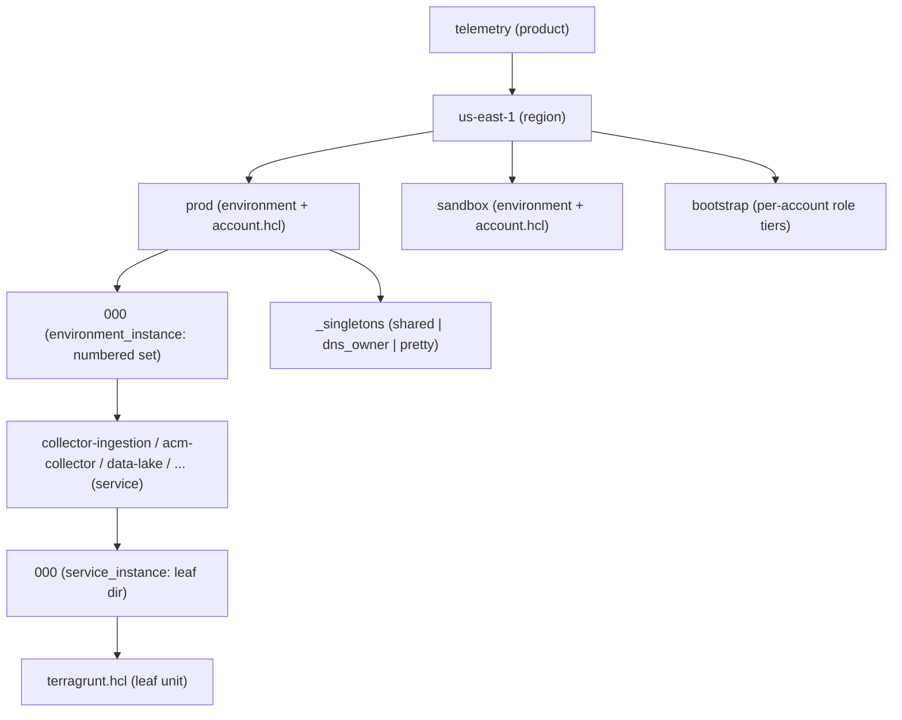

# Terragrunt Concepts and Structure

This is the single source of truth for telemetry platform deployment terminology and
structure. It defines the module taxonomy, the scope hierarchy, how the deployment
namespace is derived, how state buckets are named and locked, and what every term
(namespace, singleton, leaf unit, env set, resource set, tier) means. Other docs link
here instead of redefining these terms.

When you need it: read this first to understand any path under `terragrunt/live/`, any
name a resource is given, or any glossary term used across the docs set. For the immutable
instance-set model see [instance-sets-architecture.md](instance-sets-architecture.md); for
the dev-local vs prod-pinned source toggle see
[terraform-module-sourcing.md](terraform-module-sourcing.md).

## Module taxonomy

Terraform modules live under `providers/aws/` in two tiers. The repository uses these two
tiers only; there is no separate "collection" tier.

| Tier | Path root | Declares `resource` blocks? | Composes other modules? |
|------|-----------|-----------------------------|--------------------------|
| primitive | `providers/aws/primitives/<name>/` | Yes | No |
| reference | `providers/aws/references/<name>/` | No | Yes (required) |

- A **primitive** wraps a single AWS concern (for example `kms-key`, `s3-bucket`,
  `ecs-service`, `cloudfront-distribution`). It owns the `resource` blocks for that concern.
- A **reference** is a composition unit. It declares no `resource` blocks of its own; it
  wires primitives (and external modules) together into a deployable surface such as
  `collector-ingestion` or `data-lake`. The
  Terragrunt leaf sources exactly one reference module.

Each reference sources its child modules through `const`-typed `*_source` variables whose
default is an in-repo relative path. External `caylent-solutions/terraform-modules` sources
(the `vpc` and `budget` primitives) remain pinned git-URL literals at all times. The
dev-local vs prod-pinned mechanics live in
[terraform-module-sourcing.md](terraform-module-sourcing.md).

## The scope hierarchy

The live tree at `terragrunt/live/` is a seven-layer scope hierarchy. Each layer carries a
scope file that exposes one piece of deployment identity as a `locals` block. Six of the
seven layers are folders; the **account** layer is abstracted out of the folder path and
resolved from configuration (see below).

```text
product / region / account / environment / environment_instance / service / service_instance
```

| Layer | Scope file | Example value | How it is resolved |
|-------|------------|---------------|--------------------|
| product | `product.hcl` | `telemetry` | folder basename |
| region | `region.hcl` | `us-east-1` | folder basename |
| account | `account.hcl` | (account id) | `common/env_accounts.json`, keyed by env |
| environment | `environment.hcl` | `prod`, `sandbox`, `qa` | folder basename |
| environment_instance | `environment_instance.hcl` | `000`, `shared`, `pretty` | folder basename |
| service | `service.hcl` | `collector-ingestion` | folder basename |
| service_instance | `service_instance.hcl` | `000` | folder basename (leaf dir) |

The **account** layer has no folder of its own. `account.hcl` sits at the environment
directory (alongside `environment.hcl`) and resolves the AWS account id, named profile, and
the `use_pinned_module_sources` toggle from `common/env_accounts.json` keyed by the
environment basename. Copying an environment folder to a new env-class therefore picks up a
new account with zero edits to the copied files.

### Live tree shape



The **leaf unit** is the deepest directory (the `service_instance` level). It holds
`service_instance.hcl` and `terragrunt.hcl`. The leaf includes `root.hcl`, includes its
`_envcommon/<service>.hcl` template, and adds only the module `source`, `dependency {}`
blocks, and `inputs {}`. All remote-state, provider, and namespace logic is inherited from
the root.

## environment_instance sub-classes (tier)

The fourth field, `environment_instance`, is the directory basename verbatim and has three
mutually exclusive forms. `root.hcl` classifies each form into a `tier` and fails fast on
any unrecognized form (no fallback).

| Form | Example | tier | Meaning |
|------|---------|------|---------|
| all digits | `000`, `001` | `per-set` | a numbered, immutable serving instance set |
| bare tier word | `shared`, `dns_owner`, `pretty` | that word | a once-per-env singleton tier under `_singletons/` |
| `*_role` | `prod_role`, `sandbox_role`, `dns_owner_role` | `bootstrap` | a per-account bootstrap role under `bootstrap/` |

### Singletons (`_singletons/`)

A **singleton** tier holds units that exist once per environment rather than once per
numbered set:

- `_singletons/shared` — account-singleton services (for example `identity`,
  `observability`, `data-lake`, plus the
  `cloudfront-logs` and `vpc-flow-logs` log sinks).
- `_singletons/dns_owner` — units homed in the shared DNS-owner account (for example
  `dns-delegation`).
- `_singletons/pretty` — the pretty-CNAME units that flip user-facing hostnames between
  serving sets (for example `collector` and its `validate-*` companion).

These tiers exist identically in every environment; only their resolved account, env class,
and per-environment inputs differ.

## Namespace derivation

The **namespace** is the canonical, collision-free identity of a deployment unit, derived
entirely from its position in the tree. `root.hcl` joins six fields with `-`, replacing any
in-field `-` with `_` first, so each field stays a single token:

```text
namespace = product_family - region(no dashes) - environment - environment_instance - service - service_instance
```

For a sandbox collector unit the canonical namespace is:

```text
telemetry-useast1-sandbox-000-collector_ingestion-000
```

Two derived forms exist:

- `namespace` — canonical, keeps `_` within a field. It is the source for every `_`-legal
  name (IAM, Glue, CloudWatch log groups) and the value of the `namespace` resource tag.
- `namespace_dns` — every `_` collapsed to `-`. It feeds `_`-hostile resource kinds (S3
  buckets, DNS labels, ACM, CloudFront).

Resource names are never constructed inside modules. The Terragrunt layer computes each name
and fits it to the resource kind's length/charset constraint (see `terragrunt/common/naming.hcl`);
modules accept every name as an explicit input. Because every resource also carries one tag
per namespace field (applied centrally via provider `default_tags`), a length-fitted or
hashed name is always recoverable from tags.

### final_bucket_name

The remote-state bucket name is derived from `namespace_dns`, not from the account, so a
copied folder produces a bucket name that follows the tree:

```text
bucket_name_raw = "<namespace_dns>-tfstate"
```

When the raw name exceeds the S3 63-character limit, `root.hcl` keeps a 45-character
`namespace_dns` prefix plus an 8-hex `md5()` of the canonical namespace, guaranteeing
uniqueness even when two units share the truncated prefix:

```text
final_bucket_name = "<namespace_dns[:45]>-<md5(namespace)[:8]>-tfstate"   # when raw > 63 chars
```

The result is lowercased with any remaining `_` replaced by `-`. The state key within the
bucket is `path_relative_to_include()/terraform.tfstate`, so each unit gets a distinct key
under one per-tree bucket.

## root.hcl responsibilities

`terragrunt/root.hcl` is the single source of truth that every leaf includes. It is
responsible for:

- **Reading every hierarchy layer** via `find_in_parent_folders` (and the leaf-relative
  `service_instance.hcl`), and resolving identity from `common/*.json`
  (`accounts.json`, `domains.json`, `contacts.json`, and `env_accounts.json` via
  `account.hcl`).
- **Deriving** `namespace`, `namespace_dns`, `final_bucket_name`, the state key, the `tier`,
  and the per-field tag set.
- **Generating** the AWS provider (a default provider plus an aliased `aws.config_tags`
  provider whose `default_tags` carry a reduced 7-key set to stay within the AWS 10-tag
  S3-object cap), the backend, and the Terraform version constraint.
- **Failing fast** with actionable messages — an account id absent from `accounts.json`, an
  env-class absent from `domains.json`/`contacts.json`, or an unrecognized
  `environment_instance` form all abort parsing before any AWS call. There are no fallbacks.

### S3-native state locking

State is stored in the hardened S3 backend with **S3-native conditional-write locking**
(`use_lockfile = true`). There is **no DynamoDB lock table**. `use_lockfile` requires
Terraform/OpenTofu 1.10 or newer, satisfied by the repo-pinned `>= 1.15.5`. The state bucket
is auto-created hardened on init: customer-managed KMS encryption, versioning, full
public-access block, enforced TLS, a root-access bucket policy, and access logging to a
dedicated log bucket.

## Instance sets (brief)

Numbered directories (`000`, `001`, …) are **immutable instance sets**. A change is never
applied in place to a live set; instead a new numbered set is stood up, validated, and
traffic is flipped to it (via the pretty CNAME / `active.hcl`), and the old set is retired.
Sets exist at two levels — see the glossary below and the full model in
[instance-sets-architecture.md](instance-sets-architecture.md). The copy-and-flip procedures
live in [instance-set-operations.md](instance-set-operations.md).

## Glossary

- **scope layer** — one of the seven hierarchy levels (`product`, `region`, `account`,
  `environment`, `environment_instance`, `service`, `service_instance`). Each exposes one
  identity field via its scope file.
- **leaf unit** — the deepest directory (the `service_instance` level), holding
  `terragrunt.hcl`. It includes `root.hcl` plus its `_envcommon` template and adds only
  module source, dependencies, and inputs.
- **namespace** — the canonical, collision-free unit identity derived from the six joined
  tree fields (`_` kept within a field). Source for `_`-legal names and the `namespace` tag.
- **namespace_dns** — the namespace with every `_` collapsed to `-`, for `_`-hostile kinds
  (S3, DNS, ACM, CloudFront).
- **final_bucket_name** — the per-tree remote-state bucket name derived from `namespace_dns`,
  hash-shortened when it would exceed the S3 63-character limit.
- **tier** — the class of an `environment_instance`: `per-set` (numbered set), a singleton
  tier word (`shared`, `dns_owner`, `pretty`), or `bootstrap` (`*_role`).
- **singleton** — a unit under `_singletons/` that exists once per environment rather than
  once per numbered set.
- **env set** — an environment-instance directory, for example
  `.../us-east-1/prod/000`. The whole serving environment at one numbered version.
- **resource set** — a service-instance (leaf) directory, for example
  `.../us-east-1/prod/000/acm-collector/000`. A single resource group at one numbered
  version.
- **primitive** — a module under `providers/aws/primitives/` that owns the `resource` blocks
  for one AWS concern.
- **reference** — a composition module under `providers/aws/references/` that declares no
  `resource` blocks and wires primitives into a deployable surface.
- **long-lived** — foundation units that survive a service-tree teardown (the state backend,
  OIDC bootstrap, and the hosted zones), so a destroy/recreate never churns DNS delegation or
  the state backend. See [bootstrap-ordering.md](bootstrap-ordering.md).
- **destroyable** — the serving service tree (numbered env sets and their resource sets),
  which can be torn down and rebuilt from code without disturbing the long-lived foundation.

## Related documents

- [instance-sets-architecture.md](instance-sets-architecture.md) — the immutable instance-set
  model and zero-downtime promotion.
- [instance-set-operations.md](instance-set-operations.md) — add a new env/set or revert to an
  older set.
- [terraform-module-sourcing.md](terraform-module-sourcing.md) — `const` source variables and
  the `use_pinned_module_sources` toggle.
- [module-promotion-flow.md](module-promotion-flow.md) — module-to-leaf semver promotion.
- [bootstrap-ordering.md](bootstrap-ordering.md) — order of first-time bringup.
- [architecture.md](architecture.md) — end-to-end system and pipeline.
- [Repository overview](../README.md) — documentation hub and quickstart.
