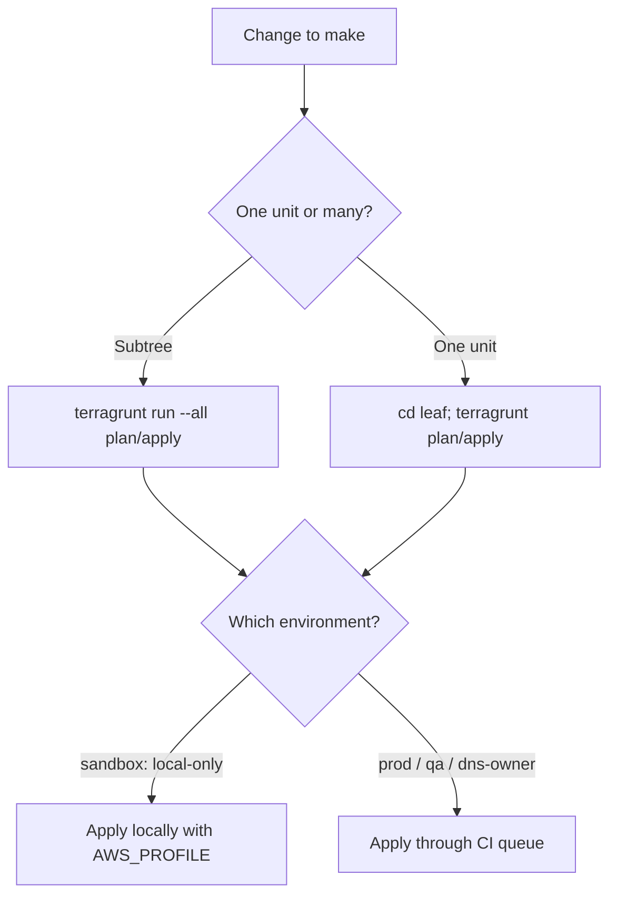

# Terragrunt Operational Runbook

Day-2 operations for the telemetry platform Terragrunt live tree: how to plan, apply, and
destroy units; how to target the right account; how state locking works; and how to read
outputs and recover from common failures. Reach for this when you already have a deployed
environment and need to change, inspect, or tear down units.

The everyday path: from a unit (leaf) directory, set `AWS_PROFILE` for the target account and
run `terragrunt plan`, review, then `terragrunt apply`. Sandbox is applied locally; production
is applied by CI through a serialized, gated queue.

For the terms used here (namespace, scope hierarchy, leaf unit, instance set, `common/`
mapping files), see [terragrunt-concepts.md](terragrunt-concepts.md) -- this runbook does not
re-derive them.

## Contents

- [Quick reference](#quick-reference)
- [Targeting an account](#targeting-an-account)
- [Scoping a run](#scoping-a-run)
- [Plan and apply locally](#plan-and-apply-locally)
- [Apply through CI](#apply-through-ci)
- [Local-only sandbox vs CI-deployable accounts](#local-only-sandbox-vs-ci-deployable-accounts)
- [State backend and locking](#state-backend-and-locking)
- [Reading outputs](#reading-outputs)
- [Destroying units](#destroying-units)
- [Drift and reconciliation](#drift-and-reconciliation)
- [Failure, cause, fix](#failure-cause-fix)
- [Related documents](#related-documents)

## Quick reference

The repository wraps the pinned Terragrunt binary behind `make` targets so the same commands
run locally and in CI. The wrapper supports `validate`, `hcl-format-check`, `plan`, and `apply`;
`destroy` is run with the raw Terragrunt binary (see [Destroying units](#destroying-units)).

| Task | Command |
|---|---|
| Validate all HCL | `make tg-validate` |
| Plan a scope | `make tg-plan INCLUDE_DIR_FLAGS="--queue-include-dir <unit-dir>"` |
| Apply a scope | `make tg-apply INCLUDE_DIR_FLAGS="--queue-include-dir <unit-dir>"` |
| Plan one leaf | `cd <leaf-dir> && terragrunt plan` |
| Apply one leaf | `cd <leaf-dir> && terragrunt apply` |
| Read one output | `make tg-output UNIT=<leaf-dir> NAME=<output> OUTPUT=$GITHUB_OUTPUT` |
| HCL format check | `make tg-format-check` |
| Config security scan | `make tg-security` |

`make tg-plan` and `make tg-apply` invoke `terragrunt run --all <cmd>` for the units named by
`INCLUDE_DIR_FLAGS`; `make tg-apply` adds `--non-interactive` so each unit's apply runs without
a prompt. `make tg-validate` runs `terragrunt hcl validate`, which recursively discovers and
validates every config without resolving deploy-time values.

The pinned toolchain is Terraform 1.15.5 and Terragrunt 1.0.7 (see `.tool-versions`). Use the
Terragrunt 1.0.7 `--queue-include-dir` token for scoping; the older
`--terragrunt-include-dir` / `--terragrunt-working-dir` tokens are not used.

## Targeting an account

The AWS account is not a directory level in the live tree -- it is resolved from the unit's
environment via `terragrunt/common/env_accounts.json`, and per-account settings
(deploy role, `ci_deploy`, DNS-owner flag) come from `terragrunt/common/accounts.json`. See
[terragrunt-concepts.md](terragrunt-concepts.md) for the resolution model.

Local operators select the target account with `AWS_PROFILE`, set to the `aws_profile` value
published for that environment in `env_accounts.json` (for example `telemetry-sandbox`,
`telemetry-prod`, `telemetry-qa`). The generated backend and provider carry no hard-coded
profile; ambient credentials from the environment are used.

```bash
AWS_PROFILE=telemetry-sandbox terragrunt plan
AWS_PROFILE=telemetry-prod    terragrunt apply
```

The generated provider pins `allowed_account_ids` to the single resolved account, so a command
run with the wrong profile fails fast rather than touching the wrong account.

## Scoping a run

A "unit" (leaf) is a single directory containing `terragrunt.hcl`. There are two ways to act
on units:

- **One unit** -- `cd` into the leaf directory and run `terragrunt <cmd>` directly. This is the
  precise, low-blast-radius option for a single change.
- **A subtree** -- from any ancestor directory, `terragrunt run --all <cmd>` walks the
  dependency graph and runs the command across every unit beneath it in dependency order.



To scope the `make` wrappers to specific units, pass one `--queue-include-dir <dir>` pair per
unit in `INCLUDE_DIR_FLAGS`:

```bash
make tg-plan INCLUDE_DIR_FLAGS="--queue-include-dir terragrunt/live/telemetry/us-east-1/sandbox/000/data-lake/000"
```

CI builds this same flag string automatically from the diff; the apply path uses
`make tg-detect-apply-units` (see [Apply through CI](#apply-through-ci)).

## Plan and apply locally

Always plan before you apply and read the plan output.

```bash
cd terragrunt/live/telemetry/us-east-1/sandbox/000/data-lake/000
AWS_PROFILE=telemetry-sandbox terragrunt plan
# review the plan, then:
AWS_PROFILE=telemetry-sandbox terragrunt apply
```

To bring up or reconcile a whole environment instance, run `--all` from the env-instance
directory. Terragrunt orders the apply by the dependency graph:

```bash
cd terragrunt/live/telemetry/us-east-1/sandbox/000
AWS_PROFILE=telemetry-sandbox terragrunt run --all apply
```

First-time bringup of a brand-new account or region has an additional state-backend bootstrap
step that must run before any service unit; that sequence lives in
[bootstrap-runbook.md](bootstrap-runbook.md) and the ordering in
[bootstrap-ordering.md](bootstrap-ordering.md). Standing up a new numbered set or service
instance by copying a folder is covered in
[instance-set-operations.md](instance-set-operations.md).

## Apply through CI

Production-affecting units are applied by the `Terragrunt Apply` workflow, not by hand. The
workflow:

- Detects the changed units from the push diff (`make tg-detect-apply-units`, which excludes
  the operator-applied bootstrap units) and emits `--queue-include-dir` flags.
- Resolves the target account and deploy role from each unit's environment via
  `common/accounts.json` (`make tg-resolve-deploy-role`), and requires that a single run target
  exactly one service account.
- Serializes every prod-affecting run through one repository-wide FIFO queue
  (`concurrency: tg-apply-prod`, `cancel-in-progress: false`) behind the `prod-apply` GitHub
  Environment gate, so an in-flight apply is never cancelled by a newer push.

The full workflow catalog (PR validation, plan-on-PR, main validation, apply, terratest sweep,
release pipeline) is documented once in [release-pipeline.md](release-pipeline.md). This runbook
does not duplicate it.

You can also trigger an apply for an explicit scope via `workflow_dispatch`, supplying the
`--queue-include-dir` flags string for the units to apply.

## Local-only sandbox vs CI-deployable accounts

Each account row in `common/accounts.json` carries a `ci_deploy` flag that decides whether CI
may apply its units:

- `ci_deploy: true` (production, qa, dns-owner) -- CI applies these units through the gated
  queue.
- `ci_deploy: false` (sandbox) -- CI never applies these units; they are applied locally with
  `AWS_PROFILE`.

`ci_deploy` is keyed on the **resolved** account, so a sandbox-folder unit that runs in the
shared DNS-owner account is still CI-deployed; only units in the local-only account itself are
skipped. Before resolving the deploy role, CI strips local-only units from the scope
(`make tg-filter-deployable-units`) and logs each skipped unit -- the skip is transparent, never
silent. If the entire scope is local-only, the apply is a clean no-op.

To apply a sandbox change, run it locally:

```bash
cd terragrunt/live/telemetry/us-east-1/sandbox/000/data-lake/000
AWS_PROFILE=telemetry-sandbox terragrunt apply
```

## State backend and locking

State lives in a per-account hardened S3 bucket; the bucket, its KMS key, and its access-log
bucket are created by the state-bootstrap unit (see [bootstrap-runbook.md](bootstrap-runbook.md)).
Each unit's state object key is derived from its path relative to `root.hcl`.

Locking is **S3-native conditional-write locking** (`use_lockfile = true`): the lock is a
sibling `.tflock` object in the same state bucket. There is no DynamoDB lock table -- the
`dynamodb_table` backend key is absent everywhere, and no unit provisions one. This requires
Terraform/OpenTofu 1.10 or newer; the pinned Terraform 1.15.5 satisfies that floor.

If an apply is interrupted (lost connection, cancelled process), the next command may report a
held lock and print a `Lock Info` block containing a lock `ID`. After confirming no apply is
actually in flight for that unit, clear it with the standard force-unlock operation from the
unit's directory:

```bash
cd <leaf-dir>
AWS_PROFILE=<profile> terragrunt force-unlock <LOCK_ID>
```

Never force-unlock a unit that an apply is genuinely still writing -- doing so can corrupt
state.

## Reading outputs

To read a single output value (the form CI uses), pass the unit directory and output name:

```bash
make tg-output UNIT=<leaf-dir> NAME=<output_name> OUTPUT=$GITHUB_OUTPUT
```

This wraps `terragrunt output -raw <name>` and fails closed (non-zero exit) when the named
output has no value. Interactively, `cd` into the unit and run `terragrunt output` to list all
outputs for that unit.

## Destroying units

There is no `make` or CI target for destroy -- no workflow carries a destroy step. Teardown is
a deliberate, local-only operation run with the raw Terragrunt binary and an explicit
`AWS_PROFILE`.

```bash
# one unit
cd <leaf-dir>
AWS_PROFILE=<profile> terragrunt destroy

# a subtree, in reverse dependency order
cd <env-instance-or-service-dir>
AWS_PROFILE=<profile> terragrunt run --all destroy
```

Destroy in reverse dependency order; `terragrunt run --all destroy` handles this for a subtree.
Do not destroy the shared state-backend buckets while any unit in that account still has state
in them.

Prefer the immutable-set pattern over destroying and mutating a live set in place: stand up a
new numbered set, validate it, and cut traffic over before retiring the old one. The set model
is described in [instance-sets-architecture.md](instance-sets-architecture.md), the
copy-and-revert procedures in [instance-set-operations.md](instance-set-operations.md), and the
traffic switch in [dns-cutover-runbook.md](dns-cutover-runbook.md).

## Drift and reconciliation

A plan against deployed infrastructure is the drift check: a non-empty plan with no local
configuration change means the live state has drifted.

```bash
cd <leaf-dir>
AWS_PROFILE=<profile> terragrunt plan
```

To reconcile, review the plan and apply it so the resources return to the declared state. Manual
console edits are an anti-pattern -- reconcile drift by applying the code, not by hand-editing
resources or state.

The daily `Terratest Sweep` exercises the modules independently of the live tree; its scope and
schedule are in [release-pipeline.md](release-pipeline.md).

## Failure, cause, fix

Most parse-time failures are deliberate fail-fast guards -- they abort before any AWS call when a
required `common/` mapping row is missing. The table below is a fast index; the canonical
failure-to-fix catalog (including pipeline and runtime failures) lives in
[troubleshooting.md](troubleshooting.md).

| Symptom | Likely cause | Fix |
|---|---|---|
| `ERROR: env-class '<env>' not found in common/env_accounts.json (envs)` | The unit's env-class has no row under `envs`, so its account cannot be resolved | Add the env-class row under `envs` in `common/env_accounts.json` |
| `ERROR: account id '<id>' not found in common/accounts.json` | The resolved account id has no per-account settings row | Add the account-id row to `common/accounts.json` |
| `ERROR: ... missing the required 'ci_deploy' key` | An account row omits `ci_deploy` (no default applied) | Add `"ci_deploy": true` or `false` to that account row |
| `ERROR: env-class '<env>' not found in common/domains.json` / `contacts.json` | New env-class lacks domain or contact rows | Add the env-class row to the named `common/` file |
| `ERROR: namespace '<ns>' not found in common/networks.json` | A VPC-creating unit has no CIDR allocation | Add a non-overlapping `vpc_cidr_block` row keyed by the unit's DNS-form namespace |
| `dns_owner_zone_id ... missing or contains the placeholder` | DNS-owner account row not finalized | Set the real Route53 hosted zone id on the `is_dns_owner: true` account row |
| `Call to function "jsondecode" failed` | Malformed JSON in a `common/*.json` file | Validate with `python -m json.tool <file>` and fix the syntax |
| Held-lock error on plan/apply | Interrupted previous apply left a `.tflock` object | Confirm nothing is in flight, then force-unlock the unit (see [State backend and locking](#state-backend-and-locking)) |
| `apply scope spans service accounts ...` (CI) | One apply run targets more than one account | Split the change so each apply targets a single account |
| Wrong-account error on apply | `AWS_PROFILE` does not match the unit's resolved account | Set `AWS_PROFILE` to the environment's `aws_profile` from `env_accounts.json` |

For VPC CIDRs, namespace forms, and the `common/` mapping schema referenced above, see
[terragrunt-concepts.md](terragrunt-concepts.md).

## Related documents

- [terragrunt-concepts.md](terragrunt-concepts.md) -- terminology, scope hierarchy, namespacing,
  and the `common/` mapping files.
- [instance-sets-architecture.md](instance-sets-architecture.md) -- the immutable env-set and
  resource-set model.
- [instance-set-operations.md](instance-set-operations.md) -- add a new set via the copy method;
  revert to an older set.
- [bootstrap-runbook.md](bootstrap-runbook.md) and
  [bootstrap-ordering.md](bootstrap-ordering.md) -- first-time state-backend bringup and order.
- [dns-cutover-runbook.md](dns-cutover-runbook.md) -- switching traffic between sets.
- [terraform-module-sourcing.md](terraform-module-sourcing.md) -- local vs pinned module
  sources.
- [release-pipeline.md](release-pipeline.md) -- the canonical CI/CD reference.
- [troubleshooting.md](troubleshooting.md) -- the full failure-to-fix catalog.
- [Documentation home](../README.md) -- the docs hub.
