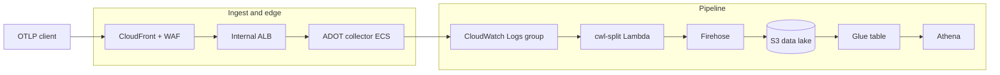

# Troubleshooting and operations FAQ

What this is: a symptom-driven reference for the most common failure modes across the
telemetry stack, grouped by area, each as **symptom -> likely cause -> fix**. When
telemetry stops flowing, an Athena query returns nothing, or a deploy goes red, start here,
then follow the cross-links into the matching runbook for step-by-step recovery.

When you need it: an OTLP export is rejected, records are not landing in the data lake,
Athena returns nothing or all-NULL, or a CI / Terragrunt apply fails. For terminology
(namespace, leaf unit, env set, resource set) see
[terragrunt-concepts.md](terragrunt-concepts.md); for the end-to-end design see
[architecture.md](architecture.md).

## How to locate a failure

Telemetry travels a single path. Identifying where it breaks narrows the cause quickly.



- HTTP error at the public endpoint -> [Ingest and edge](#ingest-and-edge).
- Records missing from `raw/`, landing in `errors/`, or Athena empty or all-NULL -> [Pipeline](#pipeline).
- Apply, release, or CI is red -> [Deploy, CI, and Terragrunt](#deploy-ci-and-terragrunt).
- Alarms not firing or notifying no one -> [Observability](#observability).

## Ingest and edge

The public edge is CloudFront (single entry) in front of an internal ALB reached over a
CloudFront VPC origin, fronted by a WAF WebACL. The ADOT collector accepts OTLP/HTTP only.
Client setup and limits are in [sending-telemetry.md](sending-telemetry.md).

### Every OTLP request returns 403

- Likely cause: the CloudFront distribution origin is misconfigured as a public custom
  origin pointing back at the collector's own public FQDN, creating a CloudFront-to-CloudFront
  self-loop; a public origin also cannot reach the internal-scheme ALB.
- Fix: the distribution must use a **VPC origin** that targets the internal ALB by ARN
  (`origin_type = "vpc"`), so CloudFront reaches the ALB privately and the ALB stays
  internal. The ALB security group should allow ingress only from the AWS-managed
  CloudFront origin-facing prefix list (supplied as an input). If you see broad 403s after a
  topology change, confirm the origin is the VPC origin and not a public domain origin.

### Large OTLP bodies return 403 while small ones return 200

- Likely cause: the WAF `AWSManagedRulesCommonRuleSet` `SizeRestrictions_BODY` sub-rule
  blocks bodies over the WAF default body-inspection limit (a few KiB), even though the ADOT
  receiver legitimately accepts much larger bodies.
- Fix: the `SizeRestrictions_BODY` sub-rule is overridden to **count** (not block) so
  oversized bodies pass the WAF; all other managed rules stay enforced. Body-size shaping is
  enforced at the ADOT receiver, never at the WAF. If large exports start failing at the
  edge again, verify the per-sub-rule override is still in place.

### Oversized request rejected at the receiver

- Likely cause: the request body exceeds the receiver cap (`max_request_body_size`, default
  4 MiB). This is enforced at the ADOT OTLP receiver by design and surfaces as a receiver-side
  rejection, not a WAF 403.
- Fix: split the export into smaller batches, or raise the configured receiver cap if the
  workload legitimately needs larger bodies. Distinguish this (receiver-side, large body)
  from the WAF case above (edge-side 403).

### Request with an unexpected content type is refused

- Likely cause: the ADOT OTLP/HTTP receiver accepts only `application/x-protobuf` and
  `application/json`. The allowlist is intrinsic to the receiver; there is no config key for
  it.
- Fix: export OTLP over HTTP with one of the two supported content types. See
  [sending-telemetry.md](sending-telemetry.md) for encodings and examples.

### ALB target marked unhealthy though traffic works

- Likely cause: the ALB target-group health check must probe the ADOT health-check extension
  on port `13133` at path `/` (which returns HTTP 200), not the OTLP traffic port `4318`.
  The extension must bind `0.0.0.0:13133`; the default `localhost:13133` is loopback-only and
  unreachable by the ALB.
- Fix: confirm the health check targets port 13133 (not traffic-port) and that the
  health-check extension endpoint is `0.0.0.0:13133`, with the port opened in the task
  security group and container port mappings.

## Pipeline

The pipeline carries OTLP logs from the collector's CloudWatch Logs group through a
subscription filter to the cwl-split transform Lambda, which re-ingests each log event as a
single JSON record into Firehose; Firehose extracts the `tool` partition, converts to
Parquet, and writes to `raw/tool=<x>/dt=<y>/`. The data model and query examples are in
[data-model.md](data-model.md).

### Records land in `errors/metadata-extraction-failed/` instead of `raw/`

This is the most common pipeline symptom and has several distinct causes. Check them in
order.

- Invalid partitioning query: the Firehose dynamic-partitioning jq query must be valid jq
  (for example `{tool=".tool"}`). `strftime`-style patterns are not valid jq and route every
  record to `errors/`. The `dt` partition is supplied by Firehose's native timestamp prefix
  (`!{timestamp:yyyy-MM-dd}`), not by jq.
- Aggregated multi-object records: a CloudWatch Logs subscription batches many log events
  into one record. Firehose's jq engine requires exactly one JSON value per record and
  rejects an aggregated block of consecutive JSON objects. The pipeline solves this with the
  **cwl-split transform Lambda**, which strips the CloudWatch Logs envelope and re-ingests
  each `logEvents[].message` as its own single-JSON record before metadata extraction.
- Large deliveries (more than 500 events): an earlier native de-aggregation processor was
  hard-capped at 500 sub-records, so deliveries over 500 events failed wholesale. The
  cwl-split transform Lambda removes that cap because it splits via `firehose:PutRecordBatch`
  rather than the de-aggregation processor.
- Fix: confirm the cwl-split Lambda is wired as the Firehose transform processor and that the
  Firehose delivery role holds `lambda:InvokeFunction` and `lambda:GetFunctionConfiguration`
  plus `kms:GenerateDataKey` / `kms:Decrypt` on the data-lake CMK. A persistently growing
  `errors/metadata-extraction-failed/` prefix indicates one of the above is broken.

### Structured-OTLP records land in `errors/` with no top-level `tool`

- Likely cause: a structured-OTLP record's `resource.attributes["service.name"]` matched the
  collector's registry-derived `structured_otlp_service_names` allowlist (so it was routed to
  the structured pipeline) but is **not** a key in the data-lake's registry-derived
  `service_tool_map`. There is **no fallback tool** by design (see
  [onboarding-a-tool.md](onboarding-a-tool.md#fail-fast-unregistered-tools-go-to-errors-never-a-catch-all)):
  the `cwl_split` reshape Lambda fails fast on that one record and re-ingests its original
  bytes, which have no top-level `tool`, so Firehose's `{tool:.tool}` extraction routes it to
  `errors/` rather than assigning it a catch-all `tool` value. Every other, co-batched record
  in the same Lambda invocation (any correctly mapped record) still
  delivers byte-identical.
- This is a config-drift symptom: it means the collector's routing allowlist and the
  data-lake's map have drifted out of the registry's single-source-of-truth state (for
  example, a deploy applied the collector-ingestion leaf but not the data-lake leaf).
- Fix: add the missing `service_names` entry to
  [`terragrunt/common/tool-registry.json`](../terragrunt/common/tool-registry.json) — see
  [onboarding-a-tool.md](onboarding-a-tool.md) — and re-apply both the collector-ingestion and
  data-lake units so the registry, the collector's allowlist, and the reshape's map are back
  in lockstep.

### Firehose `IncomingRecords` is zero and the data lake stays dark

- Likely cause: the CloudWatch-Logs-to-Firehose role trust policy scopes `aws:SourceArn` to
  a single ARN form. The CloudWatch Logs service principal presents `aws:SourceArn` in **two**
  forms: the bare log-group ARN at subscription creation, and the log-group ARN with a `:*`
  suffix at runtime delivery. A trust policy that allows only one form passes one phase and
  silently denies the other (zero records delivered).
- Fix: the trust policy must allow **both** `aws:SourceArn` forms (bare and `:*`). If
  subscription creation succeeds but no records are ever delivered, suspect the runtime
  (`:*`) form is missing.

### Athena returns all-NULL rows even though Parquet exists in `raw/`

- Likely cause: the Glue `telemetry_events` table is defined with a JSON SerDe while Firehose
  writes Parquet. A JSON SerDe cannot deserialize Parquet, so every column reads back as NULL.
- Fix: the table must use `ParquetHiveSerDe` with the Parquet input/output formats, matching
  the Firehose Parquet output and the partition projection. All-NULL columns over real
  Parquet objects is the signature of a SerDe mismatch.

### Athena queries over `tool` or `dt` do not resolve or report a duplicate column

- Likely cause: the Glue table is missing the Athena partition-projection table parameters,
  or `tool` is defined both as a data column and as a partition key (a duplicate column
  raises `HIVE_INVALID_METADATA`).
- Fix: `tool` and `dt` must be partition keys only (disjoint from the data columns), with
  partition projection configured (`tool` enum over a governed value set, `dt` date). See the
  projection details and query patterns in [data-model.md](data-model.md).

### Athena query over `tool` scans more than expected (no longer `CONSTRAINT_VIOLATION`)

- Context: the `tool` partition previously used injected projection, which rejected any
  query without an exact `tool` predicate — an unfiltered scan, a `LIKE`, or a range on
  `tool` failed with `CONSTRAINT_VIOLATION`. The partition now uses enum projection over a
  governed value set, so that failure no longer occurs: an unfiltered `SELECT` succeeds and
  simply resolves every governed `tool` partition.
- Likely cause: this is a cost concern rather than an error. An unfiltered `tool` query
  scans every governed partition, so it can scan far more than intended.
- Fix: pin `tool` with equality or an `IN` list to prune the scan to the partitions you need:

```sql
SELECT count(*)
FROM telemetry_events
WHERE tool IN ('<tool-a>', '<tool-b>')
  AND dt BETWEEN '2025-01-01' AND '2025-01-31';
```

### Athena query rejected for scanning too many bytes

- Likely cause: the Athena workgroup enforces a per-query scanned-bytes cutoff
  (`bytes_scanned_cutoff_per_query`) to cap cost.
- Fix: narrow the query with `tool` and `dt` partition predicates so Athena prunes
  partitions and scans less, or raise the configured cutoff if the workload genuinely needs
  it.

## Deploy, CI, and Terragrunt

Terragrunt drives the deploy; sandbox is applied locally and prod is applied by CI through a
serialized FIFO queue gated by a protected GitHub Environment. The full pipeline reference is
[release-pipeline.md](release-pipeline.md); day-2 operations are in
[terragrunt-operational-runbook.md](terragrunt-operational-runbook.md); first-time backend
bringup is in [bootstrap-runbook.md](bootstrap-runbook.md).

### A `terragrunt run --all` apply aborts at parse time on an unrelated unit

- Likely cause: `terragrunt run --all` discovers and parses **every** unit to build the DAG,
  regardless of change scope. A leaf that reads `get_env(...)` with no default fails parsing
  for any apply that does not export that variable, cascading into "Unsupported attribute" /
  "no variable named dependency" errors elsewhere.
- Fix: leaf `get_env` reads that only a scoped apply exports must carry an empty-string
  default so discovery parses; the module's own input validation still fails fast for a real
  apply of that unit (the empty default is not a deployable fallback). When a dependency edge
  is run-order only and its outputs are unused, set `skip_outputs = true` so discovery does
  not parse the dependency's outputs.

### A module tag is silently lost when several PRs merge in a burst

- Likely cause: the release and prod-deploy lanes share a repo-wide concurrency group. The
  default queue mode allows at most one pending run per group, so a newer queued run cancels
  the previously pending one even with `cancel-in-progress: false` (which protects only the
  running run, not the pending one).
- Fix: prod-affecting applies run through a single serialized FIFO queue, and the GitHub Merge
  Queue validates each queued PR's speculative merge ref (the PR-validation workflow must
  trigger on the `merge_group` event, or the queue hangs). If a release tag goes missing after
  concurrent merges, inspect the queue and the concurrency configuration rather than
  re-merging blindly.

### A protected-branch release leaves a dangling tag

- Likely cause: a non-atomic push lets the tag ref land even when the branch push is rejected
  (for example when the release identity is not yet a bypass actor), leaving a tag that points
  at an unpublished commit and poisons the next release's version derivation.
- Fix: the release publish step pushes branch and tag together with `git push --atomic`, so
  the server accepts or rejects both refs as a unit.

### A changed unit is not detected, or a parent-config change is missed

- Likely cause: the unit detector did not account for a parent-config-only change (for
  example a `service.hcl` or `_envcommon` edit that affects leaves without touching them
  directly).
- Fix: confirm the detector resolves parent-config changes to their dependent leaves so the
  right units plan and apply. The detection logic lives in the repository's Terragrunt unit
  and scope detection scripts.

### Terratest leaves orphaned infrastructure or races the daily sweep

- Likely cause: account- and region-unique fixture names (alarms and similar) were not
  run-id-scoped, so concurrent runs in the shared test account collided; the daily destructive
  sweep had no age guard (and could delete in-flight run resources) and could not find
  untaggable orphans (KMS aliases, Route53 parent-NS records, Cost Explorer monitors); and a
  linked member account cannot create a `CUSTOM` cost monitor (that test must be plan-only
  there).
- Fix: fixture names are run-id-scoped for isolation, the sweep carries an age guard and
  sweeps untaggable orphans by type, two account-wide sweeps cannot run at once, and the
  cost-anomaly singleton is plan-only where a linked account bans custom monitors.

### A Firehose terratest hangs for tens of minutes

- Likely cause: the `aws_kinesis_firehose_delivery_stream` resource has no `timeouts {}`
  block, so a transient stuck create or delete (a KMS-grant or IAM-propagation delay) polls up
  to the long provider defaults and can exceed the Go per-package test budget, presenting as a
  hang.
- Fix: the firehose resource carries bounded, input-driven create / update / delete timeouts
  (default 10m each) so a stuck operation fails fast with a clear provider timeout instead of
  hanging. Production consumers get the same bounded waits.

### A defect appears only on a real prod apply, never in CI

- Likely cause: offline CI plans do not exercise the full tree the way a real
  `terragrunt run --all` apply does (parse-time `get_env`, cross-unit dependency reads,
  alarm-name interactions). Such defects stay latent until a genuine apply.
- Fix: exercise a full real apply when validating tree-wide changes; the
  parse-time-default and `skip_outputs` patterns above are the common resolutions. See
  [terragrunt-operational-runbook.md](terragrunt-operational-runbook.md) and, for DNS
  cutovers, [dns-cutover-runbook.md](dns-cutover-runbook.md).

## Observability

The observability unit composes a single CMK-encrypted SNS topic as the sole sink for the
fixed set of CloudWatch alarms. Budget and cost-anomaly notifications keep their own direct
email subscribers rather than routing through the alarm topic.

### Alarms change state but no one is notified

- Likely cause: the alarm SNS topic has no confirmed subscriber. An email-protocol SNS
  subscription is delivered only after the recipient confirms it, and AWS auto-expires
  unconfirmed email subscriptions, so a previously added subscription can silently disappear.
- Fix: declare the alarm-notification email subscriber on the observability unit, then have
  the recipient **confirm** the subscription (the confirmation is a human action; the code
  only declares the subscriber).

### An alarm never enters ALARM when data is absent

- Likely cause: `treat_missing_data` is not set per alarm. For "stopped means trouble" alarms
  (a stopped ECS task, a stalled stream) the correct setting is `breaching`; for drop/error
  counters that publish nothing when healthy it is `notBreaching`. A single default cannot
  serve both.
- Fix: set `treat_missing_data` per alarm so absence-of-data alarms actually fire.

### An alarm is permanently in INSUFFICIENT_DATA and never fires

- Likely cause: the alarm is bound to a metric that the deployed pipeline never publishes.
  A memory-limiter drop metric (only emitted under memory pressure on a busy pipeline) never
  has datapoints and carries no signal at current volumes.
- Fix: remove dead, never-published alarms rather than keeping them as permanent no-data
  noise. The deployed alarm set is intentionally the six that can actually transition (ECS
  running-task-count, ALB 5xx, ALB p95 response time, WAF blocked requests, Firehose delivery
  freshness, Athena scanned bytes).

### A Lambda log group grows without bound

- Likely cause: when a Lambda's log group is implicitly auto-created by the Lambda service, it
  defaults to never-expire retention.
- Fix: declare the log group explicitly with an input-driven retention period and a
  customer-managed CMK, and order the function after the managed log group so AWS does not
  auto-create an unmanaged group of the same name first.

## Related runbooks

- [architecture.md](architecture.md) — end-to-end system and the logs-and-metrics signal scope.
- [sending-telemetry.md](sending-telemetry.md) — client endpoints, event shape, encodings, and limits.
- [onboarding-a-tool.md](onboarding-a-tool.md) — register a new tool in the tool registry.
- [data-model.md](data-model.md) — event schema, the `tool` projection, and Athena query examples.
- [release-pipeline.md](release-pipeline.md) — the canonical CI/CD reference.
- [terragrunt-operational-runbook.md](terragrunt-operational-runbook.md) — day-2 operations.
- [bootstrap-runbook.md](bootstrap-runbook.md) — first-time state-backend bringup.
- [dns-cutover-runbook.md](dns-cutover-runbook.md) — DNS cutover steps.
- [instance-set-operations.md](instance-set-operations.md) — adding or reverting an instance set.
- [terragrunt-concepts.md](terragrunt-concepts.md) — terminology and structure.
- [Project README](../README.md) — documentation hub and quickstart.
